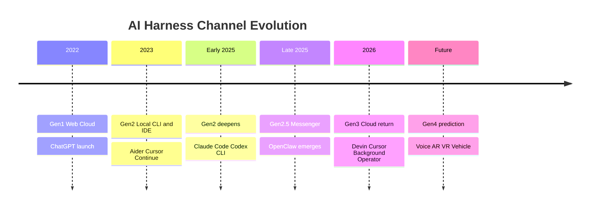
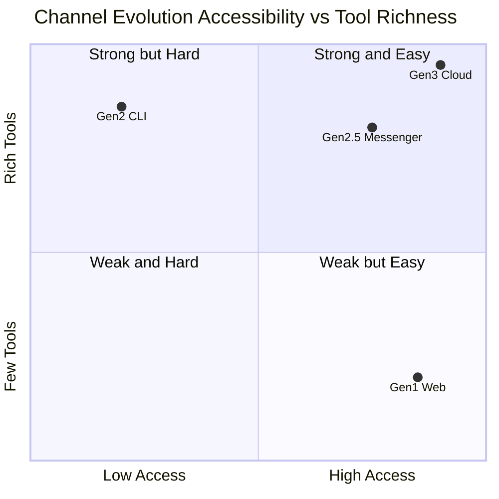

[어제 6종 비교 글](/posts/2026-04-30-coding-agent-harness-comparison/)을 쓰고 나서 이런 질문이 떠올랐어요. "왜 OpenClaw가 폭발했나?"

표면적인 답은 명확해요 — Claude Code급 도구셋 + 모델 자유 + MIT OSS. 근데 뒤집어 생각하면 그 셋이 폭발 트리거의 **본질**은 아니에요. **메신저(텔레그램·Slack·Discord) 통합을 1st-party로 가져왔다는 점**이 진짜 차별점이었습니다.

그리고 거기서 더 들어가보면, 이 전체 흐름은 하나의 패턴으로 환원돼요. **AI 하네스 시장은 "성능 게임"이 아니라 "접근성 게임"이다.**

## 채널의 진화 타임라인

각 세대를 풀어보면:

**1세대 (2022.11~) — 웹 클라우드**
ChatGPT의 충격은 GPT-3.5 성능보다 **"브라우저만 있으면 누구나 AI랑 대화"**라는 접근성에서 왔어요. 도구는 빈약했지만 진입 마찰이 0. 사용자 풀이 단번에 수억 명.

**2세대 (2023.05~) — 로컬 CLI / IDE**
Aider, Cursor, Continue가 등장하면서 **도구셋과 자율성**이 본격 발전. 단점은 환경 셋업, 노트북 켜기, 터미널/IDE 학습 곡선. 사용자 풀이 다시 개발자로 좁혀짐. **접근성을 희생하고 도구 풍부함을 얻은 거.**

**2025.02~** Claude Code, Codex CLI가 도구셋을 더 풍부하게 만들었지만 진입 장벽도 같이 올라갔어요. CLAUDE.md 같은 설정, Hooks, Skills, MCP... 강력하지만 "노트북 켜고 터미널 명령" 흐름은 그대로.

**2.5세대 (2025 후반~) — 메신저 통합**
OpenClaw가 가져온 변화는 정확히 이 지점이에요. **2세대의 풍부한 도구셋을 유지하면서, 채널을 메신저(텔레그램/Slack/Discord)로 옮긴 것.** 환경 셋업 한 번이면 그다음부터는 휴대폰 잠금만 풀면 AI 비서 호출. 컴퓨터를 켤 필요도, 터미널을 열 필요도 없음.

**3세대 (2026~) — 클라우드 회귀**
지금 본격적으로 진행 중이에요. Devin (Cognition), Cursor의 Background Agent, OpenAI Operator. 이번엔 **2세대의 도구셋과 자율성을 클라우드로 들고 가는** 단계. 사용자는 웹 채팅창에서 명령만 던지고, 자기 컴퓨터는 꺼도 됨. 24시간 일하는 AI 동료.

## 왜 사이클이 도는가

채널이 클라우드 → 로컬 → 다시 클라우드로 도는 게 우연은 아니에요. 진화 방향엔 두 축이 있어요.

**축 1: 접근성** — 사용자가 부르는 마찰
**축 2: 도구 풍부함 / 자율성** — 한 번 호출했을 때 할 수 있는 일의 깊이

1세대는 우하 (접근 쉬움 + 도구 빈약), 2세대는 좌상 (도구 풍부 + 접근 어려움), 2.5세대는 우상으로 진입, 3세대는 그 우상의 끝으로 향함. **결국 모든 진화는 "강력 + 접근 쉬움"의 우상으로 수렴**해요.

## 다음 채널은 무엇인가

3세대 너머 4세대를 예측하면 (추측 영역) — 더 보편적인 채널이 후보:

- **음성 인터페이스**: Siri/Alexa/구글 어시스턴트 통합. 손도 안 쓰고 호출.
- **AR/VR 글래스**: Vision Pro 같은 장치가 보편화되면 자연 인터페이스
- **자동차 인포테인먼트**: 운전 중에도 부를 수 있음
- **TV / 거실 디스플레이**: 가족 공용 AI 비서
- **워치 / 웨어러블**: 가장 즉각적

공통점은 명확해요. **터치도 없고 키보드도 없는 채널로 가는 흐름**. 진입 마찰을 0 너머 마이너스(자동 호출)로 가져가는 단계.

## 시장 구조의 분화

이 진화엔 부작용도 있어요. **친화적 UX는 자본·인력이 많이 들어요**. 그래서 시장이 양극화될 가능성이 큽니다 (강한 추측):

- **친화적 클라우드 진영**: Anthropic, OpenAI, Cognition, Cursor 같이 자본·UX 디자인 인력 갖춘 회사들. 일반인 시장.
- **OSS 로컬 진영**: OpenClaw, Aider 같은 커뮤니티 주도. 개발자·엔터프라이즈 시장. 프라이버시·완전 통제 필요한 영역.

둘이 충돌이 아니라 **다른 사용자 풀을 가져감**. 한 사람이 일에선 OSS 로컬, 일상에선 친화 클라우드를 같이 쓰는 흐름이 자연스러움.

## 결론

하네스 6종 비교에서 봤던 차이들 — Aider vs Cursor, Claude Code vs Codex CLI — 은 사실 동일 세대 안의 도구 디테일 차이였어요. 진짜 큰 그림은 **세대 간 채널 변화**에 있었던 거.

다음에 어떤 하네스가 인기를 끌지 예측하려면 **"접근성을 한 단계 더 낮춘 채널을 누가 먼저 차지하는가"**를 보면 됩니다. 성능·도구·모델이 아니라 채널.

**한 줄 요약:** 좋은 도구는 자주 부를 수 있는 도구다.

## 출처

- [OpenClaw GitHub](https://github.com/openclaw/openclaw)
- [Devin (Cognition AI)](https://www.cognition.ai/)
- [Cursor Background Agents 발표 (추정 출처)](https://cursor.com/changelog)
- [OpenAI Operator 발표 (2025)](https://openai.com/index/introducing-operator/)
- [ChatGPT 출시 (2022.11)](https://openai.com/index/chatgpt/)
- [어제 글 — 코딩 에이전트 하네스 6종 비교](/posts/2026-04-30-coding-agent-harness-comparison/)
