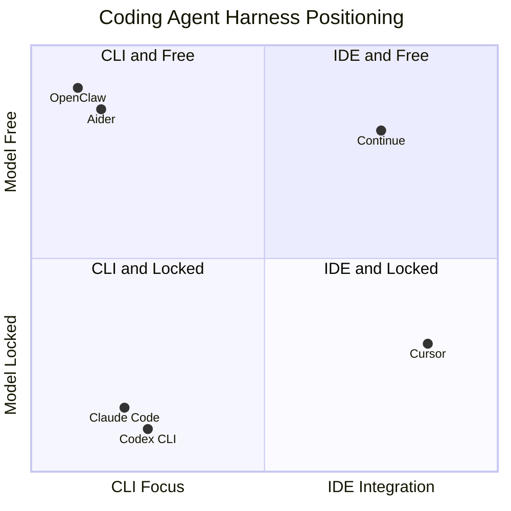

[이틀 전 글](/posts/2026-04-29-tool-use-anatomy/)과 [어제 글](/posts/2026-04-30-skills-pattern-above-tool-use/)에서 약속한 토픽이에요. 같은 Tool Use + Skills 메커니즘 위에서 코딩 에이전트들이 왜 다른 결과를 만드는지. 메이저 6종을 직접 비교합니다.

## 6종 한눈에

| 도구 | 출시 | 개발 | 형태 | 모델 | 가격 | 라이선스 |
|---|---|---|---|---|---|---|
| **Aider** | 2023.05 | Paul Gauthier (개인) | Python CLI | 자유 | 무료 + API | OSS (Apache 2.0) |
| **Cursor** | 2023 | Anysphere Inc. | VSCode fork IDE | Cursor 라우팅 | $20/월~ | 상용 |
| **Continue** | 2023 | Continue Dev, Inc. | VSCode/JetBrains 확장 | 자유 | 무료 + API | OSS (Apache 2.0) |
| **Claude Code** | 2025.02 | Anthropic | Node CLI + IDE 확장 | Claude 전용 | API or 구독 | 상용 |
| **Codex CLI** | 2025 | OpenAI | Node CLI | GPT 전용 | API or 구독 | 상용 |
| **OpenClaw** | 2025 후반 | openclaw 커뮤니티 | Node CLI + 모바일 노드 | 자유 | 무료 + API | OSS (MIT) |

## 두 축으로 보는 포지셔닝

좌상-우하 대각선이 흥미로워요. 모델 자유를 추구하면 자연스럽게 OSS·확장형 (Aider, OpenClaw, Continue), 모델 잠금이면 자체 통합 깊이로 차별화 (Claude Code, Cursor) — 둘이 정반대 전략이에요.

## 각자의 강점·약점

### Aider — 모델 자유의 클래식

장점: 어떤 모델이든 붙임 (DeepSeek/Llama처럼 저렴한 옵션 OK). git diff·자동 commit이 깔끔. 가볍고 의존성 적음. 만든 사람이 한 명(Paul Gauthier)이라 일관성 있음.

약점: UX는 단순한 터미널 텍스트. IDE 통합 없음. 컨텍스트는 사용자가 `/add file`로 명시 — "알아서 끌어 쓰는" 자율성 부족. 도구셋도 파일 편집 위주.

### Cursor — 즉각 반응형의 끝판

장점: Tab 자동완성이 다중 라인·다중 위치 동시 추론하는 게 압도적. VSCode 친숙해서 학습 곡선 낮음. 작은 단위 수정·리팩터링이 빠름. Anysphere가 자본·인력 빵빵해서 발전 속도 빠름.

약점: $20/월 유료. 폐쇄 소스. 큰 변경(파일 수십 개 동시 수정)·긴 자율 작업엔 약함. VSCode fork라 일부 확장 호환성 이슈 있음 (추측).

### Continue — IDE 그대로 + 모델 자유

장점: 기존 VSCode/JetBrains에 확장만 설치 — fork 안 함. 오픈소스 무료. 모델 자유. Continue Dev, Inc.가 엔터프라이즈 친화적 정책.

약점: 통합 깊이가 Cursor만큼 안 들어감. 사용자 베이스·생태계 작음. 기능은 autocomplete + 간단 채팅 수준.

### Claude Code — 자율 작업의 끝판

장점: 도구셋이 압도적으로 풍부 — Bash, WebFetch, Read/Edit/Write, Task(서브에이전트), Skills, MCP 서버, Plan 모드, Hooks, Slash commands. 긴 컨텍스트 자동 관리(compact). 자동화·CLI 통합에 강함. 멀티파일 큰 변경에 강함. Anthropic 공식.

약점: Claude 모델 잠금 → 가격 변동에 민감. CLI 위주라 IDE 통합은 plugin 형태로 따라잡는 중. 학습 곡선 있음 (CLAUDE.md 같은 설정 익혀야).

### Codex CLI — OpenAI의 카운터파트

장점: Claude Code와 거의 같은 도구셋·UX 컨셉. GPT 사용자에겐 자연스러움. OpenAI 공식 → 통합 신뢰.

약점: 후발주자라 생태계·커뮤니티 작음 (추측). GPT 전용 잠금. 일부 기능은 Claude Code보다 늦게 따라옴 (추측).

### OpenClaw — 풍부한 도구셋 + 모델 자유의 결합

장점: **Claude Code급 도구셋**(bash/process/read/write/edit/browser/canvas/sessions/cron) + **모델 자유**(Claude/GPT/로컬 다 지원). MIT 라이선스 OSS. **멀티 채널 통합**(Telegram/Slack/Discord/Signal/WhatsApp 등) — 다른 하네스에 없는 차별점. local-first gateway 구조로 자기 머신에서 다 돌아감.

약점: 보안 설정·샌드박싱이 복잡 (Docker 의존성). 채널 통합 구조라 단순 코딩 IDE 사용자에겐 오버엔지니어링. 커뮤니티 주도라 기능 일관성·로드맵 예측 어려움 (추측).

## 상황별 추천

| 상황 | 추천 |
|---|---|
| 모델 비용 최소화 + 가벼움 | **Aider** |
| IDE에서 즉각 반응형 코딩 | **Cursor** |
| 기존 IDE에 확장만 추가하고 싶다 | **Continue** |
| 큰 자율 작업·자동화·터미널 친화 (Anthropic 신뢰) | **Claude Code** |
| GPT 진영 + Claude Code 같은 경험 | **Codex CLI** |
| 풍부한 도구셋 + 모델 자유 + 메신저 통합 | **OpenClaw** |

## 경계는 빨리 흐려진다

이 비교는 2026년 4월 시점의 스냅샷이에요. 시장 변화 빠릅니다.

- Cursor가 CLI 모드 강화 중 (추측 — 최근 발표 추적 필요)
- Claude Code도 IDE 통합 개선 중
- OpenClaw는 2025년 말 등장 → 2026년 초 폭발적 인기. 6개월 뒤 어디까지 올라갈지 변동 큼
- 모델 잠금 도구들도 멀티 모델 지원 검토 중일 가능성 (추측)

6개월 뒤엔 위 매트릭스가 달라져 있을 거예요. 그래서 도구 선택보다 **그 아래 메커니즘(Tool Use, Skills, MCP) 이해**가 더 오래갑니다. 그 메커니즘이 안정적이고, 도구는 표면일 뿐이거든요.

## 결론

같은 Tool Use 메커니즘 위에서도 여섯 도구가 완전히 다른 방향으로 분기했어요. **모델 자유 vs 통합 깊이**, **IDE 즉각성 vs CLI 자율성**, 그리고 OpenClaw가 더한 **OSS + 풍부한 도구셋**이라는 새 축. 이 셋이 핵심 분기점.

본인 작업 패턴이 "여러 모델 비교"에 가까운지, "한 모델 깊이 활용"에 가까운지가 첫 결정. 그다음 IDE 안에서 해결하고 싶은지, 터미널·자동화 친화 환경이 좋은지가 두 번째. 자율성·도구셋이 풍부하면서도 모델 잠금이 싫으면 OpenClaw가 답이 될 수 있음.

다음에 다룰 만한 주제: OpenClaw가 등장하면서 "모델 잠금 vs OSS"의 균형이 어떻게 변화하는지, Anthropic·OpenAI가 이에 어떻게 대응하는지.

## 출처

- [Aider 공식 사이트](https://aider.chat/)
- [Cursor 공식 사이트](https://cursor.com/)
- [Continue 공식 사이트](https://continue.dev/)
- [Anthropic Claude Code 발표 (2025-02-24)](https://www.anthropic.com/news/claude-3-7-sonnet)
- [OpenAI Codex (2025)](https://openai.com/index/introducing-codex/)
- [OpenClaw GitHub repo](https://github.com/openclaw/openclaw)
- [What Is OpenClaw? — Zylon Blog](https://www.zylon.ai/resources/blog/what-is-openclaw-a-practical-guide-to-the-agent-harness-behind-the-hype)
- [LangChain Agents 문서 (역사적 맥락)](https://python.langchain.com/docs/concepts/agents/)
