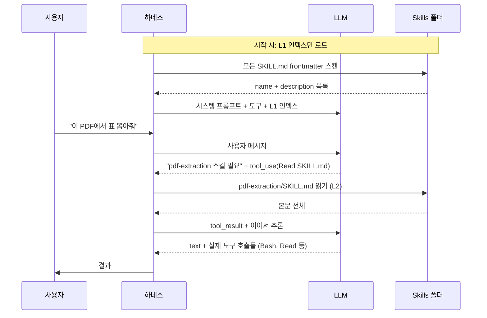

이번 주 GitHub trending(daily) 상위 20개를 펼쳐보면 묘한 패턴이 잡혀요. **`mattpocock/skills`** (today +7,356★), **`obra/superpowers`** (+1,683★), **`awesome-codex-skills`** (+1,180★), **`jcode`**(코딩 에이전트 하네스, +386★)... 키워드 하나로 묶이죠. **skills.**

어제 글에서 Tool Use가 모든 모던 LLM 하네스의 기반이라고 정리했어요([Tool Use 해부](/posts/2026-04-29-tool-use-anatomy/)). Skills는 그 위에 쌓이는 다음 층입니다. 도구가 "무엇을 할 수 있는지"라면, skills는 "그걸 어떻게, 언제 해야 하는지"예요.

## 왜 도구만으로는 부족했나

Tool Use 만으로 에이전트를 굴려보면 두 가지 한계에 부딪힙니다.

**1) 컨텍스트 윈도우는 유한하다.** Claude Sonnet 4.6 의 200K 토큰도, Opus 4.7 의 1M 토큰도, 모든 가능한 도메인 노하우를 매 요청마다 시스템 프롬프트에 우겨넣기엔 빠듯해요. PDF 처리법, 슬랙 워크플로, 보안 리뷰 체크리스트, 회사 내부 컨벤션... 다 넣으면 답변할 자리가 없죠.

**2) 도구는 "어떻게"를 모른다.** `Bash` 도구는 명령을 실행할 수 있지만, "Postgres 마이그레이션 안전하게 돌리는 절차"는 모릅니다. 그건 코드가 아니라 노하우거든요. 매번 사람이 프롬프트에 붙여넣어 줘야 했어요.

## Skills의 핵심 — Progressive Disclosure

Anthropic이 2025년 10월 [공식 발표](https://www.anthropic.com/engineering/equipping-agents-for-the-real-world-with-agent-skills)한 Skills의 핵심 아이디어는 **3단계 점진적 로딩**입니다.

| 단계 | 무엇이 컨텍스트에 올라가나 | 언제 |
|---|---|---|
| **L1** | 스킬 이름 + 1줄 설명 (frontmatter) | 시스템 프롬프트 시작 시 |
| **L2** | `SKILL.md` 본문 전체 | 모델이 "이 스킬 필요"라고 판단할 때 |
| **L3+** | 스킬 폴더의 추가 파일 (`reference.md`, 스크립트) | 본문 읽고 더 필요할 때 |

L1만 늘 떠 있고 L2/L3는 **모델이 직접 판단**해서 끌어올려요. 인덱스만 보고 책장에서 책을 꺼내는 사서랑 비슷합니다. 100개 스킬이 있어도 시스템 프롬프트에는 100줄 짜리 인덱스만 있으면 돼요.

## SKILL.md 구조

스킬 하나는 **YAML frontmatter + 본문**으로 시작하는 마크다운 파일이에요. Claude Code에서 그대로 쓰는 포맷:

```markdown
---
name: pdf-extraction
description: Use this skill when the user asks to extract text,
  tables, or images from PDF files. Handles encrypted PDFs,
  multi-column layouts, and embedded fonts.
---

# 본문
실제 절차, 주의사항, 예시 코드, 흔한 실패 패턴...
```

**`description`이 결정적**이에요. L1 단계에서 모델이 보는 건 이 한 줄이 전부니까. "Use this skill when..." 패턴으로 트리거 조건을 명시하는 게 컨벤션. 잘못 쓰면 스킬이 있어도 안 불립니다 — 모델 입장에선 존재 자체를 모르는 거랑 똑같아요.

## 흐름도



핵심은 어제 글의 결론과 같아요. **하네스는 멍청, 판단은 LLM**. Skills도 결국 "L2를 끌어올릴지" 결정하는 건 LLM이 합니다. 하네스는 인덱스를 만들고 파일을 읽어주는 사서 역할만 해요.

## 왜 GitHub 트렌딩을 점령했나

세 가지가 동시에 맞물렸어요.

**1) 표준이 잡혔다.** Anthropic이 [SKILL.md 포맷](https://github.com/anthropics/skills)을 공개하면서 "이렇게 쓰면 Claude Code/Cursor/Codex 어디서든 동작" 하는 호환 레이어가 생겼어요. 사람들이 자기 워크플로를 스킬로 패키징해 GitHub에 올리기 시작.

**2) 노하우가 자산이다.** `obra/superpowers`는 TDD 강제, 디버깅 절차, 브랜치 워크플로 같은 **방법론**을 스킬로 묶었어요. 도구는 누구나 만들 수 있지만, "10년차 시니어는 이 상황에서 이렇게 한다"는 노하우는 스킬로만 전달돼요. 그게 차별점이 됩니다.

**3) MCP와 보완 관계다.** MCP는 도구를 외부 서버로 빼는 표준이라면, Skills는 노하우를 파일 시스템에 두는 패턴. 둘이 서로 충돌 안 하고 같이 쓰면 됩니다. MCP로 도구를 늘리고, Skills로 사용법을 가르치는 식.

## 한국 개발자에게 의미

회사 위키에 잠자던 "장애 대응 플레이북", "코드 리뷰 체크리스트", "릴리스 절차" 같은 문서를 **Skills 포맷으로 옮기면 그대로 에이전트가 쓸 수 있어요.** 형식만 맞추면 되니까. 신입 온보딩 문서가 곧 에이전트 학습 자료가 되는 셈이죠.

내부 노하우를 패키징해본 적 있는 팀이라면 이 패턴은 익숙할 거예요. 새로운 건 **모델이 알아서 인덱스를 보고 끌어 쓴다**는 점. 그래서 사람이 매번 "이 문서 참고해서 답해" 라고 안 붙여줘도 돼요.

## 결론

도구가 에이전트의 손이라면, Skills는 머릿속 매뉴얼이에요. 어제 글에서 본 Tool Use 메커니즘이 손을 만들었고, 이제 그 손이 일을 잘하도록 **상황별 매뉴얼이 컨텍스트 윈도우 압박 없이 로딩되는 구조**가 표준화 중입니다.

다음에 다룰 만한 주제: 같은 Tool Use + Skills 위에서 Claude Code, Cursor, Codex 가 어떻게 다른 방향으로 분기하는지. 어제 예고했던 "도구 셋과 프롬프트 디자인 차이"가 결국 이 층까지 내려와요.

## 출처

- [Equipping agents for the real world with Agent Skills (Anthropic, 2025-10-16)](https://www.anthropic.com/engineering/equipping-agents-for-the-real-world-with-agent-skills)
- [anthropics/skills — 공식 SKILL.md 포맷 레퍼런스](https://github.com/anthropics/skills)
- [mattpocock/skills (오늘 +7,356★)](https://github.com/mattpocock/skills)
- [obra/superpowers — 방법론 스킬 프레임워크](https://github.com/obra/superpowers)
- [GitHub Trending Daily — 2026-04-30 스냅샷](https://github.com/trending?since=daily)
