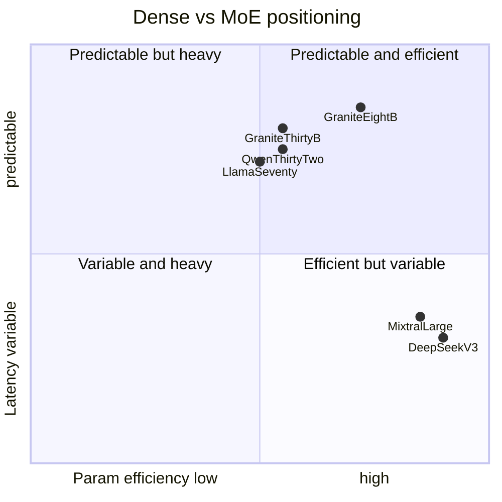

지난 1년 LLM 업계의 합의는 분명했다. "스케일을 키우려면 MoE." DeepSeek-V3, Mixtral, Qwen MoE 시리즈가 차례로 활성 파라미터 수십억을 유지하면서 총 파라미터 수백억~수천억대를 굴리는 구조를 굳혀왔다. 그런데 IBM이 어제(4월 30일) **Granite 4.1**을 풀면서 정반대 베팅을 공개했다 — decoder-only dense transformer.

흥미로운 건 결과다. 8B dense 모델이 같은 회사의 32B MoE 모델(Granite 4.0-H-Small)을 **BFCL V3에서 68.3 vs 64.7로 +3.6점 앞섰다**. ArenaHard에서도 69.0을 기록해 같은 32B MoE를 능가했다. GSM8K 92.5, DeepMind-Math 80.1로 수학 추론도 단단하다. 30B 모델은 BFCL V3 73.7로 Gemma-4-31B(72.7)를 상회한다.

## 라인업

- `granite-4.1-3b`
- `granite-4.1-8b` (실제 9B 파라미터)
- `granite-4.1-30b` (실제 29B 파라미터)
- `granite-4.1-30b-base`
- `granite-4.1-8b-fp8` (양자화)
- `granite-guardian-4.1-8b` (안전성 특화)

라이선스는 모두 **Apache 2.0**. Hugging Face `ibm-granite` 컬렉션, Ollama, IBM API 어디서든 받을 수 있다. 컨텍스트 길이는 32K → 128K → 512K로 단계적 확장 학습을 거쳤다.

## 왜 IBM은 dense를 골랐나

MoE의 장점은 명확하다. 토큰당 활성 파라미터를 줄여 추론 비용을 낮추면서 표현력은 유지한다. 그런데 이건 "평균"의 이야기다. **추론 latency의 분산이 크다.** 토큰마다 활성화되는 expert가 다르니 GPU 메모리 접근 패턴, KV 캐시 점유, 라우팅 오버헤드가 변동된다. 배치가 커질수록 라우팅 충돌이 누적된다.

엔터프라이즈·엣지 배포에서는 dense의 **예측 가능성**이 더 가치 있을 수 있다. 모든 입력이 같은 경로를 타니까 latency 분포가 좁고, 양자화·KV 캐시 최적화·온디바이스 컴파일이 단순해진다. IBM이 30B "이하"에 집중한 것도 이 맥락이다. 기업 내부 워크로드에서는 조 단위 활성 파라미터가 사실 필요 없다.

## 학습 파이프라인의 디테일

세 가지가 눈에 띈다.

1. **데이터 큐레이션**: 사후학습용 650만 샘플을 LLM-as-Judge로 필터링해 410만으로 줄였다. 양보다 질 흐름의 연장이다.
2. **4단계 RL 파이프라인**: RLHF는 수학·코딩 능력을 손상시키는 경향이 있다. IBM은 RLHF 이후 **전담 수학 RL과 코딩 RL을 따로 적용**해 능력을 복구한다.
3. **컨텍스트 단계 확장**: 32K → 128K → 512K로 늘리되 각 단계에서 짧은 컨텍스트 정확도를 측정해 후퇴 여부를 체크한다. 컨텍스트 확장하면 단축 컨텍스트 성능이 떨어지는 일반적인 함정을 피하는 장치다.

## 추론 환경별 포지셔닝

DeepSeek와 Mixtral이 MoE로 단일 모델 한계를 돌파하는 동안, IBM은 정반대 방향에서 "예측 가능한 small dense"의 한계를 끌어올리고 있다. 두 흐름은 경쟁이라기보다 분기다 — 추론 환경의 제약이 다르면 정답도 다르다.

## 의미

이번 발표는 "MoE가 답"이라는 단일 흐름에 균열을 낸다. dense가 부활한 게 아니라, **워크로드 특성에 따라 dense가 여전히 우위를 갖는 영역이 있다**는 사실이 측정 가능한 수치로 입증된 셈이다.

특히 한국에서 의미가 있다. 국내 기업의 LLM 도입은 사내 데이터와 규제 이슈 때문에 대부분 self-hosting 또는 VPC 배포로 간다. 이 환경에서 중요한 건 평균 추론 비용이 아니라 SLA가 보장 가능한 latency 상한이다. 30B 이하 dense에 Apache 2.0이라면 그 빈자리를 정확히 찌른다.

당장 ko 능력이 어떤지는 별도 검증이 필요하다(IBM은 다국어 능력을 강조했지만 한국어 벤치마크 수치는 공개하지 않음). 누군가 KMMLU·HAE-RAE 돌려보면 윤곽이 잡힐 것이다.

## 출처

- [Granite 4.1: IBM's 8B Model Matching 32B MoE — firethering.com](https://firethering.com/granite-4-1-ibm-open-source-model-family/)
- [ibm-granite 컬렉션 — Hugging Face](https://huggingface.co/ibm-granite)
- [Hacker News 토론 #47960507](https://news.ycombinator.com/item?id=47960507)
