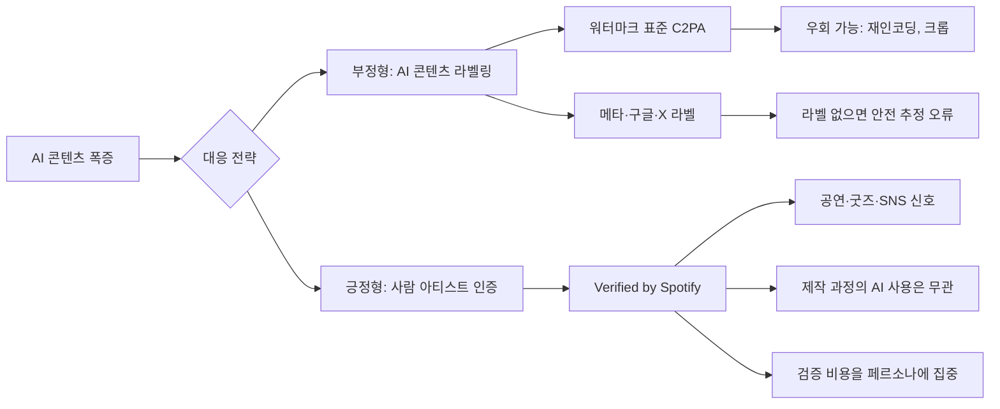

지난 1년 음악 스트리밍 플랫폼의 가장 큰 골치는 AI 생성 트랙의 범람이었다. 디퓨전 기반 음악 모델(Suno, Udio 등)이 누구나 몇 초 만에 그럴듯한 곡을 뽑아내자, 가짜 아티스트 페르소나가 차트에 올라가는 사건이 잇따랐다. 스포티파이가 어제(4월 30일) 내놓은 답은 의외였다 — **AI 콘텐츠에 라벨을 붙이는 대신, 사람 아티스트에게 인증 배지를 붙이는 것**.

새 배지의 정식 이름은 **'Verified by Spotify'**, 표시는 라이트 그린 체크마크다. 기존 10년 묵은 파란 체크 시스템을 대체한다. 핵심은 인증 기준이 "이 곡을 사람이 만들었는가"가 아니라 **"이 아티스트 페르소나가 실제 사람인가"**라는 점이다.

## 인증 기준 — '제작 과정'이 아니라 '존재 증거'

스포티파이가 제시한 자격 요건은 세 갈래다([Spotify Newsroom](https://newsroom.spotify.com/2026-04-30/verified-by-spotify-badge-artist-details/)).

- **온·오프 플랫폼에서 식별 가능한 아티스트 존재 증거** — 공연 일정, 굿즈, 연결된 SNS 계정
- **지속적 청취자 활동·참여** — 일회성 스파이크가 아니라 시간을 두고 누적된 검색·재생
- **플랫폼 정책 준수**

여기서 가장 중요한 한 줄: **"인간 아티스트가 창작 과정에 AI를 활용하는지 여부는 자격에 영향을 주지 않는다."** 스포티파이는 이 점을 따로 명시하지 않았지만, 배지 설명 어디에도 "AI 사용 금지"는 없다. 이건 의도적 설계다.

배제되는 건 **"주로 AI 생성·AI 페르소나로 보이는 프로필"**이다. 스포티파이 아티스트 파트너십 책임자의 표현은 "currently"와 "at launch" 같은 한정 단어가 들어 있다([Music Ally](https://musically.com/2026/05/01/spotifys-new-verified-badge-isnt-for-ai-artists-yet/)) — 향후 AI 페르소나도 "창작적 가치"를 입증하면 검토 여지가 있다는 뉘앙스다.

## 왜 '사람 인증' 쪽으로 틀었나

지금까지 AI 콘텐츠 대응의 디폴트는 **C2PA**(Coalition for Content Provenance and Authenticity, 어도비·MS·BBC 등이 추진하는 콘텐츠 제작 메타데이터 표준) 같은 **'AI 생성물에 워터마크를 박는다'** 방향이었다. 메타·구글·X도 이 노선을 따른다.

문제는 두 가지다. 첫째, 워터마크는 우회된다. 디퓨전 모델 출력에 박힌 invisible watermark는 재인코딩·크롭·미세 노이즈로 대부분 제거된다. 둘째, 라벨링은 **부정의 영역**이다. "이 콘텐츠는 AI다"라고 말하는 순간 라벨 붙는 모든 콘텐츠가 의심받지만, **라벨이 안 붙은 콘텐츠는 안전하다고 잘못 추론**되기 쉽다.

스포티파이 모델은 **긍정의 영역**으로 옮긴다. "이 사람은 검증된 사람이다"라고 말하면, 검증 없는 아티스트가 자동으로 "AI"가 되는 게 아니라 **"검증되지 않음"** 상태가 된다. 신인 인간 아티스트도 같은 슬롯에 들어간다 — 명확한 위계 없이 "신뢰의 한 층"만 추가된다.

또 하나, **검증 비용을 콘텐츠가 아니라 아티스트에게 부담시킨다.** 매 트랙을 분석할 필요 없이, 한 페르소나의 **공연·굿즈·SNS·청취 패턴**이라는 비교적 견고한 신호를 본다. AI가 흉내 내기 어려운 영역이다 (적어도 지금은 — AI 인플루언서 페르소나는 점점 정교해지지만, 실제 공연 일정과 굿즈 SKU까지 위조하긴 어렵다).

## 두 노선의 차이

## 한국 시장 맥락

한국은 이 문제가 더 미묘하다. 케이팝은 이미 **AI 음성 합성과 사람 보컬의 경계가 흐려진 산업**이다. 에스파의 가상 멤버 ae, 에버글로우의 AI 커버 트랙, 회사 자체가 만든 가상 아이돌 그룹 등 **"AI 페르소나"와 "사람 페르소나의 AI 활용"의 구분 자체가 산업 전략**으로 들어와 있다.

스포티파이 기준을 그대로 적용하면 **사람 멤버가 한 명이라도 있는 그룹은 인증 가능**, **순수 가상 그룹은 보류**가 된다. 일부 가상 아이돌 IP는 운영 회사가 공연(아바타 라이브)이나 굿즈를 적극 푸는데, 이 신호를 어떻게 평가할지가 후속 쟁점이다.

또 인디 신에서는 1인 프로듀서가 보컬·악기·믹싱까지 AI 협업으로 처리하는 워크플로가 늘었다. 새 배지는 이들에게 **"AI를 쓰면서도 인증받을 수 있다"**는 명시적 시그널이다 — 이 점이 한국 인디 창작자에게 가장 실질적인 변화다.

## 출시 규모와 한계

출시 시점에 스포티파이 청취자가 **실제로 검색하는 아티스트의 99% 이상**이 인증 대상이라고 한다. 절대 수로는 수십만 아티스트, 대부분 인디다. 검색량 기준이라 **롱테일은 인증 안 되는 케이스가 많을 것**으로 보인다 (이건 추측 — 정확한 분포는 공개되지 않았다).

한계도 명확하다. 인증 배지는 **"이 아티스트는 사람이다"**까지만 보장한다. **"이 곡이 AI 없이 만들어졌다"**는 보장하지 않는다. 광고·UI에서 이 차이가 흐려질 가능성이 가장 큰 리스크다. 청취자가 배지를 "이 음악은 100% 사람이 만들었다"로 오독하면, 명시적 라벨 없이 AI를 활용한 인증 아티스트를 두고 분쟁이 생긴다.

## 시사점

이 변화의 의미는 음악 산업을 넘어선다. **콘텐츠 진위 판별이 "콘텐츠 자체"에서 "창작 주체"로 이동하는 첫 사례**다. 트위터/X의 파란 체크가 한 번 무너진 후, 신뢰 인증이 다시 "주체 단위"로 돌아온다. 다음 단계는 영상(유튜브), 글(미디엄·서브스택), 코드(깃허브)일 가능성이 높다. AI 생성 자체를 막으려는 시도는 실패가 분명해졌고, **누가 책임 주체로 서명하는가**를 묻는 쪽으로 산업이 정렬되는 중이다.

## 출처

- [Verified by Spotify 공식 발표 — Spotify Newsroom (2026-04-30)](https://newsroom.spotify.com/2026-04-30/verified-by-spotify-badge-artist-details/)
- [Spotify introduces verified artist badges to help distinguish humans from AI — TechCrunch](https://techcrunch.com/2026/04/30/spotify-introduces-verified-artist-badges-to-help-distinguish-humans-from-ai/)
- [Spotify's new 'Verified' badge isn't for AI artists (yet) — Music Ally](https://musically.com/2026/05/01/spotifys-new-verified-badge-isnt-for-ai-artists-yet/)
- [Spotify's new badge identifies human artists, as AI music floods in — CBS News](https://www.cbsnews.com/news/spotify-verified-badge-ai-music/)
