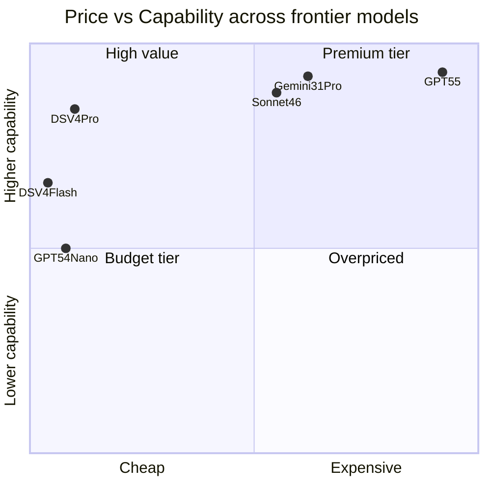

지난 4월 24일 DeepSeek가 **V4**를 풀었다. 이번에 충격을 준 건 점수보다 **세 가지 결합**이다 — frontier급 코드 성능, 1M 토큰 컨텍스트, 그리고 **MIT 라이선스**(상업 이용·재배포·수정 모두 자유로운 가장 관대한 오픈소스 라이선스). 한국 개발자·기업 입장에선 "오픈웨이트로 얼마나 frontier에 붙었나"가 한 번 더 명확해진 사건이다.

특히 가격이 무섭다. V4-Pro는 출력 1M 토큰당 **$0.87**(75% 할인 적용), Claude Sonnet 4.6의 $15, GPT-5.5의 $30과 비교하면 **약 1/17~1/35 수준**이다. 같은 Tier에서 가격을 이렇게 깎아도 코드/추론 일부 벤치마크는 frontier 두 모델을 앞선다.

## 라인업과 구조

DeepSeek V4 가족은 두 모델이다.

- **DeepSeek-V4-Pro**: 총 **1.6T 파라미터**, 활성 **49B**, **MoE**(Mixture of Experts, 입력마다 일부 전문가 sub-network만 활성화하는 아키텍처).
- **DeepSeek-V4-Flash**: 총 **284B**, 활성 **13B**, MoE.

둘 다 **컨텍스트 1M 토큰**(긴 문서·코드베이스 한 번에 입력 가능), 출력 최대 **384K 토큰**. 정밀도는 **FP4 + FP8 혼합**(FP4·FP8은 각각 4비트·8비트 부동소수점 형식. 비트 수가 적을수록 메모리·연산이 가벼움) — MoE 전문가 가중치는 FP4, 나머지는 FP8로 두어 디스크·VRAM을 압축했다. V4-Pro 가중치 다운로드 크기는 약 **865GB**, V4-Flash는 **160GB** 수준.

## 효율성: 27% FLOPs, 10% KV 캐시

이번 V4의 진짜 무게중심은 효율성에 있다. DeepSeek 자체 보고에 따르면 1M 토큰 컨텍스트에서 V4-Pro는 직전 V3.2 대비 **FLOPs**(부동소수점 연산 횟수, 추론 비용의 직접 척도)를 27%, **KV 캐시**(어텐션이 이전 토큰의 key·value를 메모리에 보관해 재계산을 피하는 영역)를 10%만 사용한다. V4-Flash는 각각 10%, 7%다. 같은 컨텍스트를 같은 GPU로 더 길게·더 싸게 굴릴 수 있다는 뜻이다.

기술적으로는 세 갈래가 합쳐졌다.

1. **하이브리드 어텐션 (CSA + HCA)**: 긴 컨텍스트에서 어텐션이 전체 시퀀스를 보지 않고도 의미를 잡도록 두 종류 어텐션을 섞었다. 이게 KV 캐시 절감의 핵심.
2. **Manifold-Constrained Hyper-Connections (mHC)**: 레이어 사이 신호 전파를 안정화하는 새 연결 구조. 깊은 모델 학습이 망가지지 않도록 잡아준다.
3. **Muon 옵티마이저**: 기존 AdamW 대신 Muon을 채택해 수렴 속도와 안정성을 높였다.

학습 토큰은 32T 이상으로 보고됐다. dense 모델 시대에 회자되던 Chinchilla 비율 따위는 이미 한참 넘어선 영역이다.

## 벤치마크: 코드는 따라잡았다

V4-Pro Max(가장 큰 추론 모드) 기준 frontier 비교다.

| 벤치마크 | GPT-5.4 xHigh | Gemini-3.1-Pro High | DS-V4-Pro Max |
| --- | --- | --- | --- |
| MMLU-Pro (지식·추론) | 87.5 | **91.0** | 87.5 |
| SimpleQA-Verified (사실성) | 45.3 | **75.6** | 57.9 |
| LiveCodeBench (실시간 코딩) | — | 91.7 | **93.5** |
| Codeforces 레이팅 | 3168 | 3052 | **3206** |
| IMOAnswerBench (수학 올림피아드) | **91.4** | 81.0 | 89.8 |

**LiveCodeBench**(Berkeley·MIT·Cornell이 만든 코딩 벤치마크. 학습 데이터 오염을 줄이기 위해 매월 새 문제를 추가하는 게 특징)에서 V4-Pro Max는 Gemini-3.1-Pro를 1.8점 앞섰다. **Codeforces**(러시아발 알고리즘 대회 사이트, 인간 프로그래머도 같은 레이팅 척도) 추정 레이팅도 GPT-5.4를 38점 앞섰다. 사실성·일반 지식은 Gemini가 여전히 우위지만, 코드 영역에선 오픈웨이트가 처음으로 frontier 두 모델을 명백히 따라잡았다.

Simon Willison은 이를 두고 "**약 3~6개월 뒤** 수준"이라 평했다. 1년 전엔 12개월~18개월 갭이라는 게 통설이었다. 격차가 빠르게 줄고 있다.

## 한국 독자에게 의미

세 가지가 동시에 일어났다.

1. **자가 호스팅 옵션이 frontier급으로 합류했다.** MIT 라이선스 + 가중치 공개라서 보안·규제 이슈로 외부 API를 쓰기 어려운 금융·공공·의료 도메인에서도 같은 모델을 사내 GPU에 띄울 수 있다. V4-Flash는 160GB 정도라 H100 80GB 두 장 + 양자화로 굴리는 게 실현 가능권에 들어왔다.
2. **API를 쓰더라도 가격이 바뀐다.** V4-Flash 입력 $0.14, 출력 $0.28는 GPT-5.4 Nano보다도 저렴하다. 한국 스타트업이 RAG/agent 인프라 비용을 다시 계산해야 하는 시점이다.
3. **벤치마크를 어디까지 믿을지가 다시 쟁점이다.** DeepSeek 자체 보고 점수다. 독립 평가(LMSYS Arena, ArtificialAnalysis)가 따라붙기까지 몇 주 더 봐야 한다. 코드 점수가 진짜인지, 사실성·툴 콜·장문맥에서 frontier와 실제 격차가 어떤지는 사용자 도메인에서 직접 시험해보는 게 빠르다.

frontier가 닫힌 모델만의 영역이라는 합의는 이제 "코드만큼은 아니다"로 좁혀졌다. 다음 분기 GPT-6이나 Claude 5가 격차를 다시 벌릴지, 아니면 오픈웨이트가 더 따라붙을지가 2026년 후반의 가장 큰 관전 포인트다.

## 출처

- DeepSeek V4 논문 (Hugging Face): https://huggingface.co/deepseek-ai/DeepSeek-V4-Flash/blob/main/DeepSeek_V4.pdf
- DeepSeek-V4-Pro 모델 카드: https://huggingface.co/deepseek-ai/DeepSeek-V4-Pro
- DeepSeek API 가격: https://api-docs.deepseek.com/quick_start/pricing
- Simon Willison, "DeepSeek V4 — almost on the frontier": https://simonwillison.net/2026/Apr/24/deepseek-v4/
- LiveCodeBench: https://livecodebench.github.io/
