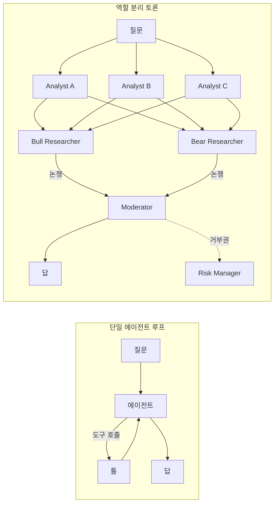

## 갑자기 다시 토론 얘기

오늘(2026-05-04) GitHub Trending daily를 열면 이상한 풍경이 보인다. 1위 근처에 `TauricResearch/TradingAgents`가 하루 3,315 스타를 먹고, 그 위쪽에 `ruvnet/ruflo`가 1,834 스타로 따라붙는다. 둘 다 단일 LLM(Large Language Model, 대규모 언어모델)을 한 번 호출하는 구조가 아니라, **여러 에이전트가 서로 다른 입장에서 논쟁하고 결론을 합치는** 구조를 핵심으로 내세운다.

같은 주에 arxiv cs.CL 신착에는 multi-agent debate(MAD, 여러 LLM 에이전트가 각자 답을 내고 서로 반박해 합의에 도달하는 추론 패턴)를 다룬 논문이 또 늘었다. DynaDebate, AgenticSimLaw, "Demystifying Multi-Agent Debate" 같은 이름이 한꺼번에 올라온다. 한 번 식었던 줄 알았던 토론 구조가 다시 떠오른다. 왜 지금일까.

## 원조 — Du et al. 2023의 단순한 아이디어

Multi-agent debate라는 이름은 2023년 5월 Du et al. 논문([arxiv:2305.14325](https://arxiv.org/abs/2305.14325))에서 굳어졌다. 아이디어는 단순하다.

1. 같은 질문을 N개의 LLM 인스턴스에 던진다.
2. 각자 답을 낸다.
3. 다른 에이전트의 답을 모두 보여주고 "다른 의견을 보고 너의 답을 다시 써봐"라고 한 라운드 더 시킨다.
4. R라운드를 반복하고 합의된 답 또는 다수결을 취한다.

이 단순한 절차만으로도 GSM8K(초등 수학 문제 벤치마크) 같은 추론 과제에서 단일 호출 대비 정확도가 의미 있게 올랐다. 핵심은 **단일 모델이 자기 답을 한번 굳히면 잘 안 흔드는데, 다른 답을 보면 흔든다**는 사실을 활용한 것이다.

## 왜 식었다가 다시 뜨는가

Du 논문이 나온 직후엔 "토큰 N배 쓰는데 이득이 그만큼인가"라는 비용 비판, "단순히 self-consistency(같은 질문 여러 번 샘플링해 다수결)와 큰 차이 없다"는 회의가 동시에 나왔다. 한동안 코딩 에이전트 쪽은 토론보다는 **단일 에이전트 + 긴 컨텍스트 + 도구 호출 루프** 방향으로 갔다. Claude Code, Cursor, Aider 같은 하네스(harness, LLM과 외부 환경을 잇고 도구 호출·상태 관리를 처리하는 얇은 실행 계층)가 그 흐름이다.

그런데 최근 두 가지가 바뀌었다.

첫째, **모델이 싸졌다.** Claude Haiku 4.5, Gemini Flash, DeepSeek 같은 라인이 등장하면서 한 질문에 5번 호출해도 단일 Opus/GPT-4 한 번보다 싸진다. 토론의 비용 부담이 약해졌다.

둘째, **단일 에이전트의 한계가 도메인별로 더 선명해졌다.** 특히 (a) 한쪽 입장으로 너무 빨리 굳는 추론, (b) 평가·검증에서 자기 답을 자기가 틀렸다고 못 하는 자기일관성 편향(self-consistency bias) — 이 두 가지는 도구 호출이 아무리 많아도 풀리지 않는다. 토론 구조는 *이 두 가지에만* 정확히 약을 친다.

## 최근 변형 — 그냥 "토론"이 아니다

2026년 들어 등장하는 multi-agent 프레임워크는 Du 원조처럼 동질의 에이전트를 N개 띄우지 않는다. **역할(role)을 다르게 쥐여준다.**

`TauricResearch/TradingAgents`가 좋은 예다. 한 종목에 대해

- Fundamentals Analyst (재무제표)
- Sentiment Analyst (소셜 무드)
- News Analyst (거시 뉴스)
- Technical Analyst (MACD, RSI 같은 기술적 지표)

가 각자 분석을 내고, 그 위에 **Bull Researcher와 Bear Researcher**가 강세/약세를 갈라 명시적으로 논쟁한다. 마지막으로 Trader 에이전트가 합치고, Risk/Portfolio Manager가 거부권을 행사한다. README에 따르면 LangGraph(다중 에이전트 워크플로우 그래프 라이브러리) 위에 올라가 있고 OpenAI/Anthropic/DeepSeek/Qwen 등 모델 백엔드를 골라 쓸 수 있다.

(저장소 자체는 "투자 자문 아니다"라고 명시한다. 여기서도 거래 성과를 보장한다고 쓰지 않는다 — 구조 패턴만 본다.)

학계 쪽도 비슷하다. AgenticSimLaw는 법정 형식으로 검사·변호·판사 역할을 분리하고, DynaDebate는 토론 중간에 막히면 별도의 검증 에이전트를 끼워 데드락을 푼다. 공통점은 **이질적 역할 + 명시적 반대 입장 + 중재자**다. 단순한 N복제 다수결과 다르다.

## 구조 비교

핵심 차이는 도구 호출 횟수가 아니라 **누가 누구에게 반대할 권한을 명시적으로 갖느냐**다. 단일 루프에서는 모델이 자기 자신에게 반대해야 하고, 보통 못 한다.

## 비판 — "이게 진짜 토론인가"

찬물도 같이 끼얹어둔다. 2025년 11월 발표된 [arxiv:2511.07784](https://arxiv.org/abs/2511.07784) "Can LLM Agents Really Debate?"는 통제된 논리 추론 과제로 MAD를 뜯어본 결과, 많은 경우 에이전트들이 **실제로 입장을 갱신하지 않고 다수 의견에 묻어가는 양상**을 보였다고 보고한다. 토론처럼 보이지만 사실은 다수결 가중치만 흔들리고 있다는 비판이다.

[arxiv:2510.25110](https://arxiv.org/abs/2510.25110) "DEBATE 벤치마크"도 같은 맥락이다 — RPLA(Role-Playing LLM Agents) 시뮬레이션에서 여론 동역학이 진짜 사람과 얼마나 닮았는지 측정해보니 차이가 컸다. 즉 "토론을 시키면 사람처럼 의견이 바뀐다"는 가정 자체가 의심받는 단계다.

## 시사점

지금 흐름을 한 줄로 줄이면 이렇다 — **도구 호출 루프(harness)는 환경과의 상호작용을 늘려줬다. 토론(debate)은 모델 내부의 단일 입장 편향을 깨려는 시도다.** 둘은 충돌하지 않는다. TradingAgents도 ruflo도, 분석 에이전트는 하네스를 그대로 쓰고 그 위에 토론 레이어를 얹는다.

다만 토론이 만능은 아니다. 11월 비판 논문이 시사하는 건 **역할만 나눠놓는다고 진짜로 다른 의견이 나오지 않는다**는 점이다. 같은 베이스 모델로 분석가와 반대자를 동시에 굴리면 결국 같은 분포에서 답이 나온다. 모델 다양성(서로 다른 베이스 모델 섞기), 입력 다양성(서로 다른 컨텍스트 분할), 강제된 반대 사전(adversarial prompt) — 이런 외부 장치 없이는 다수결로 수렴한다.

당분간 결과로 봐야 할 질문은 두 가지다. (1) 역할 분리가 정말 새로운 정보를 만들어내는가, 아니면 같은 답에 라벨만 다르게 붙이는가. (2) 5배 토큰을 쓸 만큼 이득이 큰가, 아니면 더 큰 단일 모델 한 번이 낫나. 6월쯤 이 질문에 대한 더 정량적인 비교가 나올 것 같다.

## 출처

- GitHub Trending daily, 2026-05-04 — <https://github.com/trending?since=daily>
- TauricResearch/TradingAgents — <https://github.com/TauricResearch/TradingAgents>
- ruvnet/ruflo — <https://github.com/ruvnet/ruflo>
- Du et al., "Improving Factuality and Reasoning in Language Models through Multiagent Debate" (2023) — <https://arxiv.org/abs/2305.14325>
- "Can LLM Agents Really Debate? A Controlled Study of Multi-Agent Debate in Logical Reasoning" — <https://arxiv.org/abs/2511.07784>
- "DEBATE: A Large-Scale Benchmark for Evaluating Opinion Dynamics in Role-Playing LLM Agents" — <https://arxiv.org/abs/2510.25110>
