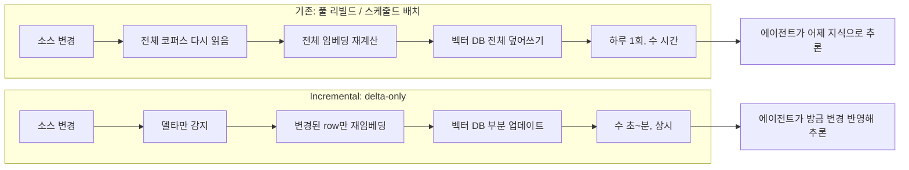

## 늘어나는 호흡, 늙어가는 인덱스

에이전트 한 번 돌릴 때 도구 호출이 5번에서 끝나던 시절은 지났다. 코딩 에이전트, 리서치 에이전트, 트레이딩 에이전트는 수십~수백 단계의 도구 호출을 한 세션에서 이어 간다. 이런 흐름을 **long-horizon agent**(한 작업을 수백 턴까지 끌고 가는 에이전트)라고 부른다.

문제는 길어지는 호흡과 그 에이전트가 의지하는 **RAG**(Retrieval-Augmented Generation, LLM이 외부 지식 베이스에서 검색해 답변에 반영하는 패턴) 인덱스의 갱신 주기 사이에 점점 큰 간극이 생긴다는 점이다. 코드베이스가 매일 수백 커밋씩 바뀌는데 인덱스는 새벽에 한 번 풀 리빌드만 한다면, 에이전트는 자기 분야의 어제 지식으로 오늘 일을 처리하게 된다.

GitHub 트렌딩에 올라오는 멀티 에이전트 프레임워크들(ruvnet/ruflo 41k★, TauricResearch/TradingAgents 67k★)이 가장 자주 부딪히는 실제 운영 이슈도 결국 이 지점이라고 cocoindex 측은 주장한다. 그래서 5월 트렌딩에서 의외의 자리(14위, 204 daily★)를 차지한 게 바로 cocoindex 같은 **incremental indexing engine**이다.

## "풀 리빌드"와 "스케줄드 배치"의 한계

지금까지 RAG 파이프라인의 두 표준이 있었다.

- **풀 리빌드**: 변화가 생기면 전체 코퍼스를 다시 임베딩해 벡터 DB에 적재. 신선하지만 비싸고 느리다. 코드베이스 한 번 임베딩에 GPU 시간과 LLM 호출이 수백 달러 단위로 나간다.
- **스케줄드 배치**: 하루 한 번 같은 주기로 풀 리빌드. 비용은 통제되지만 그 사이 데이터는 stale 상태로 머문다. 에이전트가 "방금 머지된 PR을 못 본다"는 사용자 불만이 여기서 나온다.

문제의 본질은, 변경의 99% 이상이 **델타**(delta, 변경분)임에도 매번 풀 코퍼스를 재처리한다는 데 있다. 코드 한 줄 바뀌었다고 50만 줄을 다시 임베딩하는 식이다.

## Incremental engine 패턴

cocoindex가 들고나온 모델은 단순하다.

- **선언적 target state**: 어떤 인덱스가 어디에 어떤 모양으로 있어야 하는지를 코드로 선언한다. "React for data engineering"이라는 비유를 쓴다. 사용자가 imperative한 ETL을 짜는 대신 원하는 최종 상태만 선언하면, 엔진이 소스 변화를 추적해 필요한 만큼만 재처리한다.
- **델타-only 재처리**: 소스에 5개 파일만 바뀌면 그 5개의 임베딩만 다시 계산한다. 변경이 없는 99.9%는 캐시 그대로.
- **코드 인지 캐싱**: 변환 로직(transform 함수) 자체가 바뀌면 그 변환에 영향을 받는 row만 재실행한다. 임베딩 모델을 바꾸면 임베딩만 재계산, 청킹 룰만 바꾸면 청킹부터 재실행.
- **Rust 코어 + Python DSL**: 사용자는 Python으로 `@coco.fn` 데코레이터를 붙여 변환을 정의하고, 실제 실행은 Rust 엔진이 retry, 백오프, dead-letter queue까지 산업 표준 수준으로 처리한다.

cocoindex 자체 README는 "10× cheaper at scale", "80-90% cache hits on re-index", "sub-second freshness" 같은 수치를 내세운다. 이는 회사 자체 측정이고 외부 벤치가 아니라는 점을 짚어둔다(추측 아닌 사실: 출처는 vendor README 한 곳).

지난주(4/28)에 추가된 **Kafka target connector**도 같은 줄기다. CSV 폴더를 watch하면서 새 row를 JSON으로 Kafka에 incrementally publish하는 패턴인데, "신선도를 사후에 갱신"하는 게 아니라 "원천에서 스트림으로 쏘는" 쪽으로 무게중심이 이동한다.

## 흐름 비교

## 의미

이 흐름이 의미하는 건 두 가지다.

첫째, **에이전트 인프라가 단순한 LLM API 호출 레이어를 넘어 데이터 신선도 레이어까지 포함하는 단계로 들어왔다.** LangGraph, CrewAI 같은 오케스트레이션 프레임워크가 위쪽에서 흐름을 짜는 동안, 아래쪽에선 cocoindex 같은 incremental engine이 "에이전트가 보는 세상이 늙지 않게" 하는 기반 역할을 맡는다.

둘째, **RAG 파이프라인 운영자에게 비용 곡선이 바뀐다.** 풀 리빌드 모델에서는 코퍼스 크기에 비용이 선형 비례한다. Incremental 모델에서는 변경량(delta)에 비용이 비례한다. 코퍼스가 클수록, 변경 비율이 작을수록 절감 효과가 크다는 뜻이다.

다만 incremental engine이 만능은 아니다. 변환 로직이 자주 바뀌는 실험 단계에선 캐시가 자주 무효화돼 풀 리빌드와 큰 차이가 없을 수 있고, 스키마 진화 같은 큰 변경에선 결국 풀 재처리가 필요하다. 그래서 cocoindex나 비슷한 도구를 도입할 때는 "내 코퍼스가 안정적인 변환 로직 위에서 incremental하게 자라는가"가 ROI를 가른다.

GitHub 트렌딩에 멀티 에이전트 프레임워크와 함께 데이터 인프라 도구가 같이 올라오는 풍경 자체가, 에이전트 시대의 병목이 모델에서 데이터로 옮겨가고 있다는 신호로 읽힌다.

## 출처

- [cocoindex GitHub](https://github.com/cocoindex-io/cocoindex)
- [cocoindex blog — V1 release (2026-04-22)](https://cocoindex.io/blogs/)
- [cocoindex blog — Kafka target connector (2026-04-28)](https://cocoindex.io/blogs/)
- [GitHub Trending Daily (2026-05-05)](https://github.com/trending?since=daily)
- [ruvnet/ruflo](https://github.com/ruvnet/ruflo)
- [TauricResearch/TradingAgents](https://github.com/TauricResearch/TradingAgents)
