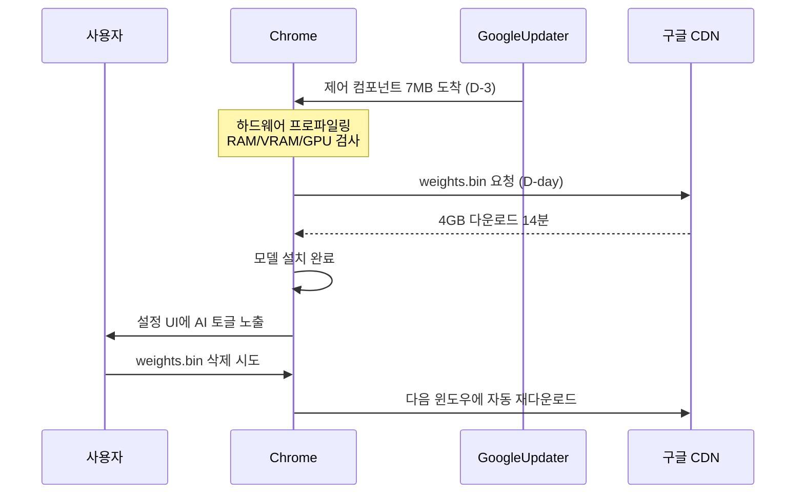

브라우저를 켰을 뿐인데, 디스크에 4기가짜리 파일이 새로 깔렸다고 가정해보자. 운영체제 업데이트도 아니고 사용자가 설치한 것도 아니다. 그것이 지난주 구글 크롬이 전 세계 일부 PC에서 한 일이다.

프라이버시 연구자 알렉산더 한프(Alexander Hanff)가 5월 4일 공개한 분석에 따르면, 크롬은 **Gemini Nano**(구글의 기기 내장형 소형 LLM, 클라우드 서버 호출 없이 사용자 기기 안에서 직접 동작하는 모델)를 동의 절차 없이 자동 다운로드해 사용자 프로파일 폴더에 저장했다. 파일 이름은 `weights.bin`, 크기는 4GB, 위치는 `OptGuideOnDeviceModel/2025.8.8.1141/weights.bin`였다.

## 무엇이 어떻게 일어났나

한프가 macOS 파일시스템 이벤트 로그(`.fseventsd`)로 추적한 타임라인은 이렇다.

- **3일 전**: 7MB짜리 제어 컴포넌트가 GoogleUpdater(크롬을 자동 업데이트하는 백그라운드 데몬)를 통해 조용히 도착.
- **D-day 16:38:54 CEST**: 크롬이 디렉터리 생성, CDN(콘텐츠 전송망, 구글이 파일을 전 세계로 배포하는 서버군)에서 다운로드 시작.
- **16:53:22**: 4GB 모델 파일 최종 배치 완료. 다운로드 총 14분 28초.
- **그 후**: 크롬 설정 화면에 "AI 기능" 토글이 등장.

핵심은 시퀀스 자체다. 다운로드가 먼저 끝나고, 거부할 수 있는 설정 UI는 그 다음에 나타났다. 한프는 분석에서 두 개의 기능 플래그 `OnDeviceModelBackgroundDownload`와 `ShowOnDeviceAiSettings`가 묶여 게이팅되는 구조를 짚으며 "설치는 사용자가 거부할 UI를 갖기 **전에** 시작된다"고 적었다.

## 왜 새로운 일인가

브라우저가 자동으로 보안 패치나 폰트 파일을 받는 건 새 일이 아니다. 새로운 건 **로컬 LLM 가중치 파일이 그 통로를 타고 들어왔다**는 점이다. 이는 두 가지를 동시에 의미한다.

첫째, **브라우저가 AI 런타임 플랫폼이 됐다.** 크롬은 사용자 하드웨어(CPU 등급, GPU 종류, 시스템 RAM, VRAM(그래픽 카드 메모리) 가용량)를 프로파일링해 16GB 이상 메모리, 충분한 GPU를 가진 기기를 골랐다. iOS의 Apple Intelligence나 안드로이드의 AI 기능은 OS 차원에서 옵트인을 받지만, 브라우저가 같은 일을 OS 위에서 별도로 해버린 사례는 이번이 사실상 첫 대규모 배포다.

둘째, **로컬 AI라는 라벨과 실제 동작이 어긋난다.** 옴니박스(주소창)에 보이는 "AI 모드" 알약은 사실 구글의 클라우드 서버로 라우팅된다. 한프는 "사용자는 아무 쓸모도 없는 4GB 바이너리의 저장 비용만 떠안는다"고 지적했다. 로컬 모델은 Help-Me-Write, 사기 탐지, 탭 요약 같은 일부 기능에서만 쓰이고, 사용자가 가장 자주 보는 AI 답변은 여전히 서버에서 온다.

## 환경 비용 추정

한프는 4GB 전송당 0.06 kg CO2e로 잡고 시나리오별로 추산했다.

- 1억 대 배포: 6,000톤 CO2e
- 5억 대 배포: 30,000톤 CO2e (런던-시드니 왕복 이코노미 승객 약 8,000명분)
- 10억 대 배포: 60,000톤 CO2e

추정치라는 점은 분명히 해두자. 하지만 사용자가 "쓰지 않는 모델"의 다운로드 비용까지 부담하게 되는 구조라면, 이런 외부효과를 누가 책임지는가는 별도 문제로 남는다.

## 흐름 도식

## 무엇이 진짜 문제인가

이 사건의 진짜 함의는 한 회사의 절차 실수가 아니라 **패턴**이다. 브라우저, OS, 메신저, 워드프로세서 같은 기존 소프트웨어가 앞으로 비슷한 방식으로 로컬 AI 모델을 silently 배포할 가능성이 높다. 모델 파일은 점점 커지고, 다운로드는 보안 업데이트 통로에 묶여 들어오며, 거부 UI는 사후에 나타난다.

크롬은 데스크톱 점유율 65% 이상이다. 한 곳이 동의 없이 깔아도 된다는 선례를 만들면, 다른 벤더가 같은 길을 가지 않을 이유가 없다. AI 회사가 모델을 만들어 클라우드로 서빙하던 시대에서, 플랫폼 회사가 모델을 사용자 기기에 직접 박아두는 시대로 넘어가는 첫 신호로 봐야 한다. 그 전환의 비용 — 디스크, 대역폭, 전력, 신뢰 — 을 누가 지불하는지가 다음 라운드의 쟁점이다.

## 출처

- 알렉산더 한프, "Chrome silently installs Gemini Nano", thatprivacyguy.com, 2026-05-04: https://www.thatprivacyguy.com/blog/chrome-silent-nano-install/
- Hacker News 토론(1,228 포인트): https://news.ycombinator.com/item?id=48029334
