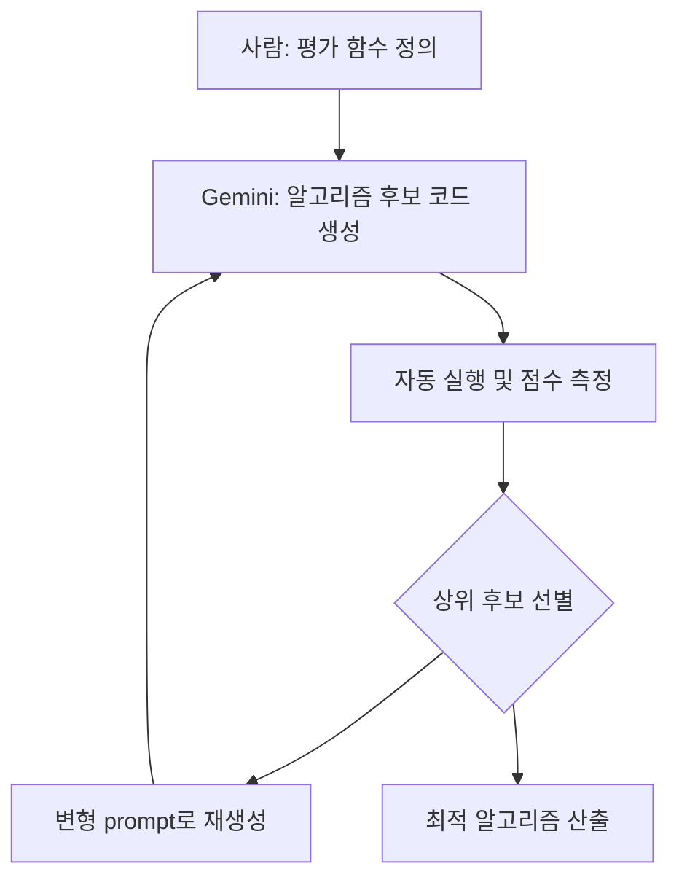

지금까지 AI 코딩은 사람이 문제를 정의하고 AI가 코드를 한 덩어리 써주는 형태였다. 그런데 DeepMind가 2026년 5월 공개한 AlphaEvolve는 거꾸로다. **사람이 평가 기준만 던져주면, Gemini가 알고리즘 후보를 수만 개 만들어 직접 시험·교배·개선하면서 더 나은 알고리즘을 찾아낸다.** 진화 알고리즘(좋은 해를 변이시키며 더 나은 해를 탐색하는 최적화 기법)과 대규모 언어모델의 코드 생성을 합친 구조다.

지금 이 토픽이 핫한 이유는 단순하다. DeepMind가 단순 데모가 아니라 **실제 분야별 측정 결과와 상업 적용 사례**를 묶어 한꺼번에 공개했기 때문이다. 게놈, 전력망, 양자 회로, 분산 데이터베이스, 물류까지 손이 닿은 범위가 넓다.

## 무엇을 얼마나 개선했나

DeepMind가 공개한 분야별 수치다.

- **DNA 시퀀싱**: PacBio와 협업한 DeepConsensus(시퀀싱 에러 보정 모델)에서 변이 검출 오류 **30% 감소**.
- **전력망 최적화**: AC OPF(AC Optimal Power Flow, 교류 전력망에서 수요·공급·송전 제약을 동시에 푸는 비선형 최적화 문제) 가용 해 탐색률을 **14%에서 88%로** 끌어올림.
- **양자 회로**: Google Willow 양자 프로세서 회로 에러율 **10배 감소**.
- **분산 데이터베이스**: Google Spanner(구글의 글로벌 분산 SQL 데이터베이스) 쓰기 증폭(write amplification, 한 번의 논리적 쓰기가 디스크에 만드는 실제 쓰기량) **20% 감소**.
- **재해 예측**: 산불·홍수·토네이도 등 20개 카테고리 자연재해 위험 예측 정확도 **+5%**.
- **수학**: Traveling Salesman Problem(외판원 문제, 모든 도시를 한 번씩 들르는 최단 경로 문제)과 Ramsey number(특정 부분구조 출현을 보장하는 그래프 크기) 하한 갱신.

상업 적용 사례는 더 구체적이다. Klarna(스웨덴 핀테크)는 자체 트랜스포머 모델 학습 속도가 **2배**가 됐고, 물류 회사 FM Logistic은 라우팅 효율이 **10.4% 개선**되어 연간 1.5만 km 이상의 운행거리를 줄였다. 화학 시뮬레이션 회사 Schrödinger는 머신러닝 기반 분자 힘장 계산이 **4배** 빨라졌다.

## 어떻게 동작하나

핵심은 단순한 루프다. Gemini가 후보 알고리즘을 코드로 여러 개 뽑고, 평가 함수가 점수를 매기고, 잘 나온 후보를 변형해서 다시 돌린다. 사람은 "무엇이 좋은 답인가"를 평가 함수로 정의하기만 하면 된다.

알고리즘 자체를 진화시키는 일은 새로운 아이디어는 아니다. 하지만 후보 생성을 LLM이 맡으면서 **탐색 공간이 단순 변이가 아니라 사람이 짠 코드와 비슷한 추상화 수준에서 움직인다**는 점이 차이다. 그래서 행렬 곱셈처럼 수학적으로 잘 정의된 문제뿐 아니라, 캐시 교체 알고리즘이나 컴파일러 최적화처럼 사람이 코드로만 다루던 영역까지 들어왔다.

## 한계 — 평가 함수가 곧 병목

Hacker News 토론에서 가장 자주 나온 비판은 이거다. **AlphaEvolve는 평가 함수가 잘 정의된 도메인에서만 동작한다.** 행렬 곱, 칩 설계, 라우팅, 컴파일러 — 모두 "더 빠르냐", "더 짧냐", "에러가 더 적냐"가 숫자로 떨어지는 분야다. 반면 일반 업무 코드, 제품 디자인, 비즈니스 로직은 "이 코드가 더 좋다"를 한 줄 함수로 쓰기 어렵다.

또 하나는 인프라 비용이다. 후보 수만 개를 만들고 실행해 점수를 매기는 구조라 평가 한 번이 비싼 분야(예: 실험실 검증이 필요한 약물 후보)에는 그대로 적용하기 어렵다. DeepMind 사례 대부분이 실행 비용이 거의 0에 가까운 코드 최적화·시뮬레이션이라는 점은 이 한계를 보여준다.

## 시사점

"AI가 코드를 다 짠다"는 시나리오와 AlphaEvolve가 보여주는 그림은 결이 다르다. 후자에서 사람의 일은 줄어드는 게 아니라 **상위 레이어로 옮겨간다** — 무엇이 좋은 알고리즘인지 평가 함수로 정의하고, 결과를 검증하고, 도메인의 제약을 코드 가능한 형태로 옮기는 작업. 자동화가 침투할수록 "좋은 평가 함수를 쓸 줄 아는 사람"의 가치가 더 올라간다는 역설이 생긴다.

당장 한국 일반 개발자가 내일부터 AlphaEvolve를 쓸 수 있는 건 아니다. 다만 데이터센터 인프라, 칩 설계, 분산 시스템 같은 곳에서 알고리즘이 슬그머니 좋아지는 흐름은 확실히 시작됐다. 우리가 쓰는 클라우드 서비스의 지연이 어느 날 조용히 짧아진다면, 그 뒤에는 이런 종류의 자동화가 한 번 돌고 있을 가능성이 있다.

## 출처

- DeepMind, "AlphaEvolve: Gemini-powered coding agent scaling impact across fields", 2026-05-07. https://deepmind.google/blog/alphaevolve-impact/
- Hacker News 토론. https://news.ycombinator.com/item?id=48050278
