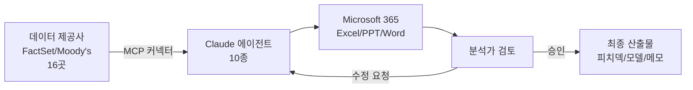

ChatGPT나 Claude에 "이 회사 재무제표 보고 DCF(Discounted Cash Flow, 미래 현금흐름을 현재가치로 환산하는 기업가치 평가법) 모델 만들어줘"라고 시켜본 적 있다면, 답이 그럴듯해 보여도 실제 IB(Investment Banking, 투자은행) 데스크에서 그대로 쓰기는 어렵다는 걸 안다. 데이터 출처가 흔들리고, 회계 형식이 회사마다 다르고, 검증 단계가 빠져 있다.

Anthropic이 5월 5일 공개한 **Claude for Financial Services**는 그 격차를 메우려는 묶음이다. 일반 챗봇이 아니라 **금융 업무 맞춤 에이전트 10종 + 외부 데이터 커넥터 16개 + Microsoft 365 add-in**을 한 패키지로 합쳤다. 발표 다음 날 GitHub 트렌딩 1위에 올라 하루 만에 별이 3,600개 넘게 쌓였다.

지금 핫한 이유는 두 가지다. 첫째, Citadel·BNY·Carlyle·Mizuho·Walleye Capital·Hg 같은 IB·운용·핀테크 회사들이 이미 사용 중인 사례가 함께 공개됐다. 둘째, 같은 주에 Anthropic이 Blackstone·Goldman Sachs·Hellman & Friedman과 손잡고 별도의 엔터프라이즈 AI 회사를 세운다고 발표했다. 즉 모델 회사가 금융 vertical에 본격적으로 들어가고 있다는 신호다.

## 무엇이 들어있나

10개 에이전트 템플릿이 두 그룹으로 나뉜다.

**리서치·커버리지(영업·뱅킹 데스크)**:
- Pitch builder — 비교기업 분석·선례 거래·LBO(Leveraged Buyout, 차입 활용 기업 인수) 자료를 받아 피치덱 초안 생성
- Meeting preparer — 클라이언트 미팅 브리핑 묶음
- Earnings reviewer — 실적 발표·공시를 모델 업데이트로 반영
- Model builder — DCF·LBO·3-statement(손익·재무상태·현금흐름 3종 통합)·비교기업 분석을 Excel에 만든다
- Market researcher — 섹터·경쟁사·peer comp 정리

**파이낸스·오퍼레이션(펀드 관리·중간/백오피스)**:
- Valuation reviewer — GP(General Partner, 펀드 운용사) 패키지 입수 및 LP(Limited Partner, 펀드 투자자) 보고용 단계 정리
- GL reconciler — 일반원장 차이 탐지와 원인 추적
- Month-end closer — 발생주의 항목·롤포워드·변동 코멘터리
- Statement auditor — LP 명세서 감사
- KYC screener — KYC(Know Your Customer, 고객 확인 절차) 문서 파싱 + 룰 엔진 실행

각 에이전트는 슬래시 명령으로 호출된다. `/comps`(비교기업), `/dcf`, `/lbo`, `/earnings`, `/ic-memo`(투자위원회 메모), `/dd-checklist`(실사 체크리스트) 같은 식이다. 분석가가 외울 명령은 적고, 분기마다 반복되는 작업이 그대로 들어간다.

## 어디서 데이터를 가져오나

vertical 에이전트가 일반 챗봇과 갈리는 결정적 지점이 외부 데이터 통합이다. Claude for Financial Services는 16곳 가까운 데이터 제공사와 MCP(Model Context Protocol, Anthropic이 표준화한 AI ↔ 외부 시스템 연결 규격) 커넥터로 연결된다.

새로 추가된 곳: Dun & Bradstreet, Fiscal AI, Financial Modeling Prep, Guidepoint, IBISWorld, SS&C Intralinks, Third Bridge, Verisk. 기존: FactSet, S&P Capital IQ, MSCI, PitchBook, Morningstar, LSEG, Daloopa. 별도 MCP 앱으로 Moody's가 6억 건 이상의 기업 신용·등급 데이터를 붙인다.

이렇게 데이터 출처가 정해져 있으면 분석가가 "이 숫자 어디서 나왔어?"라고 물었을 때 "FactSet 2026 1분기 데이터"라고 답할 수 있다. 일반 RAG(Retrieval-Augmented Generation, 검색 증강 생성 — 외부 문서를 찾아 LLM에 넣어주는 패턴)가 흔히 빠지는 출처 흐림 문제를 처음부터 차단한 구조다.

## 어디에 배치하나

배포 옵션은 셋이다.

1. **Cowork 플러그인** — 유료 Claude 플랜에서 바로 설치
2. **Managed Agents** — Claude Platform의 관리형 에이전트(public beta). 자기 인프라 없이 API로 호출
3. **Cookbooks** — 자체 구현용 레시피

Microsoft 365 add-in이 합쳐진 점이 데스크 입장에서 결정적이다. 분석가들이 실제로 작업하는 곳이 Excel·PowerPoint·Word다. Outlook 통합은 곧 추가 예정.

## 측정 가능한 차이

Vals AI의 Finance Agent 벤치마크(금융 업무 시뮬레이션 정확도 평가)에서 Claude Opus 4.7이 **64.37%**로 1위. 일반 지식 평가가 아니라 금융 워크플로 정확도를 따로 측정한 축이다. 앞으로 vertical agent 비교 기준이 될지는 아직 모르지만, Anthropic이 자기 모델의 도메인 적합성을 숫자로 같이 내놓은 셈이다.

## 시사점

지금까지 LLM 영업 사이클은 "범용 모델로 뭐든 다 됩니다"였다. 5월 5일 발표는 그 반대 방향이다 — **도메인 지식·데이터 출처·검증 흐름을 묶어 vertical 패키지로 판매**한다. 같은 주의 Blackstone·Goldman Sachs 합작 회사 발표와 묶어보면 패턴이 분명해진다. 데이터·규제·툴이 표준화돼 있으면서 단가가 높은 도메인(금융·의료·법률)에 모델 회사들이 직접 들어가는 흐름이다.

한국 입장에서 두 가지가 의미 있다. 첫째, 국내 금융사들이 이미 GPT·Claude로 내부 PoC(Proof of Concept, 개념 검증)를 돌리고 있는데, vertical 패키지가 표준이 되면 자체 RAG 구축 vs 패키지 도입의 트레이드오프가 더 명확해진다. 둘째, vertical 에이전트는 데이터 제공사 입장에서 새로운 유통 채널이다. Anthropic이 Moody's·FactSet을 직접 묶었듯, 한국신용평가·에프앤가이드 같은 국내 금융 데이터가 MCP 커넥터로 묶이는 시기도 머지않다.

핵심은 모델 자체가 아니라 **모델·데이터·평가·배치를 한 묶음으로 묶는 능력**이 새 경쟁 축이 됐다는 점이다. 이번 발표가 그 첫 실증이다.

## 출처

- Anthropic, "Agents for financial services", 2026-05-05. https://www.anthropic.com/news/finance-agents
- GitHub `anthropics/financial-services`. https://github.com/anthropics/financial-services
- GitHub Trending (Daily) 2026-05-09. https://github.com/trending?since=daily
