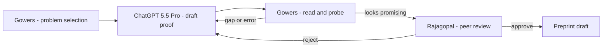

수학에는 "필즈 메달(Fields Medal)"이라는 상이 있다. 노벨상에 수학 부문이 없어서 사실상 그 자리를 대신하는 상이다. 2026년 5월 8일, 2006년 수상자인 케임브리지 교수 Tim Gowers가 블로그에 짧은 실험기를 올렸다. 제목은 "A recent experience with ChatGPT 5.5 Pro". 내용은 단순하다 — **자신 분야의 미해결 문제를 ChatGPT 5.5 Pro에 줘봤더니, 17분 만에 기존 결과를 능가하는 새 상한(upper bound)을 들고 왔다**는 것이다.

이 글은 Hacker News에서 단숨에 554점을 얻었고, "최첨단 LLM이 정말 새 지식을 만들 수 있는가"에 대해 지금까지 나온 가장 구체적인 사례로 회자되고 있다.

## 어떤 문제였나

Gowers가 사용한 문제는 동료 수학자 Mel Nathanson이 최근 발표한 **가산적 정수론(additive number theory)** 분야의 미해결 문제였다. 비전공자에게도 어렵지 않게 설명할 수 있다.

정수 집합 A에서 원소 h개를 골라 더한 모든 결과를 모아 집합 hA를 만든다. A = {1, 3, 7}, h = 2면 hA = {2, 4, 6, 8, 10, 14}. Nathanson의 질문은 "|A| = k일 때, A의 지름(최댓값과 최솟값 차)이 얼마나 작아도 hA가 특정 형태가 될 수 있는가"였다. 본인 구성으로는 지름이 **k에 대해 지수적으로(2^k − 1) 커야** 했고, 이게 정말 필요한 한계인지가 열려 있었다.

## 17분, 두 번의 개선

Gowers는 이 문제를 그대로 모델에 던졌다.

**1차 (17분):** 모델은 **2차(quadratic) 지름**이면 충분하다는 구성을 만들어냈다. k²에 비례하는 지름. Nathanson의 지수적 한계를 단숨에 깨버린 결과다.

**2차:** 일반화된 h에 대해서도 모델은 지수적 상한을 **다항식 상한**으로 개선했다. 정확히는 임의의 α > 1/2에 대해 k^α 지수.

핵심 아이디어는 **h²-dissociated set**(서로의 합 표현이 거의 겹치지 않는 집합 — 가산적 정수론의 도구)을 써서 "기하급수의 절반을 다항식 구간 안에 짜넣는" 구성이었다. Gowers의 협업자 Isaac Rajagopal은 이걸 보고 "독창적이고 영리하다(original and clever) — 내가 몇 주 고민해야 떠올렸을 아이디어"라고 평가했다. 최종 preprint까지 작성됐고, Rajagopal은 기술적·개념적으로 "almost certainly correct"라고 판정했다.

## 무엇이 새로웠고, 무엇은 그대로인가

오해하지 말아야 할 부분이 있다. 이건 **"AI가 새 수학을 발견했다"가 아니라 "최정상급 수학자가 AI를 도구로 써서 새 결과를 도출했다"** 가 정확한 표현이다. 문제 선택, 검증, 의미 부여 — 모두 Gowers와 Rajagopal이 했다.

하지만 Gowers 본인은 글에서 더 큰 변화를 짚는다.

> "박사 과정 학생을 가르치는 일이 방금 어려워졌다. 학생을 시작시키는 가장 흔한 방법이 비교적 부드러운(gentle) 미해결 문제를 주는 것이었기 때문이다."

미해결이지만 풀릴 만한 "가벼운" 문제로 첫 논문을 쓰는 길은 학계의 표준 트랙이었다. 그런데 그 정도 난이도면 이제 ChatGPT 5.5 Pro가 17분에 해버린다. Gowers는 또 **접근성 격차**도 짚었다. 월 단위로 비싼 모델 — 자원이 부족한 연구자가 같은 도구를 못 쓰면 AI가 만든 새 표준이 곧 격차가 된다.

## 협업 구조

ChatGPT는 "증명 후보를 빠르게 생성하는 엔진" 역할이다. 무엇이 가치 있는 문제인지는 인간이 정하고, 모델이 내놓은 논증의 빈틈을 사람이 찌르고, 모델이 다시 시도한다. 코딩에서 익숙한 agent-in-the-loop 패턴과 본질적으로 같다 — 산출물이 코드 대신 증명일 뿐.

## 결론

첫째, 최첨단 LLM은 이미 **수학 연구의 보조 저자 수준에 도달**했다. 도메인 전문가 검증을 통과해 preprint에 들어갈 논증을 17분 단위로 만들어낸다.

둘째, **'쉬운 미해결 문제'의 가치가 빠르게 무너지고 있다**. 학계 진입 트랙, 박사 과정 모델, 공로(credit) 분배 — 모두 다시 그려야 한다. Gowers가 글 끝에 던진 질문 — "수학자가 LLM과 함께 만든 발견을 우리는 그 수학자의 업적으로 인정할 것인가?" — 은 앞으로 몇 년간 이 분야가 정면으로 마주할 문제다.

큰 그림에서, 이 사건은 **"AI는 일반 사무직만 노린다"는 가정이 흔들리는 분기점**이다. 가산적 정수론은 인간이 모델을 fine-tune할 때 의식적으로 가르치는 분야가 아니다. 그런데도 결과가 나왔다. 같은 일이 화학, 물리, 생물 통계, 법률 분석에서 어디까지 일어날지가 앞으로 1년의 관전 포인트다.

## 출처

- Tim Gowers, "A recent experience with ChatGPT 5.5 Pro" (2026-05-08): https://gowers.wordpress.com/2026/05/08/a-recent-experience-with-chatgpt-5-5-pro/
- Hacker News 토론: https://news.ycombinator.com/item?id=48075144
- 배경 — Mel Nathanson, additive number theory에 관한 최근 preprint들 (Gowers 글 안 인용 링크 참조)
