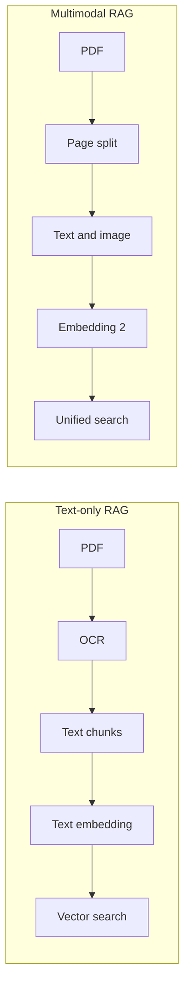

기업 자료실에 PDF 보고서 수천 개가 쌓여 있다고 가정해보자. 대부분의 핵심은 본문 텍스트가 아니라 **표, 차트, 다이어그램**에 들어 있다. 매출 추이, 시장 점유율, 시스템 구조도 — 이런 것들은 이미지로 박혀 있어 키워드 검색에 잡히지 않는다. 사람이 PDF를 한 장씩 넘기며 눈으로 찾는다.

지금까지 AI 검색도 이 한계를 그대로 물려받았다. 5월 5일 구글이 공개한 Gemini API의 File Search 업데이트는 이 벽을 일부 허문다. PDF 안 이미지·차트를 별도 처리 없이 같은 검색에 통합한다는 것이 핵심이다.

## 무엇이 바뀌었나

먼저 용어부터. **RAG**(Retrieval-Augmented Generation, 검색 증강 생성)는 LLM이 답변하기 전에 외부 자료에서 관련 부분을 먼저 찾아와 함께 보고 답하게 하는 구조다. ChatGPT가 "내 회사 매뉴얼에 따라 답변해줘"를 가능하게 만드는 부품이 바로 RAG다.

기존 RAG는 거의 다 **텍스트 임베딩** 기반이었다. 임베딩(embedding)은 문장을 숫자 벡터로 바꿔 의미가 가까운 것끼리 가깝게 배치하는 기법이다. 텍스트만 다루다 보니 이미지가 들어간 PDF는 별도 OCR(광학 문자 인식)을 돌려 글자만 뽑아낸 뒤 처리해야 했고, 차트의 시각적 의미는 그냥 버려졌다.

이번 업데이트는 세 가지를 동시에 도입했다.

- **멀티모달 검색**: 텍스트와 이미지가 한 임베딩 공간에 같이 들어간다. "2025년 매출 그래프"라고 검색하면 텍스트 단락뿐 아니라 차트 이미지도 후보에 오른다.
- **페이지 단위 인용**: 검색 결과가 어느 PDF 어느 페이지에서 왔는지 자동으로 표시된다. "환각"(hallucination, AI가 사실이 아닌 내용을 그럴듯하게 생성하는 현상) 검증이 쉬워진다.
- **커스텀 메타데이터 필터**: 부서·연도·작성자 같은 키-값 태그로 검색 범위를 좁힐 수 있다.

이 멀티모달 능력의 엔진은 같은 시기 공개된 **Gemini Embedding 2**다. 텍스트, 이미지, 비디오, 오디오, 문서를 하나의 임베딩 공간으로 매핑하는 모델로, "구글의 첫 네이티브 멀티모달 임베딩 모델"이라고 회사가 직접 표현했다.

## 기존 RAG 파이프라인과 차이

차이는 분기점이다. 기존 파이프라인은 PDF를 받자마자 글자만 뽑아내 시각 정보를 손실 처리했다. 새 파이프라인은 페이지 단위로 텍스트와 이미지를 같이 묶어 통째로 임베딩한다. 검색 단계에서 두 양식을 합칠 필요가 없어진다 — 처음부터 같은 공간에 있기 때문이다.

## 실제로 어떤 일이 가능해지는가

구글 블로그가 인용한 초기 사용 사례는 토픽이 갈린다.

- **K-Dense Web**(생명과학 검색 도구): 웨스턴 블롯, 현미경 사진, 에이전트가 생성한 그래프를 한 쿼리로 동시에 뒤진다. 전통적으로는 텍스트 논문 검색과 이미지 데이터베이스가 분리돼 있었다.
- **Klipy**(GIF 라이브러리): 거대한 GIF 모음에서 의미 기반 검색. 파일명·태그가 아닌 "장면이 어떤 감정인지"로 찾는다.
- **Code Fundi**(개발자 도구): 오픈소스 프로젝트의 아키텍처 다이어그램, ERD, 시퀀스 다이어그램을 인덱싱해 코딩 에이전트에게 "사진 같은 기억"을 부여한다. 코드만 읽던 에이전트가 시스템 구조도까지 같이 본다.

세 사례 모두 **이미지가 1급 시민**이라는 공통점이 있다. 텍스트의 부속물이 아니라 검색 자체의 대상이다.

## 가격과 한계

운영 측면도 가볍다. 스토리지는 무료, 쿼리 시점 임베딩 비용도 무료. 인덱싱 시점의 임베딩 토큰과 답변 생성에 들어가는 문서 토큰만 과금된다. 무료 티어 1GB, 유료 티어 1TB까지 저장한다.

다만 한계도 분명하다. 이미지 해상도는 4K x 4K 이내, 단일 파일 100MB 이내로 제한된다. **오디오와 비디오는 아직 지원하지 않는다** — 멀티모달이라고 해도 현재 범위는 사실상 "텍스트 + 정지 이미지 + 문서"다. 한 store가 20GB를 넘으면 검색 지연이 눈에 띄게 늘어난다는 가이드도 있다.

## 의미

ChatGPT의 검색·요약 기능, Claude의 Projects 같은 제품들은 모두 안쪽에 RAG를 깔고 있다. 그 RAG의 입력 양식이 텍스트에서 이미지로 확장되면 사용자 입장에서 보이는 변화는 단순하다 — 같은 PDF를 던졌을 때 답변의 근거가 더 풍부해진다. 차트 안 숫자, 다이어그램의 화살표, 손글씨 메모까지 검색 결과로 올라온다.

OpenAI의 Vector Stores, Anthropic의 Files API도 비슷한 방향으로 가고 있고, 이번 구글의 발표는 그 경쟁이 이미지 양식까지 끌고 들어왔다는 신호다. 사람이 자료를 읽는 방식과 AI가 자료를 읽는 방식의 간격이 한 칸 좁아졌다.

## 출처

- [Gemini API File Search is now multimodal — Google Blog](https://blog.google/innovation-and-ai/technology/developers-tools/expanded-gemini-api-file-search-multimodal-rag/)
- [Gemini Embedding 2 — Google Blog](https://blog.google/innovation-and-ai/models-and-research/gemini-models/gemini-embedding-2/)
- [File Search 기술 문서 — ai.google.dev](https://ai.google.dev/gemini-api/docs/file-search)
- [Building with Gemini Embedding 2 — Google Developers Blog](https://developers.googleblog.com/building-with-gemini-embedding-2/)
