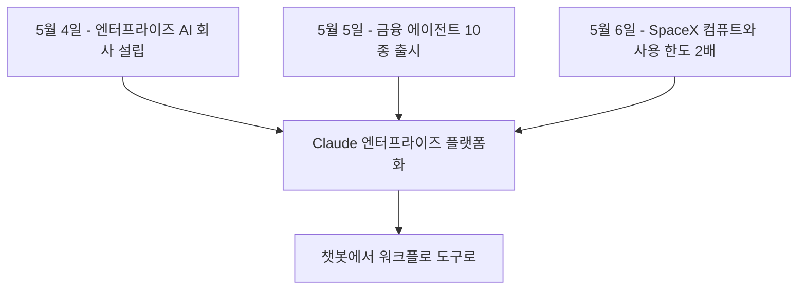

5월 4일부터 6일까지 사흘 사이, Anthropic은 굵직한 발표를 세 건 연달아 내놨다. 새 엔터프라이즈 AI 서비스 회사 설립, 금융 산업용 Claude 에이전트 10종 출시, SpaceX 데이터센터 확보와 사용 한도 두 배 상향. 따로 보면 각자의 뉴스지만, 묶어서 보면 한 방향이 보인다. Claude를 "질문에 답해주는 챗봇"에서 "기업의 업무를 대신 처리하는 도구"로 옮기려는 시도다.

## 5월 4일: 중견 기업 Claude 도입 회사

Anthropic은 Blackstone, Hellman & Friedman, Goldman Sachs 세 대형 사모펀드와 함께 새 엔터프라이즈 AI 서비스 회사를 만든다고 발표했다. General Atlantic, Apollo, Sequoia Capital, GIC 등도 컨소시엄에 참여한다.

목적은 단순하다. 중견 기업이 Claude를 자기 업무 시스템에 붙이는 일을 전담해 주는 회사다. Anthropic의 Applied AI 엔지니어들이 고객사 운영 방식을 파악하고, 의료·금융·제조 같은 산업별로 맞춤 솔루션을 만든다. 회사 이름은 아직 공개되지 않았다.

이게 의미하는 바는 분명하다. "API를 줄 테니 알아서 갖다 써라" 모델이 아니라 "우리가 직접 들어가서 깔아 드리겠다" 모델이다. 모델을 파는 회사가 아니라 솔루션을 파는 회사로 한 발 더 들어선 셈이다.

## 5월 5일: 금융 에이전트 10종 템플릿

하루 뒤 Anthropic은 Claude for Financial Services를 발표했다. 사전 제작된 에이전트 템플릿 10종이다.

- 연구·클라이언트 영역: 피치북 작성, 실사, 실적 검토, 재무 모델 구축, 시장 조사
- 재무·운영 영역: 가치평가 검토, 총계정원장 조정, 월말 결산, 재무제표 모니터링, KYC(Know Your Customer, 금융기관이 거래 고객 신원과 자금 출처를 확인하는 규제 절차) 심사

Claude는 Excel, PowerPoint, Word에 직접 연결돼 작업 사이의 맥락이 유지된다. 데이터 커넥터로 Dun & Bradstreet, Verisk, Guidepoint, IBISWorld 등이 붙고, Moody's는 MCP(Model Context Protocol, AI 모델이 외부 데이터·도구에 연결하는 표준 프로토콜) 앱 형태로 6억 개 이상 기업의 신용 데이터를 공급한다.

공개된 고객 명단도 무게가 있다. Citadel(헤지펀드), BNY(미국 최대 수탁은행), Mizuho(일본 대형 은행), Carlyle(사모펀드), Travelers(보험), Walleye Capital, Hg.

성능 수치도 같이 공개됐다. Vals AI의 Finance Agent 벤치마크(금융 업무용 에이전트 능력을 측정하는 평가)에서 Claude Opus 4.7이 64.37%를 기록해 업계 1위라고 한다. 절대 수치가 100% 근처는 아니라는 점은 짚어둘 만하다. 아직 사람의 검토 없이 마무리되는 일은 적다는 뜻이기도 하다.

## 5월 6일: SpaceX 데이터센터 + 사용 한도 두 배

이튿날 Anthropic은 SpaceX의 Colossus 1 데이터센터 전체 용량을 쓰기로 했다고 발표했다. 300MW(메가와트, 데이터센터 전력 용량 단위. 1MW가 대략 1천 가구가 동시에 쓸 수 있는 전력 규모) 규모에 NVIDIA GPU 22만 장이 들어간다. 한 달 내 가동 예정이다.

같은 발표에 사용자 측 변화도 함께 들어 있다.

- Claude Code(터미널에서 도는 Claude 코딩 에이전트) 5시간 rate limit 2배 상향 (Pro·Max·Team·Enterprise 모두 적용)
- Pro·Max 사용자의 피크 시간대 제한 제거
- Claude Opus API rate limit 대폭 상향

피크 시간대 제한 제거는 한국 시간 기준 새벽에서 오전 사이 미국 업무 시간이 겹쳐 한도가 빨리 닳던 사용자에게 실질적인 변화다. 컴퓨트를 더 확보했으니 한도를 풀 수 있게 됐다는 단순한 이야기이기도 하다.

## 사흘을 한 그림으로 보면

세 발표는 따로 보면 잡지 기사 세 편이지만, 묶어서 보면 같은 이야기다. 도입 채널(엔터프라이즈 회사), 사용 패턴(산업별 템플릿), 인프라(데이터센터와 한도 확장). Claude를 "직접 가서 깔고, 산업별 시나리오를 미리 만들어 두고, 그걸 받아낼 컴퓨트도 확보한다"는 풀스택 흐름이다.

## 무엇이 바뀌는가

지난 1-2년간 모델 성능 경쟁이 주류였다. 누구의 모델이 어떤 벤치마크에서 몇 점 더 높은지가 헤드라인을 채웠다. 2026년 5월부터 경쟁의 무게중심이 옮겨가는 신호가 보인다. "이 모델을 어떻게 실제 일에 끼워 넣을 것인가"가 본격적인 격전지가 된다.

Anthropic은 사흘 만에 그 답을 세 방향에서 동시에 던졌다. 모델을 더 똑똑하게 만드는 일은 그대로 가되, 그 위에 도입 컨설팅 회사를 얹고, 가장 돈이 도는 산업(금융)부터 사전 조립된 워크플로를 박아 넣고, 인프라를 두 배로 키웠다. 다음 분기에 누가 얼마나 깊게 기업 업무에 박히느냐가 시장 점유율을 정할 가능성이 크다.

일반 사용자 입장에서 가장 직접적인 변화는 Claude Code 한도 두 배와 피크 시간 제한 제거다. 가장 큰 그림은, Claude가 "대화창" 바깥의 일을 점점 더 많이 떠맡기 시작했다는 것이다.

## 출처

- [Higher usage limits for Claude and a compute deal with SpaceX](https://www.anthropic.com/news/higher-limits-spacex) — Anthropic, 2026-05-06
- [Agents for financial services](https://www.anthropic.com/news/finance-agents) — Anthropic, 2026-05-05
- [Building a new enterprise AI services company with Blackstone, Hellman & Friedman, and Goldman Sachs](https://www.anthropic.com/news/enterprise-ai-services-company) — Anthropic, 2026-05-04
- [Anthropic newsroom](https://www.anthropic.com/news)
