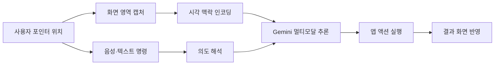

마우스 포인터는 40년 동안 거의 그대로였다. 화살표가 움직이고, 클릭하면 뭔가 열리고, 드래그하면 뭔가 옮겨진다. 그 단순함이 데스크톱 컴퓨팅의 표준이 됐다. 그런데 구글 딥마인드가 5월 12일 공개한 "AI Pointer" 프로젝트는 이 작은 화살표를 AI 에이전트의 입력 채널로 바꾸자고 제안한다. 포인터가 가리키는 것이 무엇인지, 그리고 왜 사용자가 그것을 가리키는지를 Gemini가 함께 해석한다.

핵심은 "Fix this", "Move that" 같이 사람끼리 옆에서 말할 때 쓰는 짧은 지시어를 컴퓨터가 이해하도록 만드는 것이다. 지금까지는 AI에게 뭔가 시키려면 별도 챗봇 창을 열고, 무엇을 어디서 어떻게 바꿔야 하는지 문장으로 다 설명해야 했다. AI Pointer는 그 설명 부담을 시각적 맥락이 대신하게 한다.

## 무엇이 새로운가

딥마인드는 네 가지 원칙을 공개했다.

1. **흐름 유지(Maintain the flow)** — 별도 앱이 아니라 사용자가 이미 쓰는 모든 앱 위에서 작동한다. 챗봇 창으로 컨텍스트 스위칭하지 않는다.
2. **보여주고 말하기(Show and tell)** — 포인터가 위치한 곳의 시각·의미적 맥락을 시스템이 자동으로 캡처한다. 사용자가 길게 설명할 필요가 없다.
3. **약어 수용(Embrace shorthand)** — "이거 고쳐", "이걸 옮겨"처럼 사람끼리 쓰는 대명사 기반 표현을 AI가 그대로 받는다.
4. **픽셀을 객체로(Transform pixels)** — 화면에 그려진 날짜·장소·표 같은 시각 요소를 구조화된 엔티티로 변환해 다른 작업에 바로 연결한다.

발표에서 시연된 능력은 다음과 같다. 이미지에서 특정 사물을 가리키며 "이거 지워" 하면 인페인팅이 실행된다. PDF 문서의 한 단락을 가리키며 "요약해서 메일에 붙여" 하면 요약본이 다른 앱으로 흘러간다. 표를 가리키며 "차트로 만들어" 하면 시각화가 생성된다. 레시피의 분량 표시를 가리키며 "두 배로" 하면 모든 재료가 비례 조정된다.

기술적 디테일은 의외로 적게 공개됐다. 어떤 Gemini 변종(Nano·Pro·Flash 등 라인업 중 어느 것)이 돌아가는지, 온디바이스인지 클라우드인지, 응답 지연이 얼마인지는 발표에 없다. 저자로 Adrien Baranes·Rob Marchant 두 연구원이 실려 있고, 현재는 Google AI Studio 데모와 Chrome 안의 Gemini 통합, 그리고 새로 발표된 Googlebook 노트북의 "Magic Pointer" 기능, Google Labs의 Disco 플랫폼으로 단계적 롤아웃이 예고된 상태다.

## 왜 이게 지금 핫한가

세 가지 흐름이 동시에 모인다.

첫째, **에이전트 UX의 위치 이동**이다. 2025-2026년에 걸쳐 AI 에이전트는 별도 챗봇 창에서 "사람이 보는 화면 그 자체"로 옮겨가는 중이다. Anthropic의 Computer Use, OpenAI의 Operator, 그리고 이번 AI Pointer까지 모두 같은 방향이다. 차이는 입력 채널이다. Computer Use·Operator는 에이전트가 스스로 화면을 보고 클릭한다. AI Pointer는 그 반대로, **사람이 가리키는 곳을 에이전트가 본다**. 자율 에이전트(agent-first)와 사람-주도 협업(human-pointing) 두 갈래가 동시에 발전하고 있다는 신호다.

둘째, **멀티모달 컨텍스트 비용의 하락**이다. 1년 전이면 화면 영역을 실시간으로 캡처해 모델에 넣는 것이 비쌌다. 지금은 Gemini Flash·Nano 같은 저지연·저비용 멀티모달 모델이 늘면서 "포인터 주변 픽셀을 매 동작마다 모델에 보낸다"가 현실적으로 가능해졌다.

셋째, **OS·브라우저 경쟁**이다. Chrome 안의 Gemini 통합과 Googlebook 노트북에 들어가는 "Magic Pointer"는 단순한 데모가 아니라 OS·브라우저 레벨 진입 시도다. 애플이 Siri·Apple Intelligence로, 마이크로소프트가 Copilot으로 노리는 자리를 구글이 포인터라는 가장 익숙한 인터페이스에서 차지하려 한다.

## 한계와 시사점

발표가 데모 중심이라는 점은 분명한 한계다. 실제 사용 환경에서 화면을 매 순간 캡처할 때 프라이버시·전송 비용·지연이 어떻게 다뤄지는지가 빠져 있다. 카메라·마이크 권한과 다르게 화면 캡처는 사용자가 평소 의식하지 않는 데이터가 들어간다. 패스워드 매니저 창, 메시지 앱, 금융 화면이 무차별로 캡처되는지, 어떤 필터가 들어가는지가 실제 채택을 결정할 것이다.

그래도 방향은 명확하다. 챗봇 창은 임시 인터페이스였다. AI가 OS·브라우저·앱 위로 스며들수록, 사용자는 "AI를 호출"하지 않고 그냥 평소 하던 동작 — 가리키기, 클릭하기, 말하기 — 안에서 AI를 쓰게 된다. 마우스 포인터는 그중 가장 평범하고 가장 많이 쓰이는 입력이다. 거기를 먼저 잡는 쪽이 데스크톱 AI UX의 디폴트를 정의할 가능성이 크다.

한국 사용자 관점에서 당장 체감하는 변화는 크지 않다. Google AI Studio 데모와 Chrome Gemini 통합이 먼저 풀리겠고, Googlebook은 출시·국내 유통 시점이 별개다. 다만 Chrome 사용자 비중이 높은 만큼, Chrome 브라우저 안에서 포인터 기반 명령이 표준이 되면 한국 일반 사용자도 비교적 빠르게 닿는다.

## 출처

- Google DeepMind, "Reimagining the mouse pointer for the AI era" (2026-05-12): https://deepmind.google/blog/ai-pointer/
