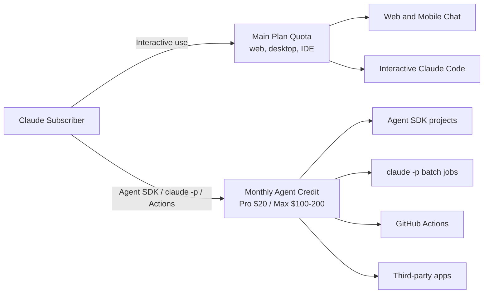

AI 구독의 표준 가격은 단순했다. "월 20달러 내고 적당히 쓰세요." 사람이 앉아서 질문을 던지는 만큼만 한도가 깎인다는 전제였다. 그런데 AI 에이전트가 24시간 백그라운드에서 돌기 시작하면 이 전제가 깨진다. 한 사람이 손가락으로 칠 수 있는 분량과, 그 사람이 트리거한 에이전트가 한 달 내내 자동 실행하는 분량은 자릿수가 다르다.

Anthropic이 5월 13일 헬프센터에서 공개한 정책 변경은 이 문제에 대한 첫 공식 답이다. 6월 15일부터 Claude 구독은 둘로 나뉜다. 사람이 쓸 때 한도와, 에이전트가 쓸 때 한도가 따로 잡힌다.

## 무엇이 바뀌나

지금까지는 `claude -p`(Claude Code의 비대화 모드, 한 번에 명령을 던지고 결과만 받는 방식)나 Agent SDK(Python·TypeScript에서 Claude를 호출하는 개발자용 라이브러리)로 만든 자동 에이전트가 구독 한도를 그대로 먹었다. 6월 15일부터는 이 사용량이 구독의 메인 한도에서 분리돼 별도 월 크레딧으로 빠진다.

플랜별 월 크레딧:

- Pro: 20달러
- Max 5x: 100달러
- Max 20x: 200달러
- Team Standard seat: 20달러 / Premium seat: 100달러
- Enterprise(usage-based): 20달러 / Premium seat: 200달러

크레딧이 적용되는 대상은 네 가지다. 본인 프로젝트의 Agent SDK 호출, `claude -p` 명령, Claude Code GitHub Actions 연동, 사용자의 Claude 구독으로 인증해 호출하는 서드파티 앱. 반대로 터미널·IDE의 대화형 Claude Code, 웹·데스크톱·모바일 앱의 대화, Claude Cowork는 메인 한도에 그대로 남는다.

함정도 있다. 안 쓴 크레딧은 다음 달로 **이월되지 않고**, 팀끼리 **풀링도 안 된다**. 개인 계정에 묶이며 매월 청구 주기에 리셋된다. 크레딧이 떨어지면 "추가 사용량"을 미리 켜둔 경우만 표준 API 요금으로 이어지고, 안 켜뒀으면 다음 주기까지 정지다.

## 왜 분리하나

표면적으로는 "에이전트 사용 때문에 사람의 대화 한도가 동나는 일을 막겠다"는 명분이다. Anthropic은 헬프센터 글에서 "구독 한도는 Claude Code·Claude Cowork·Claude를 사람이 직접 쓰는 용도로 보존된다"고 명시한다.

깊은 의미는 따로 있다. 지금까지 SaaS 구독의 단위는 "사람 1명"이었다. 한 사람이 한 달 동안 만들어낼 부하는 어느 정도 예측 가능했다. 에이전트가 끼면 이 가정이 무너진다. GitHub Actions에서 매 푸시마다 도는 PR 리뷰 에이전트 하나만으로도 월 수십만 토큰을 쉽게 넘긴다. 사람용과 에이전트용 한도를 한 통에 담으면 둘 다 망가진다.

## 다른 회사와의 차이

OpenAI의 ChatGPT Plus·Pro, Google의 Gemini Advanced는 아직 사용자의 API 호출에 별도 크레딧을 주지 않는다. API는 별도 종량제다. Anthropic이 "구독에 일정 액수 API 크레딧을 내장"하는 모델을 정식 발표한 첫 대형 랩이다.

## 일반 사용자에게 의미

Claude Pro(월 20달러)를 쓰면서 가끔 `claude -p`로 스크립트를 돌린다면, 6월 15일 이후 그 사용량은 메인 한도가 아니라 별도 20달러 크레딧에서 차감된다. 평소 대화 한도가 더 여유로워진다는 뜻이다. 단, 두 통이 따로 소진되므로 "에이전트 안 쓴 달 크레딧을 다음 달에 몰아 쓰기"는 불가능하다. Max 20x 구독자에게는 매달 200달러어치 API 크레딧이 자동으로 더 붙는 셈인데, 이걸 어디다 쓸지가 다음 한 달의 화제가 될 가능성이 높다.

## 시사점

SaaS의 단위가 "사람"에서 "사람과 그 사람의 에이전트들"로 갈라지는 첫 신호다. 한 사람이 여러 에이전트를 띄우는 시대가 오면 가격 모델은 결국 사람 자리와 에이전트 실행량의 합산으로 갈 수밖에 없다. Anthropic이 먼저 둘을 분리한 것은 청구 깔끔함의 문제가 아니라, "에이전트 경제"의 도래를 가격표가 인정한 사건에 가깝다. OpenAI와 Google의 다음 수가 관전 포인트다.

## 출처

- Anthropic Help Center, "Use the Claude Agent SDK with your Claude plan", 2026-05-13 업데이트, https://support.claude.com/en/articles/15036540-use-the-claude-agent-sdk-with-your-claude-plan
- Hacker News, "New Claude Code programmatic usage restrictions" 토론, 2026-05-13
- Hacker News, "Claude subscription changes coverage of `claude -p`" 토론, 2026-05-13
