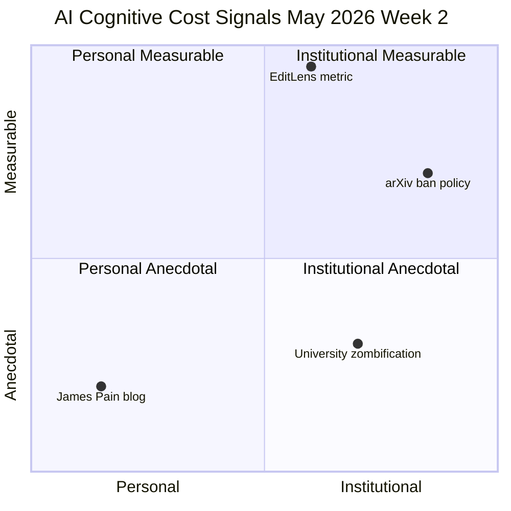

5월 둘째 주 Hacker News를 훑다 보면 한 가지 패턴이 도드라진다. AI를 어떻게 쓰면 더 잘 쓰느냐가 아니라, **AI를 너무 많이 쓰면 우리에게 무슨 일이 생기느냐**를 묻는 글이 같은 시기에 네 곳에서 동시에 올라왔다. 한 명의 푸념이 아니라, 개인·대학·학술 인프라·측정 도구가 같은 방향을 가리키기 시작한 것이다.

이 글은 그 네 가지 신호를 한 줄로 잇고, 무엇이 새로 바뀌었는지 짚는다.

## 신호 1 — "1-2년 맡겼더니 코드를 잊었다"

5월 13일 HN 상위에 올라온 James Pain의 블로그 글 「AI is making me dumb」은 275점을 받았다. 핵심 문장은 단순하다.

> "AI에게 1-2년 동안 코딩을 거의 전부 맡겼더니, 어떻게 코드를 짜는지 거의 잊었다."

흥미로운 건 그가 묘사한 피드백 루프다. AI 결과물이 자기 글보다 매끈해 보이면 → 자기 능력을 의심하고 → 더 AI에 위임하고 → 다시 자기 능력을 의심한다. 글 마지막에 그는 "이 글마저 Claude에 한 번 돌려보고 싶다는 충동을 느낀다"고 적었다. 개인 한 명의 자백이지만, HN 댓글에 같은 경험을 적은 사람이 수백 명이었다.

## 신호 2 — 대학의 "좀비화"

같은 주 The New Critic에 실린 「The Great Zombification」은 미국 엘리트 대학 현장을 정리한다. 인용된 사실 몇 개:

- UCLA 졸업식에서 ChatGPT 화면을 띄운 학생 사진이 화제.
- 프린스턴 대학 부정행위 적발 건수: 63 → 119. AI 통합 이니셔티브를 도입한 해에 거의 2배.
- 시카고 대학 학보 *The Maroon*이 AI 생성 기사를 여러 건 게재했다가 사후 적발.
- 학생들이 숙제뿐 아니라 이메일·운동 루틴·데이트 조언까지 LLM(Large Language Model, GPT·Claude·Gemini처럼 자연어로 대화하는 대형 언어모델)에 위임.

저자는 좀비 개미 곰팡이 비유를 쓴다. 학생이 점점 더 많은 인지 기능을 위임할수록, 독립적 사고 능력을 잃어간다는 주장이다.

## 신호 3 — arXiv가 처음으로 "1년 정지" 카드

5월 14일 arXiv가 새 정책을 공지했다. **환각 인용(hallucinated references — AI가 그럴듯해 보이지만 실제로 존재하지 않는 논문을 만들어낸 출처)**이 포함된 논문을 제출한 저자에게 1년 동안 신규 제출을 금지한다는 내용이다.

이게 의미하는 바는 단순하지 않다. 학술 출판 인프라가 처음으로 "AI에 의한 데이터 오염"을 권고 차원이 아니라 **강제 조치**로 응징하기 시작했다는 뜻이다. 그동안 학회·저널의 AI 정책은 대부분 "표시해 달라"는 수준이었다.

## 신호 4 — "AI 편집한 글"을 따로 측정한다

같은 주 arXiv에 올라온 EditLens 논문(2510.03154)은 한 발 더 나간다. 기존 AI 탐지기는 "사람이 썼는가, AI가 썼는가" 이분법이었다. EditLens는 그 사이에 있는 **"사람이 썼지만 AI가 편집한 글"**을 별도 카테고리로 분리한다.

- 회귀 모델로 사람-AI 편집-AI 생성 텍스트의 유사도를 계량.
- 이진 분류 F1(F1 score, 정밀도·재현율의 조화 평균) **94.7%**, 삼진 분류 F1 **90.4%**.

핵심은 측정을 0/1이 아니라 **스펙트럼**으로 옮긴다는 점이다. "AI 썼느냐 안 썼느냐"가 아니라 "AI가 얼마나 손댔느냐"가 새 기준이 된다.

## 네 신호의 공통점

각각은 다른 채널에서 나왔지만 같은 방향을 가리킨다.

오른쪽 위 사분면이 비기 시작했다. 즉, **AI 의존을 막연한 우려로 두지 않고 측정·집행 가능한 비용으로 옮기는 흐름**이 같은 주에 세 곳(arXiv 정책·EditLens·대학 통계)에서 동시에 생겼다.

## 시사점

네 신호 자체가 새로운 사실은 아니다. AI 의존 우려는 2024년부터 있었다. 달라진 건 **숫자가 붙기 시작했다**는 점이다. 프린스턴 적발 건수, EditLens F1 94.7%, arXiv 1년 정지 — 이 숫자들이 한 주에 몰린다는 게 신호다.

가까운 미래의 질문은 "AI를 쓸 것인가"가 아니라 "AI를 써도 자기 인지 능력을 잃지 않으려면 어떻게 써야 하는가"로 옮겨간다. 측정 도구가 갖춰지면 정책이 따라오고, 정책이 따라오면 행동이 바뀐다.

## 출처

- James Pain, "God damn, AI is making me dumb" — https://jpain.io/god-damn-ai-is-making-me-dumb/
- Owen Yingling, "The Great Zombification" (The New Critic) — https://www.thenewcritic.com/p/the-great-zombification
- arXiv 정책 공지 (T. Dietterich 트윗) — https://x.com/tdietterich/status/2055000956144935055
- EditLens 논문 — https://arxiv.org/abs/2510.03154
- Hacker News 상위 게시물 (2026-05-14~15) — https://news.ycombinator.com/
