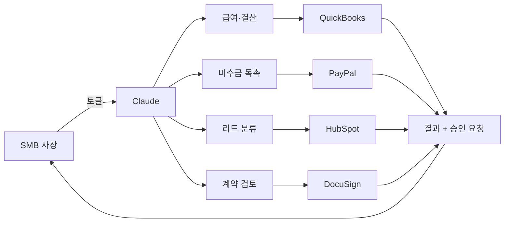

앤트로픽(Anthropic)이 2026년 5월 13일, 동네 하드웨어 가게나 카페 같은 작은 회사를 겨냥한 새 패키지 "Claude for Small Business"를 공개했다. Claude는 ChatGPT와 비슷한 AI 챗봇인데, 이번 발표의 핵심은 챗 화면이 아니라 **이미 쓰고 있는 회계·결제·마케팅 도구 안에서 자동으로 일을 처리하는 워크플로 묶음**이라는 점이다. 다음날 해커뉴스(Hacker News)에서 507점·댓글 450여 개로 그 주 최상위에 올랐다.

## 구성

핵심은 세 가지다.

- **15개 에이전트 워크플로**: 급여 계획, 월말 결산, 미수금 독촉, 리드 분류(영업 가능성 있는 고객 추리기), 캠페인 운영, 계약서 검토 등.
- **15개 재사용 스킬**: 현금 흐름 예측, 마진 분석, 콘텐츠 전략 같은 작은 단위. 워크플로 안에서 부품처럼 호출된다.
- **8개 외부 도구 커넥터**: 퀵북스(QuickBooks, 미국 중소기업 표준 회계 SW), 페이팔, 허브스팟(HubSpot, 영업·마케팅 CRM), 캔바, 도큐사인, 구글 워크스페이스, 마이크로소프트 365.

기존 Claude 화면에서 토글로 켜는 방식이고 **별도 요금이 없다**. Pro/Team/Enterprise 유료 플랜만 있으면 따라오는 부가 기능이다. 플랜에 따라 월 20달러에서 200달러 Agent SDK 크레딧이 함께 지급된다.

## 왜 굳이 SMB 전용으로 분리했나

미국 중소기업은 전체 GDP의 44%, 민간 고용의 절반을 차지하지만 AI 도입률은 대기업보다 한참 뒤처져 있다. 앤트로픽은 SMB(Small and Medium Business, 중소기업) 운영 방식에 맞춘 도구가 없어 "AI 활용이 대부분 챗 창에서 멈춘다"고 진단했다. 여기서 두 가지 패턴이 보인다.

첫째, **AI 매출 구조의 다음 단계**. 지금까지 Claude·ChatGPT 매출은 개발자와 대기업 두 끝에서 나왔다. 그 사이의 "15명 HVAC(냉난방 시공) 업체, 30명 조경 업체, 50명 부동산 중개사" — 미국에 3,600만 개 있는 이 층을 잡지 못하면 시장이 두 갈래로만 굳는다.

둘째, **진입 장벽이 챗 창에서 워크플로로 이동**. 사장이 매번 ChatGPT에 데이터 붙여넣을 수는 없다. 이미 쓰는 퀵북스에 토글 하나 켜는 게 훨씬 현실적이다. OpenAI의 ChatGPT Business, 구글의 Gemini for Workspace도 같은 방향이고, 이번 발표는 그 경쟁이 본격화됐다는 신호다.

## 해커뉴스 반응 — 환영보다 우려가 컸다

댓글 450여 개에서 반복된 주제는 의외로 "위험"이었다.

- **의존성**: Claude가 다운되면 직원들이 수작업 절차를 잊은 채 멈춘다는 경험담. "마약 같다"는 비유까지 나왔다.
- **검증 없는 산출물**: 비기술 임원이 AI 문서를 검토 없이 돌리고, 받는 쪽도 다시 검토 없이 돌리는 패턴. 생산성이 아니라 조직 비효율의 새 형태라는 지적.
- **컴플라이언스 공백**: Claude Cowork은 zero-data-retention(데이터 즉시 폐기) 정책 범위 밖이라, 의료·금융처럼 감사 추적이 법적으로 요구되는 곳은 그대로 쓰기 어렵다.
- **장기 인력 공동화**: 시스템 작동 원리를 아는 사람이 줄면, AI 결과물에 문제 생겼을 때 고칠 사람도 줄어든다.

## 정리

Claude for Small Business는 새 모델이 아니라 **유통 전략의 전환**이다. 같은 Claude를 SMB 사장이 이미 쓰는 도구 안에 토글로 심고, 가격은 기존 플랜에 포함. 미국 시장 위주 출시라 한국에서 바로 같은 형태로 쓸 수는 없지만, 같은 패턴이 다음 1년 안에 OpenAI·구글에서도 나올 가능성이 높다. 작은 회사 입장에선 두 가지를 봐야 한다 — AI가 챗 창을 넘어 회계·결제·계약 도구 안으로 들어온다는 점, 그만큼 검증·승인 절차 설계가 중요해진다는 점.

## 출처

- [Introducing Claude for Small Business — Anthropic 공식 발표](https://www.anthropic.com/news/claude-for-small-business)
- [Anthropic courts a new kind of customer: small business owners — TechCrunch](https://techcrunch.com/2026/05/13/anthropic-courts-a-new-kind-of-customer-small-business-owners/)
- [Anthropic debuts Claude for Small Business — Yahoo Finance](https://finance.yahoo.com/news/anthropic-debuts-claude-for-small-business-as-it-continues-its-enterprise-software-push-160500355.html)
- [Anthropic offers new Claude Code tools for small businesses — Axios](https://www.axios.com/2026/05/13/anthropic-claude-small-business-smb)
- [Claude for Small Business — Hacker News (507점)](https://news.ycombinator.com/item?id=48130950)
