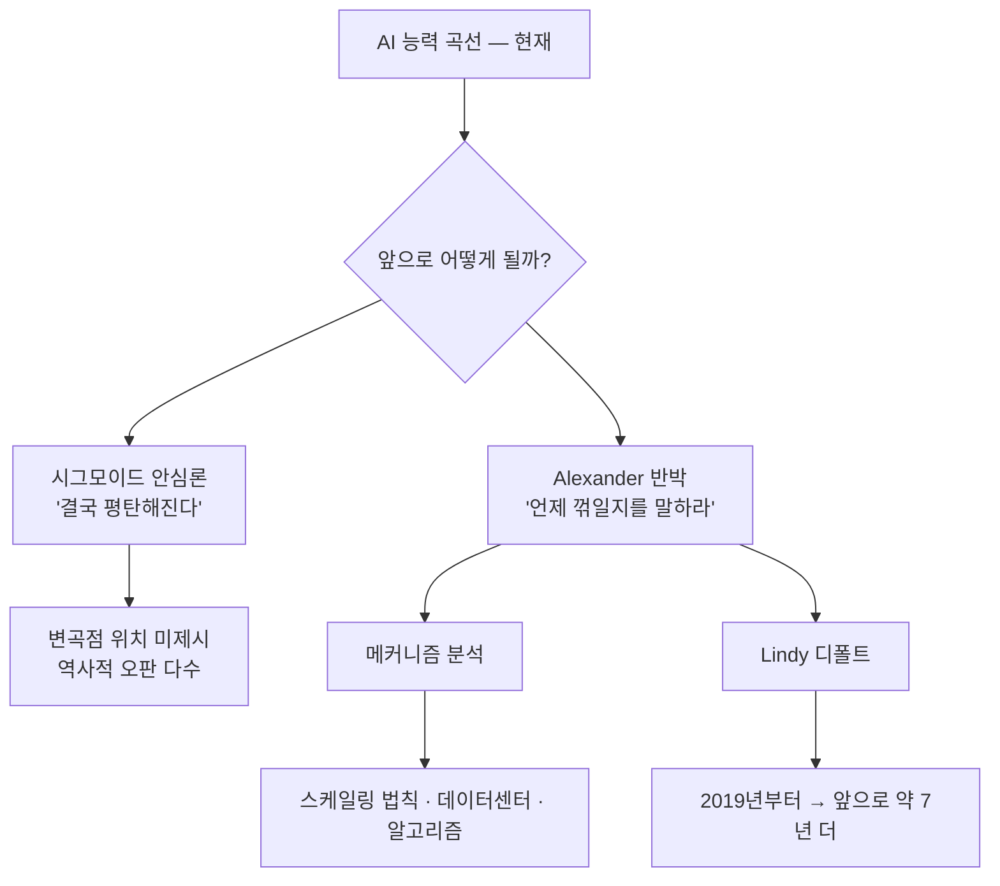

"AI가 지금 빨리 발전하는 건 알겠는데, 곧 한계에 부딪힐 거야." 최근 1년간 AI 회의론 토론 어디에나 등장한 문장이다. 근거는 단순하다 — 자연계 어떤 성장도 영원히 폭증하지 않고, 결국 S자 곡선(시그모이드, sigmoid: 처음엔 가속하다 어느 시점부터 둔화돼 평탄해지는 그래프)을 그린다.

논리적으로 맞는 말이다. 그런데 2026년 5월 15일, Scott Alexander(Astral Codex Ten 운영자, AI 예측 분야 영향력 있는 블로거)가 새 글 *The Sigmoids Won't Save You*에서 정면으로 반박했다. 제목 그대로 — "시그모이드는 당신을 구해주지 않는다."

## "결국 멈춘다"는 말은 *언제*에 답하지 않는다

Alexander의 핵심 논점은 단 하나다. "결국 S자 곡선이 된다"는 명제는 참이지만, **그 곡선이 *언제* 꺾이는지는 전혀 말해주지 않는다.** AI 안전 논쟁의 진짜 질문은 "다음 GPT·Claude·Gemini 세대가 위험 수준 능력에 도달할까"이지, "언젠가 평탄해질까"가 아니다. 후자는 자명하다. 전자는 자명하지 않다.

그는 '시그모이드 오판 명예의 전당'을 정리해 보여준다.

- **3위 — 출산율 예측**: UN은 출산율이 급감하는 나라들에서 "곧 안정화"를 매년 다시 예측해왔다. 한 번도 맞은 적이 없다. 실제 데이터는 계속 떨어졌고, UN의 시그모이드 외삽선은 매번 다시 아래로 수정됐다.
- **2위 — 태양광 보급**: IEA(International Energy Agency, 국제에너지기구)의 *World Energy Outlook*은 매년 "올해 태양광 설치가 많이 늘었으니 내년엔 평탄해질 것"이라 예측했다. 매번 곡선은 그들이 그린 시그모이드를 뚫고 위로 갔다.
- **1위 — AI 능력 자체**: 2026년 초 Wharton 연구진이 AI 벤치마크 점수의 시그모이드 모델을 발표하며 "곧 포화"를 예측했다. 그 직후 출시된 모델들이 그들이 그린 상한선을 그대로 넘어버렸다.

S자 곡선이 "존재한다"는 사실과 그 변곡점을 "맞히는" 것은 완전히 다른 문제다. 안심론은 늘 첫 번째만 말하고 두 번째에는 침묵한다.

## Lindy의 법칙 — 메커니즘 모를 때의 디폴트

그럼 변곡점은 어떻게 추정해야 하나? Alexander는 두 가지 길을 제시한다.

1. **메커니즘 모델링** — 데이터센터 증설 속도, 알고리즘 개선 추세, 스케일링 법칙(scaling law: 모델 크기·데이터·연산량 증가가 성능에 어떻게 기여하는지 정량화한 경험식)을 직접 분석. 어렵지만 정확.

2. **Lindy의 법칙(Lindy's Law)** — 작동 원리를 모를 때, "지금까지 X년 지속됐다면 앞으로도 X년 더 지속될 가능성이 가장 높다"고 가정. AI 스케일링은 2019년경부터 본격화됐으니 디폴트 추정은 **앞으로 약 7년 더**. 2년 안에 멈출 확률은 약 22%에 불과하다는 계산이다.

그가 든 비유가 명료하다. 간헐천 앞에 서 있는데 분출 주기를 모른다고 치자. 방금 분출 장면을 봤다면, 다음 분출도 비교적 가까운 시점일 확률이 높다. 100년 주기 간헐천이라면 당신이 그 정확한 0.001% 시점에 도달했을 확률은 낮으니까. AI도 마찬가지다. 최근 모델 진화가 빠른 것을 *우리가 지금 보고 있다*는 사실 자체가, "우리가 시그모이드 후반부에 있다"는 가설에 반증이 된다.

## 두 가지 예측 경로의 구조

## 결론 — 입증 책임의 전복

이 글의 진짜 함의는 토론 구조의 전복이다. 그동안 "AI가 곧 위험 수준에 도달할 수 있다"는 쪽이 입증 책임을 졌다. Alexander는 거꾸로 묻는다. "곧 멈춘다"는 쪽이 변곡점의 *위치*를 구체적으로 제시해야 한다고. 메커니즘으로든 Lindy 같은 디폴트 가정으로든.

OpenAI·Anthropic·Google DeepMind가 분기마다 발표하는 모델 성능 곡선이 아직 가시적으로 꺾이지 않은 시점에서, "S자 곡선" 한 마디로 우려를 일축하는 건 분석이 아니라 위안이라는 게 그의 결론이다. 동의하든 안 하든, 다음에 "AI도 결국엔 한계가 있어"라는 말이 나오면 한 번 더 물어볼 가치는 있다 — "*언제*인지 말해줄 수 있어?"

## 출처

- Scott Alexander, "The Sigmoids Won't Save You", Astral Codex Ten, 2026-05-15: https://www.astralcodexten.com/p/the-sigmoids-wont-save-you
- Hacker News 토론: https://news.ycombinator.com/item?id=48147021
