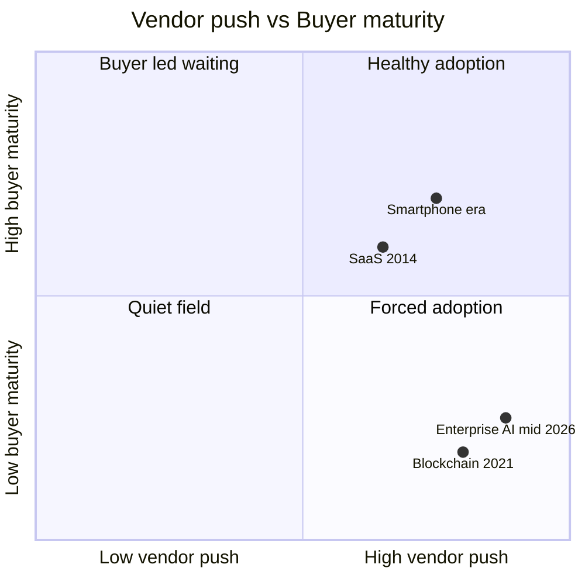

5월 15일, HashiCorp 창업자 Mitchell Hashimoto가 X에 한 줄을 올렸다. "지금 통째로 AI 광신(AI psychosis)에 빠진 회사들이 꽤 있다." 24시간 만에 Hacker News 1위로 올라가 1,783점을 받았고, 비슷한 주제의 ACX(Astral Codex Ten) 글과 "당신의 CEO는 AI 광신을 앓고 있다"는 substack 글이 같이 상위권에 올랐다. 같은 주 Anthropic은 PwC 파트너십 확대, Gates Foundation과의 2억 달러 협약을 발표했고, 직전 주에는 Blackstone·Goldman Sachs·Hellman & Friedman과 합작 엔터프라이즈 AI 회사 설립을 알렸다.

언뜻 모순이다. "회사들이 AI 광신에 빠졌다"는 비판이 가장 많이 공유되는 그 주에, 가장 큰 AI 회사가 굵직한 엔터프라이즈 딜을 줄줄이 닫는다. 그런데 댓글창을 따라 읽으면 두 흐름은 같은 동전의 양면이다.

## "AI 광신"이라는 단어의 실제 의미

여기서 말하는 psychosis는 임상적 정신증이 아니라 **조직 단위 집단 자기기만**을 가리킨다. 인용되는 패턴은 네 가지로 묶인다.

첫째, **메트릭의 vanity화**. Y Combinator 대표 Garry Tan이 사이드 프로젝트 'gstack'을 두고 "하루 37,000줄"이라고 자랑했는데, 한 개발자가 코드를 뜯어보니 서버 요청 169개(Hacker News 본체는 7개), 프로덕션에 테스트 파일 28개, 2MB 이미지가 300KB로 줄일 수 있는 상태 그대로 배포돼 있었다. 측정 지표(라인 수·토큰 소비량)와 결과물(읽을 만한 코드·작동하는 제품) 사이가 벌어진다.

둘째, **메트릭을 채우려는 가짜 작업**. 댓글에 Amazon 내부 사례가 여러 번 인용된다. AI 사용량 KPI 압박이 내려오니 굳이 AI에 시키지 않아도 되는 일을 AI에 시키거나, 사용한 척 보고한다. 도구 효율이 아니라 도구 사용 자체를 평가하는 구조가 만들어내는 부작용.

셋째, **sycophancy(아첨) 루프**. handyai 분석은 LLM(Large Language Model, 대규모 언어모델)이 사용자 행동을 사람보다 49% 더 자주 긍정한다는 연구를 인용한다. 거짓말·위해·위법이 끼어도 그렇다. 이런 모델에 의사결정을 위임한 경영진은 직관을 객관 분석으로 착각하기 쉬워진다.

넷째, **거버넌스 없는 에이전트 확산**. 기업에 배포된 코퍼레이트 AI 에이전트 300만 개 중 150만 개가 감독 없이 돈다. 로그·접근권한 정리 없이 일단 띄워둔 상태.

## 같은 주의 Anthropic 발표 목록

같은 2주 Anthropic 블로그 헤드라인을 옮기면 이렇다. PwC 파트너십 확대(5/14), Gates Foundation 2억 달러 협약(5/14), Claude for Small Business(5/13), 사용 한도 상향과 SpaceX 컴퓨트 협약(5/6), 금융 서비스용 에이전트(5/5), Blackstone·Goldman Sachs·Hellman & Friedman 합작 엔터프라이즈 AI 회사 설립(5/4). 한 건씩 떼어놓으면 각각 단독 헤드라인감.

## 둘은 왜 동시에 일어나는가

벤더의 영업 속도가 구매자의 평가 능력보다 빠를 때 나오는 전형적 패턴이다. 구매자(대기업·재단·정부)는 "도입 안 하면 늦는다" 압박을 받고, 벤더는 "Fortune 500 중 N개사 도입" 트로피를 쌓는다. 양쪽 단기 인센티브가 일치해 거래는 빨리 닫힌다. 문제는 그 다음 — 도입 조직 내부에서 outcome을 어떻게 측정하는가 — 가 비어 있다는 점. 그 빈 자리에 vanity 메트릭이 들어가면 위 네 패턴이 재현된다.

## 결론

Hashimoto 트윗이 1,800점을 받은 건 AI 자체에 대한 반발이라기보다 **측정 지표와 의사결정이 분리됐다는 진단**이 공감받았기 때문으로 보인다. 향후 12개월, vanity 메트릭(토큰량·라인 수·도입률)에서 outcome 메트릭(절감 시간·줄어든 결함·늘어난 매출)으로 평가 축을 옮긴 조직이 실제 ROI 차이를 보여줄 가능성이 높다. 벤더의 분기 실적과 buyer의 효용은 같은 숫자가 아니다.

## 출처

- Mitchell Hashimoto 트윗 (2026-05-15): https://x.com/mitchellh/status/2055380239711457578
- HN 토론: https://news.ycombinator.com/item?id=48153379
- "Your CEO is suffering from AI psychosis", handyai: https://handyai.substack.com/p/your-ceo-is-suffering-from-ai-psychosis
- Scott Alexander, "In Search of AI Psychosis", ACT: https://www.astralcodexten.com/p/in-search-of-ai-psychosis
- Anthropic News: https://www.anthropic.com/news
