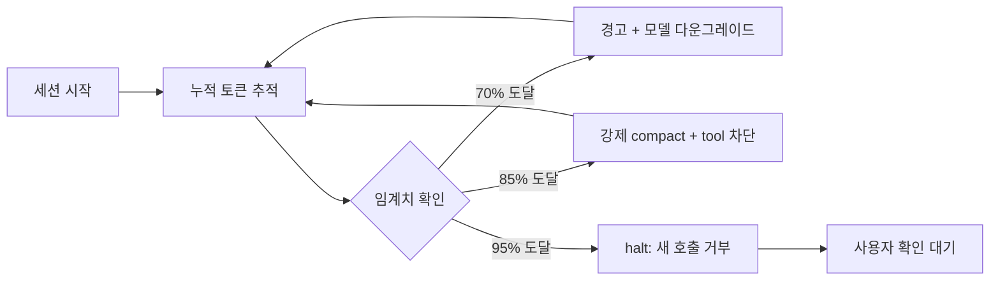

2026년 1월 Anthropic이 Claude Code 플러그인 마켓플레이스를 정식 등재한 뒤, 한 사용자 제작 플러그인이 GitHub 스타 10만 개를 넘었다. obra/superpowers — Claude Code(Anthropic의 터미널 기반 코딩 에이전트)에 자가 학습형 스킬 묶음을 얹는 패키지다. 같은 시기 Claude Code 자체 사용자도 폭발적으로 늘면서, "공식 기능을 기다리지 않고 플러그인으로 직접 채워 넣는" 방식이 정착됐다.

본격 생태계가 형성된 지금, 다음 메가 히트 후보를 미리 짚어볼 만하다. 본문은 같은 세 잣대로 카테고리마다 점수를 매긴다. (1) **페인포인트 강도** — 매주 얼마나 많은 사용자가 짜증을 내는가, (2) **차별화·해자** — 한 주 만에 카피 가능한가 아니면 누적 자산이 필요한가, (3) **인기 가능성** — 컬트 팬덤 수준인가 전 세그먼트 수요인가.

## A. 텔레그램 supervisor류 — 원격 제어·생존 감시 봇

Claude Code를 PC·서버에 띄워두고 외부에서 텔레그램·디스코드·슬랙으로 명령을 내리는 패턴. 본체 세션이 멈추거나 MCP(Model Context Protocol, Claude가 외부 도구·데이터에 접근하는 표준 프로토콜) 연결이 끊겼을 때 다른 봇이 강제 재시작·`/compact`(컨텍스트 압축)·`/clear` 같은 슬래시 명령을 주입해 살려낸다.

- 페인포인트: 중. 데스크톱에 종일 묶이기 싫은 power user에게는 절실, 일반 사용자는 IDE 안에서만 쓴다.
- 차별화: 높음. 봇 토큰·권한 정책·복구 시퀀스 조합이 복잡하고 실운영 패턴이 녹아야 안정적이다.
- 인기 가능성: 컬트 팬덤. 두꺼운 틈새지만 메가 히트는 아니다.

## B. 자가 진단·복구류 — "이번 주에도 또 멈췄다"

MCP 끊김, hook 무한 루프, 응답 stall, 컨텍스트가 갑자기 90%로 폭주하는 상황을 자동 감지해 해당 MCP 서버만 재시작하거나, 멈춘 도구 호출을 timeout 처리하거나, 폭주 직전에 `/compact`를 강제 발화하는 류.

- 페인포인트: 강. 거의 모든 사용자가 매주 한 번씩 겪는다. Reddit·HN 댓글창 단골.
- 차별화: 중. 증상별 시그널 정의·임계치 튜닝·복구 시퀀스 누적이 필요. 단순 재시작은 쉽지만 정밀한 분기 트리는 시간이 든다.
- 인기 가능성: 높음. "신뢰성 +1" 류는 꾸준한 수요가 있고, 한 번 의존하면 빼기 어렵다.

## C. 빈말 금지·페르소나 교정 — sycophancy 제거 룰셋

"Great question!", "You're absolutely right!" 같은 LLM(Large Language Model, 대규모 언어모델) 특유의 아첨 어휘를 제거하고, 추측은 "추측"이라 표시하게 강제하며, 의견은 동의·반대 분명히 말하게 만드는 시스템 프롬프트·skill·hook 묶음.

- 페인포인트: 강. sycophancy는 ChatGPT 4o 롤백 사건 이후 모든 LLM 사용자의 공통 짜증. Anthropic이 아첨 패턴을 줄이는 방향으로 RLHF(Reinforcement Learning from Human Feedback, 인간 피드백 기반 강화학습)를 조정한다고 밝혔지만, 사용자가 원하는 톤은 디폴트보다 더 직설적이다.
- 차별화: 중. 시스템 프롬프트 패치는 GitHub에 흩어져 있지만 "skill + hook + 후처리" 패키지는 적다. 진입장벽이 낮아 카피가 빠르다.
- 인기 가능성: 바이럴 잠재력 최상위. 비포·애프터 스크린샷이 SNS에서 잘 돈다. 다만 1위가 빠르게 교체된다.

## D. 컨텍스트 가시화 — 사용률 %, 임계치 자동 처리

매 응답 말미에 "(18.1%)" 같은 컨텍스트 사용률을 자동 표기, 70% 넘으면 경고, 90% 넘으면 자동 compact 발화. 토큰 소비를 항상 보이게 한다.

- 페인포인트: 강. 컨텍스트 폭주는 모두 겪는데 현재값이 안 보이는 게 답답하다.
- 차별화: 낮음. 세션 로그에서 토큰 합산하는 로직 자체는 단순.
- 인기 가능성: 중. 공식이 내장 status bar로 흡수할 가능성이 크다. 짧은 황금기.

## E. 크론·스케줄 강화 — 내장보다 유연한 자동 발화

Claude Code 내장 `/schedule`은 단순 cron형 발화 + 알림 정도. 여기에 결과 라우팅(파일→메인 세션 주입), 의존성(앞 작업 결과로 뒤 작업 분기), 정책 강화를 얹는 류.

- 페인포인트: 중. 자동화에 진심인 power user 한정.
- 차별화: 중. 발화·결과 라우팅·세션 주입을 묶어내는 노하우가 필요.
- 인기 가능성: 낮음에서 중. 일반 사용자는 "예약 한 번 돌리면 끝"으로 충분.

## 다크호스: Budget Guard — 토큰·비용 가드레일

A에서 E 어디에도 잘 안 들어가는 신규 카테고리를 하나 짚는다. 핵심은 "내가 잠든 사이 에이전트가 폭주해서 비용이 터지는 사고를 사전에 막아준다"이다.

**페인포인트는 최상위**. "자고 일어났더니 runaway agent가 $400을 태웠다" 류 사고는 인디 개발자·소규모 팀·기업 어디서나 정기적으로 보고된다. HN(Hacker News, 실리콘밸리 개발자가 모이는 IT 뉴스 커뮤니티)과 X에서 분기마다 비슷한 후기가 올라오고, 댓글창은 매번 "제발 누가 kill switch 좀 만들어달라"로 끝난다.

**차별화·해자도 높다**. 카피하기 어려운 세 자산이 누적된다. 첫째, **분석 로직** — 작업별 평균 비용 베이스라인이 있어야 비정상 폭주를 잡는다. 둘째, **정책 엔진** — `warn@70%`, `degrade@85%`, `halt@95%` 같은 룰을 settings.json에 선언적으로 쓰게 만드는 DSL(Domain Specific Language, 특정 목적용 작은 언어). 셋째, **자동 대응 시퀀스** — 모델 다운그레이드(Opus 4.7에서 Haiku 4.5로 자동 전환), 강제 compact, 새 tool call 차단 같은 단계별 개입.

기존 대안은 자리를 채우지 못한다. Anthropic Console은 사후 조회만, 실시간 차단 없음. OpenRouter·LiteLLM 같은 게이트웨이는 라우팅 중심이라 Claude Code 세션 단위 세분화는 약하다. 단순 token counter 플러그인은 카운트만 보여줄 뿐 개입하지 않는다.

MVP 기능 셋은 (1) **실시간 누적 추적** — 세션·일·월 단위 토큰·비용을 status bar에 항상 표시, (2) **임계치 정책 엔진** — 위 DSL로 자동 모델 스왑·강제 compact·tool gate, (3) **잔여 예산 기반 작업 견적** — 새 작업 시작 시 "직전 10번 평균 $X" 미리 confirm.

마케팅 카피는 이런 식이 자연스럽다. "Claude Code burned $400 overnight on a runaway agent. Budget Guard would've stopped it at $20." HN Show 제목으로는 "Show HN: Budget Guard — a kill-switch for runaway Claude Code agents". 무료(추적·경고)와 유료(자동 개입·팀 대시보드) 분기가 자연스럽고, 전 세그먼트 수요가 있다.

## 메가 히트의 공통 조건

여섯을 같은 잣대로 놓고 보면 패턴이 보인다. 첫째, **페인포인트가 모두에게 즉시 와닿아야 바이럴**이 된다 — C와 D가 그 자리. 비포·애프터를 한 장 스크린샷으로 보여줄 수 있다. 둘째, **카피하기 어려운 누적 자산이 있어야 오래 간다** — B와 Budget Guard가 강하다. 정책 트리·베이스라인 데이터·복구 시퀀스는 한 주 만에 따라잡기 어렵다. 셋째, **즉시 측정 가능한 가치가 결제로 이어진다** — "이번 달 $312 절약" 같은 숫자가 떠야 유료 전환이 일어난다.

obra/superpowers의 10만+ 스타는 시작에 가깝다. 다음 메가 히트는 위 세 조건을 동시에 만족하는 자리에서 나올 가능성이 크고, Budget Guard처럼 아직 비어 있는 자리가 그중 하나다.

## 출처

- Anthropic 공식 블로그: Claude Code 플러그인 마켓플레이스 GA 발표 (2026년 1월)
- GitHub: obra/superpowers — Claude Code skill 패키지 (스타 카운트는 2026-05 기준)
- Hacker News 토론 스레드들 — "runaway agent cost overnight" 류 후기 누적 (분기별 반복)
- Anthropic Console: 사용량 대시보드 기능 명세
