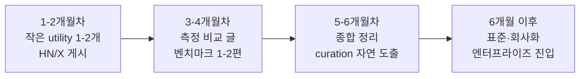

2026년 1월 Anthropic이 Claude Code(Anthropic의 터미널 기반 코딩 에이전트) 플러그인 마켓플레이스를 정식 등재한 뒤 4개월이 지났다. 그 사이 obra/superpowers 같은 사용자 제작 플러그인이 GitHub 스타 10만 개를 넘기며 본격 생태계가 형성됐다. 이제 자연스럽게 떠오르는 질문 — 다음 메가 히트는 어떤 카테고리에서 나올까. 그리고 무명의 솔로 개발자, 특히 비영어권 개발자에게 그 자리에 들어갈 틈이 있을까.

이 글은 결론을 단정하지 않는 시론이다. 시장 형성기 마지막 land-grab 구간에서 반복적으로 관찰되는 두 종류의 어필 트랙과, 그 안에서 솔로 메이커가 부딪히는 다섯 함정을 정리한다. 마지막엔 이 분석 자체의 한계도 한 섹션을 할애해 적는다.

## 함정 1 — 플러그인은 본질적으로 commodity

가장 먼저 깨야 할 환상은 "잘 만든 플러그인 하나가 곧 해자(垓子, moat — 경쟁자 진입을 막는 구조적 우위)가 된다"는 가정이다. 단순 utility 플러그인(token 카운터, 비용 표시, prompt 템플릿 같은 것)은 사실상 if문 몇 줄 + API 호출 한 줄짜리다. 인기를 얻으면 일주일이면 동일 기능 클론이 다섯 개씩 올라온다.

해자 후보를 검토하면 모두 결정적이지 않다. 사용량 데이터 플라이휠은 프라이버시·옵트인 부담 때문에 초기 수집이 어렵고, 브랜드 선점은 Slack vs Discord, Evernote vs Notion 사례처럼 후발 우위가 너무 자주 일어난다. 인접 기능 확장도 카테고리 안에서 1-2주면 카피된다.

진짜 해자는 단일 플러그인이 아니라 (1) **표준·스펙 선점**(OpenTelemetry처럼 다른 도구들이 implement하게 만드는 것), (2) **엔터프라이즈 진입**(SOC2 인증·SSO·조달 hook)에서 나온다. 즉 플러그인 자체가 메가 히트가 아니라 "마케팅·portfolio·커뮤니티 신뢰를 쌓아 회사화로 가는 진입로"에 가깝다.

## 함정 2 — 정량 트랙과 정성 트랙을 섞으면 둘 다 죽는다

메가 히트 후보 카테고리를 보면 어필 메커니즘이 두 종류로 갈린다.

**정량 트랙**은 측정 가능한 수치로 어필한다. 가상의 "Budget Guard"(API 비용 한도 가드)나 "Cache Hit Optimizer"(prompt cache hit rate — 캐시 재사용률 — 최적화) 같은 도구. 어필 수단은 receipts(증거 자료)고, 숫자를 던지면 회의론자가 "체리피킹 아니냐"고 반박할 여지를 미리 봉쇄해야 한다.

**정성 트랙**은 prettier(JavaScript 자동 포매터)나 Honest Mode(가칭, AI 빈말·아부 응답을 꺼버리는 플러그인) 같은 카테고리다. 측정 metric이 없거나 모호하고, "코드가 더 예뻐졌어"가 숫자로 안 잡힌다. 어필은 감각·결정 제거·정체성으로 한다.

두 트랙을 섞으면 둘 다 약해진다. 정성 카테고리에 억지로 숫자를 붙이면 "prettier가 17% 더 빠릅니다" 같은 의미 없는 비교가 되고, 정량 카테고리에 감성 마케팅을 붙이면 "그래서 비용 얼마나 줄어듭니까"를 못 답한다.

## 함정 3 — receipts를 잘못 ship하면 backlash가 더 크다

정량 트랙은 받는 만큼 까이는 트랙이다. "토큰 비용 92% 절감" 같은 한 줄 hero 숫자를 던지면 HN(Hacker News, 개발자 커뮤니티) 댓글창은 즉시 "어떻게 측정했냐", "내 케이스에서는 안 그렇던데"로 채워진다. 메가 히트로 가는 receipts는 다섯 요소를 갖춘다.

1. **재현 키트 동봉** — 숫자만 던지지 말고 측정 스크립트를 같이 ship. 회의론자가 자기 repo에서 그대로 돌리게.
2. **범위 보고** — 단일 hero 숫자 대신 분포를 공개. "5개 프로젝트에서 30에서 80%, 분산 큰 이유는 캐시 구조 차이" 식.
3. **사전 등록** — 측정 전에 방법론을 먼저 공개. 학계 pre-registration 관행을 빌려오면 "결과 보고 metric 골라낸 거 아니냐" 공격을 봉쇄한다.
4. **한계 명시** — "이런 경우엔 안 먹힙니다" 섹션을 본인이 먼저 쓴다. 토론이 방어전이 아니라 보완전으로 흐른다.
5. **독립 재현 동봉** — early 사용자 몇 명의 raw before/after를 같이 공개. 외부 측정이 같이 있으면 자가 보고와 무게가 다르다.

요약하면 "마케팅 자료가 아니라 mini-paper처럼 ship한다"는 감각이다.

## 함정 4 — 정성 트랙은 결정 제거·정체성·집단 채택의 게임

정성 트랙은 다른 근육이다. prettier의 성공은 기능 우위가 아니라 "opinionated"(저자 의견이 강하게 박혀 있어 사용자가 고를 게 거의 없음)를 단점이 아닌 셀링 포인트로 뒤집은 마케팅이었다. 팀이 매주 brace 스타일·세미콜론 유무로 PR(pull request, 코드 변경 제안) 코멘트를 주고받던 시간을 한 방에 없앤다. 그 가치는 숫자로 안 잡히지만 모두가 안다. 정성 트랙의 메커니즘은 네 가지다 — 결정 제거(반복 논쟁 종결), 감각적 before/after(스크린샷·GIF가 숫자 역할), 부족 정체성("나는 X 쓰는 사람" 깃발), 집단 채택 시에만 발현되는 네트워크 효과.

문제는 정성 트랙도 무명 솔로에게 친절하지 않다는 점이다. 정체성·집단 채택은 이미 발언권 있는 maintainer가 시작해야 굴러간다. 무명이 정성 트랙으로 진입하려면 결국 "결정 제거"의 칼날이 압도적으로 날카로워야 한다.

## 함정 5 — 한국 솔로 무명의 장벽은 영어만이 아니다

영어 README와 영문 글이 필요한 건 누구나 안다. 그보다 덜 이야기되는 세 장벽이 있다.

**시간대.** HN 프론트 페이지 수명은 보통 8에서 10시간인데, 그 골든 윈도우가 KST(한국 표준시) 기준 밤 11시에서 다음날 오전 8시 사이에 가장 자주 열린다. 라이브 응답이 빠지면 "ghost OP"(OP, original poster — 글 올린 사람이 응답을 안 함) 인상이 박혀 추진력이 죽는다.

**컬처 레지스터.** HN tone은 terse(짧고 건조), dry(감정 빠진), 반(反)마케팅이다. 한국 IT 글의 정중·열정 문체를 그대로 옮기면 본능적으로 마케팅 냄새로 읽힌다. "Hope you find it useful!" 같은 표현은 거기선 빨간불이다.

**비공식 시딩 네트워크 부재.** 서구 maintainer들은 사적 Discord·슬랙 채널에서 초기 upvote·첫 댓글을 비공식 시딩한다. 이 인프라는 외부에서 보이지 않고, 비영어권 솔로는 정의상 거의 항상 그 네트워크 바깥이다.

이 셋이 겹치면 "메가 히트"의 정의를 재조정해야 한다. 한국 Claude Code 사용자 베이스가 글로벌 대비 작아 한국어 전용 플러그인은 정의상 sub-market이다. 천장은 대략 GitHub 스타 500에서 2000개 + 작은 유료 niche 수준이다. 지표를 "스타 수"가 아니라 "지속 수익"으로 재정의하면 한국어 전용도 합리적인 전략이 된다.

## Timing window와 vendor 흡수 위험

마켓플레이스 정식 등재 후 4개월, 현재는 mid-window다. 프라임 진입 시점(2026년 1월에서 3월)은 지났지만 끝물은 아니다. 통상적으로 이런 플랫폼은 형성 후 12에서 18개월에 카테고리 신설이 끝나고 incremental improvement 게임으로 전환된다(이 추정은 일반 마켓플레이스 통념을 끌어온 거라 Claude Code 특유의 속도는 다를 수 있다).

vendor 흡수 위험도 늘 있다. 인기 분석·utility 플러그인은 Anthropic이 첫 마이너 패치로 본체에 흡수할 가능성이 크다. 대처는 세 갈래다 — (1) 분석·재작성 레이어로 포지셔닝(본체는 raw data만, 그 위에 도메인 해석을 얹기), (2) 멀티 벤더 확장(Claude 외 OpenAI·Gemini까지 묶기), (3) CI(continuous integration, 자동 빌드·테스트 시스템)·PR workflow에 박혀 옮기는 비용을 키우기.

## 부트스트랩 — 6개월 micro-burst 순서

무명이 처음부터 "이게 표준이다"를 선언하면 평판이 없어서 무시당한다. 받아들여지는 순서가 따로 있다.

1-2개월차에는 작은 측정 가능한 utility를 1-2개 ship하고 HN·X(구 Twitter)에 게시해 각각 작은 견인을 얻는다. 3-4개월차에는 측정 가능한 비교 글을 쓴다 — 가상 예: "7개 Claude Code 셋업의 토큰 비용 분포". 5-6개월차가 되면 그동안 쌓은 측정·도구·관찰을 묶어 종합·curation 콘텐츠가 자연스럽게 나온다. 이 순서를 거꾸로, 즉 처음부터 curation으로 진입하면 발언권이 없어 묻힌다.

## 이 분석의 한계

receipts의 네 번째 요소(한계 명시)를 본인이 따르지 않으면 신뢰가 서지 않는다. 이 글의 약점.

첫째, "timing window 12-18개월" 추정은 일반 플랫폼 통념을 갖다 붙인 것이다. Claude Code 플러그인 마켓 자체에 대한 정량 데이터는 아직 충분치 않다.

둘째, "한국 솔로는 정량 트랙이 낫다"는 권유는 한국 솔로 메가 히트 사례 데이터가 없는 상태에서의 단정이다. receipts 전략은 어차피 영문 README + 재현 키트 docs + 영문 블로그를 요구하기 때문에 영어 부담이 사라지는 게 아니라 본문 prose에서 표·코드·스크립트로 옮겨갈 뿐이다.

셋째, 정량/정성 이분법은 prettier가 "결정 제거"라는 정성 가치를 ubiquity(편재성)라는 정량 결과로 잠그는 hybrid 사례 앞에서 무너진다. 실제 메가 히트는 두 트랙을 동시에 굴리는 경우가 더 많을 수 있다.

## 마무리 — "메가 히트"라는 지표를 다시 정의해야 한다

스타 10만 같은 가시적 지표를 기본값으로 두면 비영어권·솔로·niche는 영원히 변두리다. 같은 노력을 "지속 수익", "엔터프라이즈 1개 도입", "표준 스펙 채택" 같은 다른 metric으로 재정의하면 land-grab은 아직 끝나지 않았다. 다음 메가 히트는 단일 플러그인이 아니라 카테고리 표준 제안 + 그 표준을 implement한 본체 플러그인 + SaaS 변환 경로를 함께 묶은 패키지에서 나올 가능성이 높다. 적어도 시론으로는 그렇다.

## 출처

- [Anthropic Claude Code Plugin Marketplace 공지 (2026-01-15)](https://www.anthropic.com/news/claude-code-plugins)
- [obra/superpowers GitHub](https://github.com/obra/superpowers)
- [prettier opinionated 디자인 노트](https://prettier.io/docs/en/option-philosophy)
- [Hacker News 운영 가이드](https://news.ycombinator.com/newsguidelines.html)
