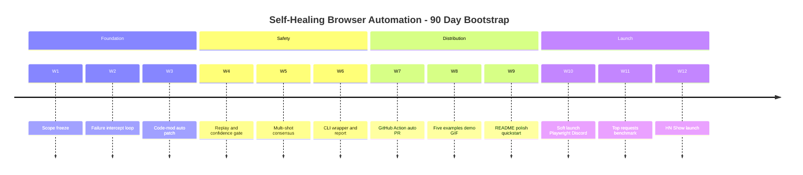

가상의 한국 솔로 인디 개발자 A가 있다 하자. 24/7 LLM(Large Language Model, 대형 언어모델) 에이전트와 셀프 호스팅 자동화를 1-2년 운영하며 페인포인트를 누적했다. 결심한다 — "이 경험을 OSS(Open Source Software, 오픈소스 소프트웨어)로 만들어 GitHub 스타 1만 개를 노리자." 문제는 "내가 겪은 페인 = 시장이 원하는 OSS" 등식이 성립하지 않는다는 점이다. 페르소나 경험은 후보 발굴의 1단계 도구일 뿐 정답지가 아니다. 이 글은 후보 다섯 개를 시장 viability 필터로 좁히며 "내 itch가 시장 itch는 아니다" 원칙이 어떻게 작동하는지 정리한다.

## 1. 페르소나 풀에서 후보 5개

- **A. LLM agent supervisor** — death·MCP(Model Context Protocol, 에이전트-외부도구 연결 프로토콜) 끊김·hang 자동 복구. 페인 강, 차별화 중, 인기 높음.
- **B. LLM-native scheduler** — cron(Unix 작업 스케줄러) 위 LLM job 레이어, 재시도·토큰 한도 정책 내장. 페인 중, 차별화 높음, 인기 중상.
- **C. awesome-ai-content-survival** — Google HCU(Helpful Content Update, 구글 콘텐츠 평가 업데이트) 이후 살아남는 AI 사이트 운영 패턴 큐레이션. 페인 강, 인기 매우 높음.
- **D. Self-Healing Browser Automation** — Playwright(Microsoft 브라우저 자동화) wrapper, selector(DOM 요소 지정) 깨지면 LLM이 DOM(Document Object Model, 브라우저 페이지 트리) 보고 자동 복구. 페인 강, 차별화 높음, 인기 높음.
- **E. Subagent Orchestration Patterns** — 메인↔서브 에이전트 협업 검증 + 경량 framework. 페인 강, 차별화 중, 인기 높음.

## 2. C 탈락, D 1순위

C부터 떨어진다. awesome-* 큐레이션은 2020년경 폭발 후 식상화돼 신규는 100-1k 스타 정체. AI 콘텐츠·SEO(Search Engine Optimization, 검색엔진 최적화) 청중은 비-개발자 비중이 높아 X(구 트위터)·뉴스레터에서 공유하지 GitHub 스타를 누르지 않는다 — 1만+ 스타는 개발자 청중의 화폐다.

남은 A·B·D·E 중 D 신호가 가장 깨끗하다. 개발자 native 청중 + 개발자 도구 = 스타 누적에 최적. demo가 즉시 receipt 역할 — "selector가 깨지자 LLM이 30초 만에 PR(Pull Request, 코드 변경 제안)을 자동으로 열었다" GIF 하나면 HN(Hacker News, 개발자 커뮤니티) 프론트 후보다. 매주 깨지는 팀은 repo 재방문 이유가 있어 contributor 자연 유입이 이어진다.

## 3. D의 진짜 차별화 — "LLM이 운전"이 아닌 "LLM이 고친다"

browser-use, Skyvern, Stagehand, OpenAI Operator 같은 30k 스타급은 표면적으로 같은 카테고리다. 차이는 비용과 결정성. 기존은 매 실행 LLM이 운전한다 — 비싸고 느리고 재현 불가. Playwright/Cypress CI(Continuous Integration, 코드 자동 통합·검증) 스위트 1000개를 가진 회사는 전부 rewrite할 수 없다.

self-healing은 drop-in wrapper다. 평소엔 결정적·무료로 돌고 selector가 깨질 때만 LLM이 개입한다. 비용 비대칭이 가장 큰 무기다. heal 이력을 PR로 남기면 QA·SRE(Site Reliability Engineering, 안정성 엔지니어링) 거버넌스도 충족된다.

## 4. 시장 좁힘 — 어디에 페인이 살아있는가

greenfield(신규) 본인 앱은 `getByRole`·`testid`(테스트 식별자) 쪽으로 가는 추세라 깨짐이 줄어드는 영역도 있다. 진짜 살아있는 시장은 (1) 외부 사이트 자동화·스크래핑 (남의 사이트엔 testid 못 박음), (2) 엔터프라이즈 레거시 테스트 스위트 (XPath·CSS 수년치 누적), (3) SAP·Salesforce·내부 인트라넷의 RPA(Robotic Process Automation, 단순 반복 업무 자동화), (4) 크로스팀 자동화 (자기 팀 UI가 아닌 경우). 포지셔닝은 "테스트 스위트 고치는 도구"가 아니라 **"통제 못 하는 UI 자동화의 유지보수 도구"**다.

## 5. LLM false positive에 대한 5중 신뢰 안전망

가장 큰 두려움은 LLM이 잘못된 selector로 패치해 테스트가 통과한 척하는 경우다. (1) **auto-merge OFF 디폴트** — PR만 생성, merge는 사람, (2) **confidence score gate** — 자기 평가 임계치 미만은 alert만, (3) **functional replay 검증** — heal 후 테스트 통과 시에만 PR, (4) **multi-shot consensus** — LLM 3회 호출, 2개 이상 동일 selector 시에만 채택, (5) **heal scope 보수** — "element not found"만 자동, "동작이 다르다"는 사람. README(프로젝트 설명 파일) 상단에 이 묶음이 명시되면 엔터프라이즈 평가의 첫 거부 사유가 사라진다.

## 6. 부트스트랩 reframe과 90일 plan

OSS 통념인 "5 reference customer 확보"는 무명 솔로에게 작동하지 않는다. **5 reproducible scenarios**로 reframe — `examples/`에 Vercel·Supabase·Prisma 공개 테스트 스위트 fork와 Wikipedia·Hacker News·Amazon 합성 시나리오를 넣으면 누구나 5분 안에 healing 작동을 직접 검증한다. customer가 아니라 scenario가 신뢰 fuel이다.

이 일정은 가설이다. 실제 솔로의 weekly capacity와 burnout 리스크는 따로 계산해야 한다.

## 7. 글의 중심 통찰 — 페르소나 4축 유용성

페르소나 경험이 무가치하단 뜻이 아니다. 네 축에서 유용 — (1) **페인 발굴** (안 겪어본 페인은 정직하게 표현 못 함), (2) **차별화 통찰** (매일 부딪힌 영역의 빈틈), (3) **마케팅 narrative** ("직접 살아서 만들었다" 신뢰 fuel), (4) **기술 자산 이전** (인접 분야 도구·패턴 이식). 진짜 방법론은 **페르소나 풀에서 후보 도출 → 시장 viability 필터** 2단계. 페르소나만으로 정하면 niche에 갇히고, 시장만으로 정하면 6개월 grind 중 동기 고갈. **양 축 교집합에서 고른다**. D는 둘 다 통과, A는 페르소나 안이지만 시장 신호 약함. 그래서 D다.

## 8. 페르소나 자산 빌리기 + vendor 흡수 대처

A가 D에 빌릴 무기 둘. (1) **장기 selector-breakage 히스토리** — 1-2년 누적 깨짐 케이스 익명화 → D의 공개 벤치마크. 신규 진입자가 못 가지는 자산. (2) **anti-detection·세션 영속화 노하우** — rate limit 회피, fingerprint(브라우저 식별 지문) 관리, 로그인 갱신, CAPTCHA(봇 검증) 우회. "외부 사이트·SaaS(Software as a Service, 클라우드 소프트웨어) RPA" 세그먼트의 차별화 무기.

거대 vendor가 SDK(Software Development Kit, 개발자 도구 모음)에 흡수할 위험엔 네 대응: 카테고리를 "CI-grade deterministic 유지보수"로 좁힘, GitHub Actions·CircleCI·Jenkins plugin·Slack 알림 같은 깊은 dev workflow 통합, LLM provider 중립(OpenAI/Anthropic/Gemini/로컬 ollama swap), 공개 데이터셋·패턴 repo로 community 해자.

## 9. 이 분석의 한계 — 자체 비판

- "selector breakage 시장이 살아있다"는 카테고리 이동 방향성만 본 추측. greenfield 감소는 측정 가능하지만 레거시·RPA 시장 사이즈의 단정적 데이터가 없다.
- "한국 솔로가 D로 mega-hit 가능"은 한국 솔로 OSS mega-hit 사례가 드문 상태의 추정. Pretendard(한국어·라틴 통합 폰트, 한국 솔로 OSS 성공 사례) 외엔 reference 부재.
- 90일 plan은 일반 OSS launch 통념을 D에 맞춰 짠 추정 일정이지 솔로의 weekly capacity·생계·burnout은 고려하지 않았다.
- "페르소나 + 시장 교집합" 프레임도 simplification. 자본·청중·운 같은 두 축 외 차원을 무시한다.

그래도 페르소나 single-axis보다는 두 축 교집합이 더 안전하다는 점은 남는다.

## 10. 마무리

페인포인트는 자산이지만 가장 흔한 오용이 "내가 가장 아픈 곳을 그대로 OSS로 만드는 것"이다. 페르소나 풀에서 후보를 도출하되 시장 viability 필터를 통과한 카테고리에 자산을 빌려준다 — 한 번에 한 후보, 페르소나 풀은 그대로 보관. 그게 솔로 메이커의 1만 스타 베팅 전략에 가깝다.

## 출처

- Playwright: <https://playwright.dev>
- browser-use: <https://github.com/browser-use/browser-use>
- Skyvern: <https://github.com/Skyvern-AI/skyvern>
- Stagehand: <https://github.com/browserbase/stagehand>
- Pretendard: <https://github.com/orioncactus/pretendard>
- Hacker News Show 가이드: <https://news.ycombinator.com/showhn.html>
