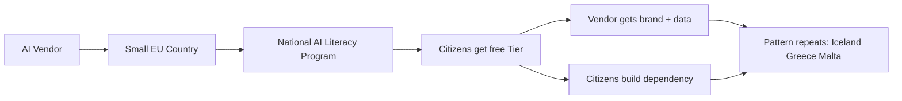

한 나라가 국민에게 수도·전기를 깔듯, 이제 AI도 비슷한 방식으로 보급된다. 2026년 5월 16일 OpenAI와 몰타 정부가 발표한 파트너십은 **몰타 시민·거주자 중 전자신분증(eID, electronic ID — 한국 주민등록 기반 공동인증서와 비슷한 디지털 본인확인 체계) 보유자에게 ChatGPT Plus(월 20달러 유료 요금제)를 1년 무료로 제공**하는 내용이다. 조건은 한 가지, 2시간짜리 의무 AI 강의를 먼저 수강해야 한다. 1년이 지나면 자비로 결제해야 한다.

지난 24시간 동안 이 발표는 Hacker News에서 302점을 받으며 상위권에 올랐다. 한 줄로 압축하면 "유료 AI 구독이 국가 단위로 풀린 첫 사례 중 하나"인데, 자세히 보면 이게 정말 새로운 패턴인지, 아니면 잘 짜인 마케팅인지 의견이 갈린다.

## 정확히 뭘 받는가

- **대상**: 몰타 국적자 또는 합법 거주자 중 eID 활성 계정 보유자. "전 국민"은 아니지만, 몰타 인구가 약 55만 명으로 작아 사실상 광범위.
- **사전 조건**: 정부가 제공하는 2시간 온라인 AI 리터러시(AI literacy, AI를 비판적으로 이해하고 활용하는 능력) 과정 수료.
- **혜택**: ChatGPT Plus 1년 무료(GPT-5 우선 접근, 이미지 생성, 더 높은 속도 한도 등).
- **이후**: 자동 갱신 아님. 본인이 결제해야 유지.

OpenAI 측이 직접 사용자에게 결제 정보를 안 받는 구조라 단순한 무료 체험과 다르고, 정부가 "AI 활용 능력 향상"이라는 공식 정책으로 포장한다는 점이 핵심이다.

## 작은 유럽 국가 패턴

이게 OpenAI의 첫 국가 단위 딜은 아니다. HN 토론에서 자주 인용된 패턴은 다음과 같다.

- **Anthropic + Iceland**: 아이슬란드 정부와 협력해 자국어 학습 데이터·번역 품질 개선.
- **OpenAI + Greece**: 그리스 학교·공공 부문에 ChatGPT 접근 확대 협약.
- **OpenAI + Malta**: 이번 건. 시민 전체로 범위 확장.

공통점이 분명하다. 모두 **인구 100만 이하, 영어·또는 유럽 통합 시장 안에 있는, 디지털 행정이 잘 정비된 소국**이다. 큰 나라(독일·프랑스·한국)에 같은 모델을 적용하면 비용·정치 비용 모두 폭발하지만, 몰타 규모에서는 OpenAI가 부담할 수 있는 마케팅 예산 수준이다.

## 비판 — "리터러시"인가 "데이터"인가

HN 댓글에서 가장 많이 나온 우려를 정리하면 세 갈래다.

**1. 데이터 수집 의혹**
무료 사용자는 곧 학습 데이터 공급원이다. ChatGPT 정책상 Plus 계정도 별도 옵트아웃을 하지 않으면 일부 대화가 모델 개선에 쓰일 수 있다. 몰타 시민 수십만 명이 일상·업무·민감 정보를 쏟아붓는 사회적 실험이라는 지적.

**2. GDPR 충돌 가능성**
EU 일반개인정보보호법(GDPR, General Data Protection Regulation, 2018년 시행된 EU 개인정보보호법) 하에서 시민이 의료·법률·재정 정보를 OpenAI 서버로 보내는 행위가 기관 차원의 묵인 아래 일어난다는 점이 문제. 정부가 권장하는 행동이 GDPR 책임 소재를 흐릴 수 있다는 우려.

**3. 정치 일정**
공교롭게도 몰타는 총선이 임박한 시점이다. "AI 무료로 받으세요"가 표심 자극용으로 활용된다는 비판이 있다. 1년 무료 만료 시점이 다음 정치 사이클 직전이라는 점도 거론됐다.

또 한 댓글의 차가운 계산: 몰타 인구 전체가 매주 ChatGPT를 쓴다 해도 OpenAI 주간 활성 사용자(WAU, Weekly Active Users)는 0.1% 정도 늘 뿐이다. 사용자 수 견인보다는 **브랜드와 정책 레퍼런스** 확보가 진짜 목적이라는 해석.

## 한국 맥락에서 보면

한국은 인구·언어·디지털 인프라 측면에서 몰타와 정반대다. 같은 모델을 그대로 들이기는 어렵지만, 비슷한 시도가 부분적으로 나타나고 있다.

- 공무원·교사 대상 ChatGPT/Claude 시범 도입.
- 지자체별 행정용 LLM 파일럿.
- 국내 LLM(네이버 HyperCLOVA X, 카카오 Kanana 등)을 공공 부문에 우선 배치하려는 정책 방향.

몰타 사례가 한국에 던지는 질문은 단순하다. **외산 모델을 국가 단위 무료 인프라로 깔 것인가, 아니면 자국 모델로 같은 효과를 만들 것인가.** 어느 쪽이든 1) 누가 데이터를 갖는가 2) 1년 후 비용은 누가 내는가 3) 의존도가 임계점을 넘으면 협상력은 어디로 가는가, 이 세 질문은 똑같이 따라온다.

몰타-OpenAI 딜의 진짜 시사점은 "한 나라에 AI를 깔았다"가 아니라, **AI 회사가 국가 단위 공공 서비스 공급자 위치를 시험하기 시작했다**는 신호다. 1년 무료가 끝나는 2027년 봄, 그 시점의 갱신율과 가격 책정이 다음 라운드 패턴을 결정할 것이다.

## 출처

- OpenAI 발표: https://openai.com/index/malta-chatgpt-plus-partnership/
- Hacker News 토론: https://news.ycombinator.com/item?id=48163392
- GDPR 개요: https://gdpr.eu/
