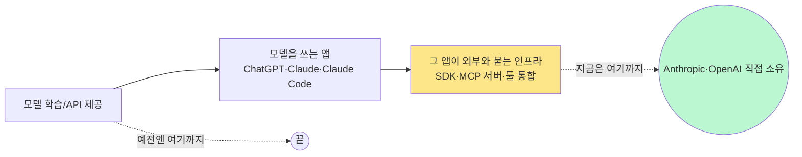

2026년 5월 18일, Anthropic이 Stainless라는 회사를 통째로 인수했다고 발표했다. 이름이 낯설 텐데, 한 줄로 줄이면 이렇다 — **"당신이 ChatGPT나 Claude를 코드로 부르려고 깔던 그 공식 라이브러리, 사실 거의 다 한 회사가 자동 생성해주고 있었다."** 그 회사를 Anthropic이 사버린 것이다.

이게 단순히 "AI 회사가 작은 스타트업 하나 인수했다" 수준의 뉴스가 아닌 이유는 두 가지다. 첫째, 같은 회사가 **OpenAI 공식 SDK도 만들고 있었다.** 둘째, Anthropic은 인수 직후 그 회사의 공개 서비스를 종료한다고 통보했다. 수백 개 기업이 의존하던 인프라가 어느 한 진영의 사내 도구로 들어간 셈이다.

## SDK가 뭔지부터

SDK(Software Development Kit, 어떤 서비스를 코드에서 쉽게 부르도록 미리 만들어둔 함수 묶음)는 개발자가 API를 직접 다루지 않아도 되게 해주는 포장지다. `openai.chat.completions.create(...)` 같은 한 줄짜리 호출 뒤에는 HTTP 요청 조립, 인증, 에러 처리, 스트리밍 파싱 같은 잡일이 다 숨어 있다. 이 잡일을 언어마다(파이썬·자바스크립트·자바·고·코틀린·루비…) 따로 만들어 유지하는 게 SDK 회사의 일이다.

Stainless는 이걸 **OpenAPI 스펙(API 명세를 표준 포맷으로 적어둔 파일) 하나에서 모든 언어의 SDK를 자동 생성해주는 서비스**였다. Anthropic API의 모든 공식 SDK가 회사 창립 이래 Stainless로 만들어졌다. 그리고 Stainless가 공개한 고객 명단에는 **OpenAI도 들어 있었다.**

여기에 더해 Stainless는 최근 1-2년 사이 MCP(Model Context Protocol, Anthropic이 만든 "에이전트가 외부 도구·데이터에 붙는 표준 프로토콜") 서버를 OpenAPI 스펙에서 자동 생성해주는 기능도 밀고 있었다. 즉 **에이전트가 외부 시스템에 연결되는 모든 길목의 자동화 도구**다.

## 인수 후 무엇이 바뀌나

Anthropic의 발표문은 두 가지를 말한다.

- 플랫폼 엔지니어링 책임자 Katelyn Lesse: *"에이전트는 무엇에 연결될 수 있는지에 따라서만 유용하다."* 즉 모델 자체보다 **연결성**이 다음 경쟁축이라는 선언.
- Stainless 창업자 Alex Rattray: *"우리 팀은 가장 중요한 플랫폼 위에서 좋아하는 일을 계속하게 됐다."* 사실상 팀이 Anthropic 사내로 들어가 Claude 전용 작업을 한다는 의미.

HN 토론에서 가장 많이 지적된 건 두 가지였다. 첫째, **Stainless의 공개 SDK 생성 서비스가 종료된다.** 수백 곳이 이미 의존 중인데도 그렇다. 둘째, **이게 OpenAI를 우회적으로 때리는 효과가 있다.** OpenAI는 SDK 인프라를 Stainless에 의존해왔기 때문에, 단기적으로는 마이그레이션 비용을, 장기적으로는 "경쟁사 손에 들어간 인프라"라는 부담을 안게 된다.

## 더 큰 그림 — AI 회사가 "토큰 파는 회사"를 넘어선다

이번 인수가 흥미로운 진짜 이유는 한 건의 거래가 아니라 **방향성**이다. AI 회사들이 단순한 모델 제공자에서 "개발자 워크플로우 전체 사업자"로 확장하고 있다.

- Anthropic은 작년부터 Claude Code(터미널 코딩 에이전트), Claude for Small Business, Claude Design 같은 **자기 모델을 쓰는 도구 자체**를 만들어왔다.
- OpenAI도 같은 방향으로 ChatGPT 앱·Codex CLI·Operator 같은 **앱 레이어**를 직접 만든다.
- 이번 Stainless 인수는 거기서 **한 단계 아래(인프라 레이어)**까지 내려간 사건이다.

비유하자면 클라우드 사업자가 단순히 서버만 팔다가, 점차 데이터베이스·메시지 큐·인증 서비스까지 자기 brand로 묶어 파는 흐름과 같다. AWS가 EC2만 팔다가 RDS·SQS·Cognito까지 갖춘 것처럼, AI 회사도 모델 옆 인접 레이어를 흡수 중이다.

## 한국 개발자·사용자에게 의미

당장 한국에서 SDK를 자체 운영하는 회사는 많지 않다. 하지만 두 가지가 의미 있다.

**첫째, MCP가 곧 표준이라는 신호가 강해졌다.** Anthropic이 SDK + MCP 자동 생성 회사를 통째로 사들였다는 건 "에이전트 ↔ 외부 시스템 연결"을 자기 손으로 직접 깎겠다는 뜻이다. 한국 회사가 자기 서비스를 LLM 에이전트에 노출하려 한다면, REST API만으로는 부족해지고 MCP 서버 제공이 점점 기본이 될 가능성이 높다.

**둘째, "중립 인프라"가 빠르게 정리되는 중이다.** 같은 SDK 회사가 OpenAI·Anthropic 라이브러리를 같이 만들던 구조가 1년 만에 한쪽으로 흡수됐다. 비슷한 사례가 더 나올 가능성이 있다(추측).

벤치마크 점수 몇 점이냐를 따지던 시기에서, **모델 옆에 무엇이 붙어 있느냐**가 더 중요한 단계로 넘어가는 중이다. 이번 인수는 그 변화를 가장 또렷하게 보여준 한 컷이다.

## 출처

- Anthropic, "Anthropic acquires Stainless" (2026-05-18): https://www.anthropic.com/news/anthropic-acquires-stainless
- Stainless 공식 사이트: https://www.stainless.com/
- Hacker News 토론 (243 points): https://news.ycombinator.com/item?id=48182281
