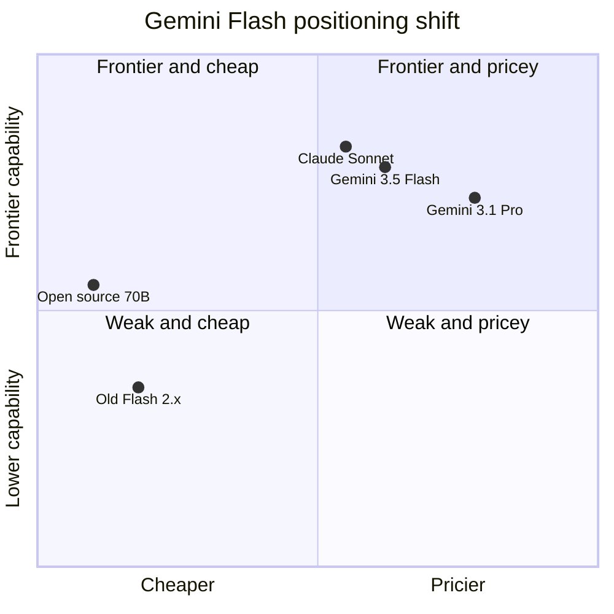

Google이 어제(5월 19일) Gemini 3.5 Flash를 정식 공개했다. Gemini 라인업에는 두 갈래가 있다. 비싸고 강력한 **Pro**, 그리고 빠르고 싼 **Flash**. 한국에서 Gemini 앱을 켰을 때 기본으로 도는 게 이 Flash 계열이다. 이번 발표를 한 줄로 요약하면 **"Flash가 frontier 성능까지 따라왔는데, 가격도 frontier 수준으로 올라왔다"** 이다.

이게 단순한 모델 업데이트로 안 보이는 이유는, Flash가 그동안 **"싸서 마음껏 쓰는 라인"**으로 자리잡혀 있었기 때문이다. 그 포지셔닝이 한 세대 만에 흔들렸다.

## 무엇이 바뀌었나 — 벤치마크

Google 발표는 Flash가 **이전 세대 Pro(Gemini 3.1 Pro)를 코딩과 에이전트 작업에서 뛰어넘었다**고 주장한다. 즉 "작고 빠른 라인"이 "큰 라인의 한 세대 전"을 추월하는 익숙한 패턴이 또 일어났다.

공개된 주요 점수:

- **Terminal-Bench 2.1**: 76.2% — 터미널 환경에서 멀티스텝 작업을 끝까지 수행하는 능력 측정.
- **GDPval-AA**: Elo 1656 — 다양한 실무 과제를 사람 평가자가 페어 비교한 점수.
- **MCP Atlas**: 83.6% — MCP(Model Context Protocol, Anthropic이 만든 "에이전트가 외부 도구·데이터에 붙는 표준 프로토콜) 기반 도구 사용 능력. Google이 자기 모델 평가에 경쟁사 프로토콜 벤치를 쓴다는 자체가 MCP가 사실상 업계 표준이 됐다는 신호다.
- **CharXiv Reasoning**: 84.2% — 학술 차트·그림 해석.
- **출력 속도**: "다른 frontier 모델 대비 4배 빠른 토큰 출력".

속도와 성능을 동시에 끌어올렸다는 게 핵심이다. 보통 둘 중 하나만 잡는데(빠른데 약하거나, 강한데 느리거나), 이번엔 두 축을 같이 밀어붙였다.

## 진짜 화제는 가격

HN에서 가장 격렬하게 토론된 건 벤치마크가 아니라 **가격**이었다. Flash가 한 세대 만에 약 3배 비싸졌다.

- 입력 토큰: 백만 토큰당 약 $1.50
- 출력 토큰: 백만 토큰당 약 $9.00

비교 감각을 위해 — 기존 Flash 계열은 입력 $0.30-0.50 / 출력 $2-3 수준이 일반적이었다. 그 라인이 이번 세대에서 입력 $1.50 / 출력 $9으로 점프했다. HN 상위 댓글의 정서는 단순했다. *"Flash는 원래 싸서 쓰는 거였는데, 이제 싸지 않다."*

Google은 이 변화를 직접 언급하지는 않지만, 발표문에서 *"competing frontier 모델 절반 이하 비용으로 에이전트 작업 수행"*이라 표현한다. 즉 **벤치마킹 대상이 "값싼 모델"에서 "frontier 모델"로 이동**한 것이다. 같은 이름(Flash)인데 비교 그룹이 달라졌다.

## 도식 — Flash 라인의 포지션 이동

Flash가 좌하단(싸고 보통)에서 우상단(비싸고 강함) 쪽으로 크게 이동했다. 이 빈자리(좌하단·좌상단)를 채우는 건 점점 오픈소스 모델(Qwen, DeepSeek 등)이다.

## 의미 — "싼 라인" 자체가 사라진다

이번 가격 변화는 Google 한 회사 얘기로 보기 어렵다. 이유는 두 가지로 추측한다.

1. **에이전트 워크로드가 토큰을 폭식한다.** 모델이 스스로 수십 단계 도구 호출을 도는 시대로 넘어가면서, 같은 사용자라도 토큰 소비량이 한 자릿수 배수로 뛴다. 단가를 같이 올리는 게 모델 회사 입장에서 합리적이 된다.
2. **오픈소스가 저가 구간을 흡수했다.** Qwen, DeepSeek, Llama 같은 모델이 충분히 쓸 만해지면서, frontier 업체가 "싼 모델로 경쟁"할 이유가 줄었다. HN 댓글에서 가장 많이 언급된 대안이 정확히 이들이라는 점이 이 흐름과 맞물린다.

## 한국 사용자에게 의미

- **개인 사용자**: Gemini 앱·AI Mode에서 자동으로 3.5 Flash로 갱신된다. 답변 품질·속도는 체감 가능. 무료 한도 축소 또는 Pro 유도 강화 가능성(추측).
- **API 사용 개발자**: 기존 Flash 비용 가정으로 짜둔 자동화·챗봇 파이프라인은 청구서가 갑자기 3배로 튈 수 있다. 토큰 캐싱, 컨텍스트 다이어트, 또는 일부 워크로드를 오픈소스로 옮기는 게 합리적인 시점.

성능만 보면 좋은 업데이트지만, 이름표(Flash)와 실제 포지션(frontier급 비용)이 어긋났다는 게 이번 발표의 진짜 핵심이다.

## 출처

- Google, "Gemini 3.5 Flash" (2026-05-19): https://blog.google/innovation-and-ai/models-and-research/gemini-models/gemini-3-5/
- Hacker News 토론 (303 points, 264 comments): https://news.ycombinator.com/item?id=48196570
