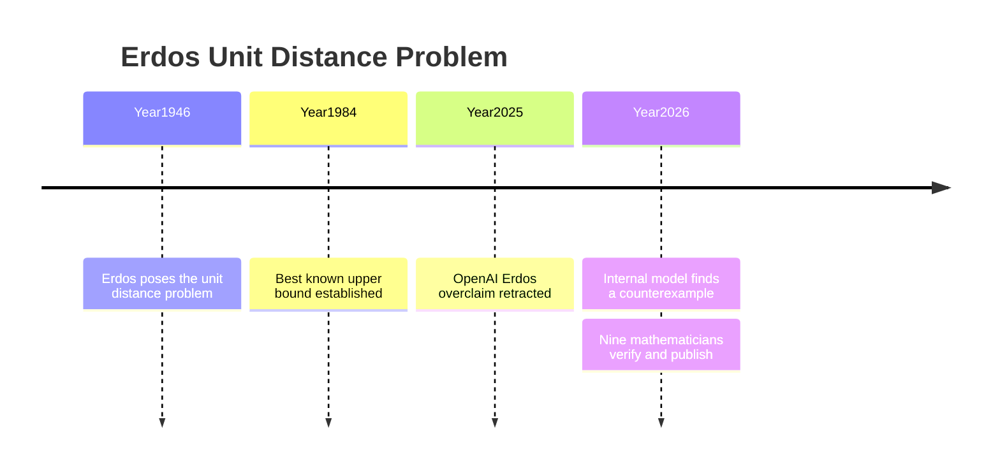

평면에 점을 n개 찍는다. 그중 정확히 같은 거리만큼 떨어진 점 쌍은 최대 몇 개나 만들 수 있을까? 질문은 단순해 보이지만, 1946년 헝가리 수학자 파울 에르되시(20세기에 가장 많은 수학 논문을 남긴 인물)가 던진 뒤 80년 동안 풀리지 않았다. 조합기하학에서 "가장 유명하고 가장 설명하기 쉬운 미해결 문제"로 꼽히는 질문이다.

지난 5월 20일, OpenAI는 자사 내부 모델이 이 문제를 둘러싼 핵심 추측을 깨뜨렸다고 발표했다. 그레그 브록만 OpenAI 사장은 "AI가 한 수학 분야의 중심 미해결 문제를 스스로 풀어낸 첫 사례"라고 했다. 다만 이 발표에는 7개월 전의 망신을 의식한 신중함이 깔려 있다. 무엇이 진짜 성과이고 무엇이 조심해서 읽어야 할 부분인지 정리해 본다.

## 80년 동안 아무도 못 깬 추측

이 문제의 정식 이름은 '단위 거리 문제'다. n개의 점으로 만들 수 있는 '같은 거리 점 쌍'의 최대 개수를 U(n)이라 하자. 에르되시는 점을 바둑판처럼 배열한 격자를 쓰면 U(n)이 n보다 아주 조금 큰 값까지 올라간다는 걸 보였고, 1984년에 다른 수학자들이 위쪽 한계가 n의 4/3제곱 정도임을 증명했다.

문제는 그 사이 어디가 진짜 답이냐는 것이었다. 에르되시는 격자가 사실상 최선이라고 — 즉 U(n)이 n에 아주 가까운 값에 머문다고 — 추측했고, 이 믿음에 500달러의 상금까지 걸었다. 80년간 누구도 격자보다 나은 배열을 찾지 못했기에, 대다수 수학자는 이 추측이 맞다고 여기고 추측을 '증명'하는 쪽에만 매달렸다.

## 내부 모델이 찾아낸 반례

OpenAI의 내부 범용 추론 모델(답을 내기 전 내부적으로 긴 사고 과정을 거치는 모델)은 정반대를 했다. 격자보다 같은 거리 점 쌍을 더 많이 만드는 새로운 점 배열의 무한 계열을 찾아낸 것이다. 이 한 사례가 곧 반례(추측이 틀렸음을 보여주는 단 하나의 사례)이고, 에르되시의 추측은 틀린 것으로 판명됐다.

개선폭 자체는 극도로 작다. 새 배열이 격자를 앞서는 정도는 지수로 따져 약 1 + 6×10⁻³⁸ 수준 — 사실상 0에 붙어 있는 값이다. 하지만 핵심은 크기가 아니다. 격자의 우위는 n이 커질수록 0으로 사라지는 종류였는데, 새 배열의 우위는 아무리 작아도 사라지지 않고 고정돼 있다(다항식 규모의 개선). "언젠가 0이 되는 차이"와 "영원히 남는 차이"는 수학적으로 전혀 다르고, 에르되시가 틀린 지점이 바로 거기다.

더 주목받는 건 푼 방식이다. 모델은 평면 위 점의 문제를 대수적 정수론(정수의 성질을 더 넓은 수 체계로 일반화해 다루는 분야)의 깊은 도구와 연결했다. 격자를 특정 수 체계 위의 배열로 보고, 그 수 체계를 더 복잡한 것으로 갈아끼우면 더 나은 배열이 나온다는 발상이다. 서로 멀리 떨어진 두 분야를 잇는 이 연결이 결과를 특별하게 만든 이유다.

## 9명의 수학자가 검증했다

OpenAI는 이번엔 결과를 외부 검증부터 받았다. 노가 알론, 토머스 블룸, 티머시 가워스(필즈상 수상자) 등 9명의 수학자가 AI의 증명을 사람이 읽기 쉽게 정리·검증한 짧은 논문을 함께 냈다. 블룸은 "AI가 500달러짜리 에르되시 문제를 풀었다고 분명히 말할 수 있다"고 했고, 알론은 "수많은 뛰어난 인간 연구자가 시도했다 실패한 일을 AI가 해냈다"고 평했다.

이런 신중함에는 이유가 있다. 2025년 10월 OpenAI의 한 임원이 "GPT-5가 미해결 에르되시 문제 10개를 풀었다"고 했다가, 알고 보니 모델이 이미 학술지에 실린 기존 답을 재발견한 것에 불과해 글을 내린 사건이 있었다. 당시 그 주장을 "심한 왜곡"이라 비판했던 인물 중 한 명인 블룸이, 이번엔 검증자로 이름을 올렸다.

## 그래도 조심해서 읽어야 할 것

검증에 참여한 수학자들조차 결과를 무조건 띄우지는 않는다. 가워스는 이번 성과가 추측을 '증명'한 게 아니라 '반례'를 찾은 것이라는 데 안도했다고 적었다. 증명에는 새로운 개념적 도약이 필요하지만, 반례는 컴퓨터가 수많은 경우를 끈질기게 시도하다 찾아낼 수 있는 종류이기 때문이다.

멜라니 우드는 "이 결과는 AI가 증명했다고 주장했다가 틀렸던 수많은 경우는 보여주지 않는다"며, AI가 사람을 설득하는 일이 실제로 옳은 증명을 내는 일보다 쉬워질 수 있다고 경고했다. 또 AI 논문이 선행 연구를 제대로 인용하지 않은 점을 지적하며, 학계가 인용 규범을 다시 정해야 한다고 했다.

인간의 역할도 사라지지 않았다. 검증 논문은 "AI가 만든 원래 증명은 완전히 유효했지만, 인간 연구자들이 이를 상당히 개선했다"고 적었다. 발상은 AI가 했어도, 그걸 읽고 다듬고 검증하는 일은 여전히 사람 몫이다.

## 마일스톤과 숙제가 같이 왔다

이번 일의 의미는 분명하다. AI가 수학 연구에서 사람을 돕는 보조 도구를 넘어, 사람이 80년간 놓친 발상을 스스로 내놓는 단계에 들어섰다. 가워스는 "사람이 이 논문을 써서 학술지에 냈다면 망설임 없이 게재를 권했을 것"이라고 했다. 동시에 이 사건은 숙제도 남겼다. 진짜 성과와 과장을 가려내는 일, AI의 증명을 검증하는 일, 인용 규범을 정하는 일 — 모두 아직 인간 공동체가 답을 정하지 못한 문제다. 하나의 발표 안에 마일스톤과 미완의 숙제가 같이 들어 있는 셈이다.

## 출처

- [An OpenAI model has disproved a central conjecture in discrete geometry — OpenAI](https://openai.com/index/model-disproves-discrete-geometry-conjecture/)
- [Remarks on the Disproof of the Unit Distance Conjecture (PDF) — Alon, Bloom, Gowers 외](https://cdn.openai.com/pdf/74c24085-19b0-4534-9c90-465b8e29ad73/unit-distance-remarks.pdf)
- [OpenAI claims it solved an 80-year-old math problem — for real this time — TechCrunch](https://techcrunch.com/2026/05/20/openai-claims-it-solved-an-80-year-old-math-problem-for-real-this-time/)
- [Greg Brockman on X](https://x.com/gdb/status/2057182650784452925)
- [Hacker News 토론](https://news.ycombinator.com/item?id=48212493)
