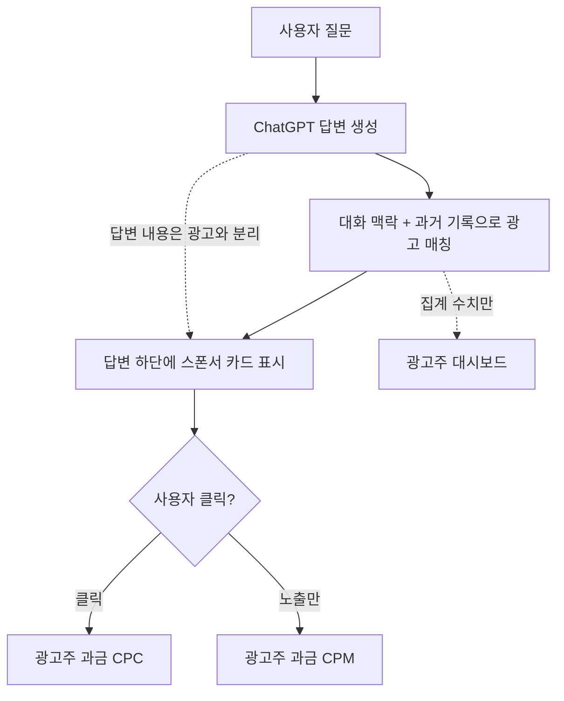

구글 검색창이 처음 나왔을 때는 광고가 없었다. 검색어를 넣으면 결과 링크만 깔끔하게 나왔다. 몇 년 뒤 결과 위아래로 '스폰서' 표시가 붙은 링크가 생겼고, 지금은 그 검색 광고가 구글 매출의 가장 큰 축이다. ChatGPT가 지금 그 길의 초입에 들어섰다.

OpenAI는 2026년 2월 미국의 무료 사용자에게 ChatGPT 광고를 처음 띄웠고, 5월 5일에는 'Ads Manager'라는 셀프서브 광고 플랫폼의 베타를 열었다. 셀프서브(self-serve)란 광고주가 영업 담당자를 거치지 않고 웹에서 직접 캠페인을 만들고 집행하는 방식이다. 이게 지금 주목할 만한 이유는 단순한 기능 추가가 아니라, 그동안 "무료 AI는 어떻게 돈을 버나"라는 질문에 OpenAI가 분명한 답을 내놓은 사건이기 때문이다.

## 광고는 어디에, 어떻게 보이나

ChatGPT 광고는 답변 자체를 바꾸지 않는다. 사용자가 질문하면 ChatGPT는 평소대로 답을 생성하고, 그 답변 아래에 '스폰서' 라벨이 붙은 살짝 음영 처리된 카드가 따로 표시된다. 카드에는 광고주 이름, 파비콘(favicon, 사이트 아이콘), 헤드라인, 짧은 설명, 이미지, 그리고 연결 링크가 담긴다. 검색 결과 페이지의 스폰서 링크와 형태가 거의 같다.

광고가 표시되는 건 무료 등급과 저가형인 ChatGPT Go 등급 사용자다. OpenAI는 광고가 답변 내용에는 영향을 주지 않는다고 못 박았다. 즉 "이 제품을 추천해 달라"는 식으로 답변을 매수하는 구조가 아니라, 답변과 광고를 물리적으로 분리해 둔 것이다.

## 키워드가 아니라 대화 맥락으로 매칭한다

전통적인 검색 광고는 사용자가 입력한 키워드에 광고를 붙인다. ChatGPT 광고는 다르게 작동한다. 지금 나누고 있는 대화의 주제, 과거 대화 기록, 이전에 어떤 광고를 눌렀는지를 종합해 맥락으로 매칭한다. 예를 들어 저녁 메뉴 레시피를 묻는 사용자에게는 식료품 배송이나 밀키트 광고가 붙는 식이다.

여기서 자연스럽게 떠오르는 걱정 — 광고주가 내 대화를 들여다보는 것 아닌가. OpenAI의 설명은 그렇지 않다는 것이다. 광고주는 사용자의 채팅 내용, 대화 기록, 메모리, 개인정보에 접근할 수 없고, 받는 것은 "광고가 몇 번 노출되고 몇 번 클릭됐다"는 집계 수치뿐이다. 맥락 매칭은 OpenAI 내부에서 처리하고, 광고주에게는 결과 숫자만 넘긴다는 구조다. 이 약속이 실제로 얼마나 지켜지는지는 시간이 지나야 검증되겠지만, 적어도 설계 의도는 명확하다.

## 진짜 변화는 '누구나 광고주'가 됐다는 점

2월 출시 때 ChatGPT 광고는 최소 지출 5만 달러를 요구하는 큐레이션된 시범 프로그램이었다. 대형 광고주만의 무대였다. 5월 셀프서브 전환은 이 문턱을 없앴다. 미국 사업체라면 최소 지출 요건 없이 약 5분 만에 광고주로 등록하고 캠페인을 돌릴 수 있다.

과금 방식도 늘었다. 기존 CPM(Cost Per Mille, 1000회 노출당 과금, 약 25-60달러)에 더해 CPC(Cost Per Click, 클릭당 과금, 카테고리별 입찰 하한 3-5달러)가 추가됐다. 또 광고 성과를 추적하는 측정 픽셀과 전환 데이터를 주고받는 Conversions API도 함께 열렸다. 측정 도구가 갖춰졌다는 건 광고판이 '실험'에서 '상품'으로 넘어갔다는 신호다. Dentsu, Omnicom, Publicis, WPP 같은 대형 광고 대행사와 Adobe, Criteo 등 애드테크 업체도 이 플랫폼에 붙었다.

## 무료 AI의 수익 모델이 정해졌다

OpenAI가 공개한 목표 숫자는 이 전환의 무게를 보여준다. 올해 광고 매출 25억 달러, 2030년까지 1000억 달러다. 구독료만으로는 수억 명이 쓰는 무료 등급의 운영 비용을 감당하기 어렵다는 현실 인식이 깔려 있다. 무료 AI 챗봇은 결국 구독과 광고라는 두 기둥으로 굴러갈 가능성이 커졌고, OpenAI가 먼저 그 두 번째 기둥을 세웠다.

남는 긴장은 답변의 중립성이다. 지금은 답변과 광고가 분리돼 있지만, 광고 매출 비중이 커질수록 "답변 자체에 스폰서를 끼워 넣고 싶은" 유인은 구조적으로 강해진다. 검색엔진이 지난 20여 년간 광고와 검색 품질 사이에서 줄타기를 해온 것처럼, AI 챗봇도 같은 줄타기를 시작했다. ChatGPT를 매일 쓰는 사용자 입장에서는, 답변 밑에 붙는 카드가 점점 익숙한 풍경이 될 것이다.

## 출처

- [New ways to buy ChatGPT ads — OpenAI](https://openai.com/index/new-ways-to-buy-chatgpt-ads/)
- [Testing ads in ChatGPT — OpenAI](https://openai.com/index/testing-ads-in-chatgpt/)
- [OpenAI launches self-serve ad platform — Axios](https://www.axios.com/2026/05/05/openai-self-serve-ad-platform)
- [OpenAI Launches Self-Serve Ads Manager for ChatGPT — Search Engine Journal](https://www.searchenginejournal.com/openai-launches-self-serve-ads-manager-for-chatgpt/573971/)
- [OpenAI Opens Ad Platform To CPC Bidding, Self-Serve Buys — MediaPost](https://www.mediapost.com/publications/article/414857/openai-opens-ad-platform-to-cpc-bidding-self-serv.html)
