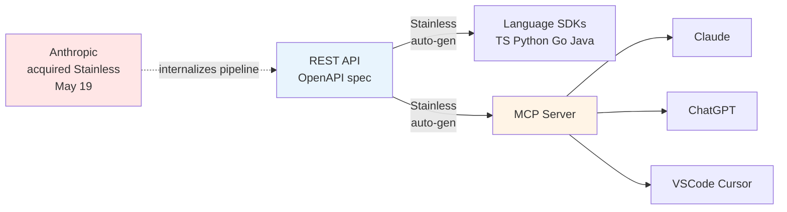

스마트폰을 산 사람이 가장 빨리 체감하는 평화는 충전 케이블이다. C타입 하나면 휴대폰·태블릿·노트북까지 다 꽂힌다. 5년 전엔 기기마다 다른 단자를 들고 다녀야 했다. AI 업계는 지금 그 USB-C 직전 상태와 비슷한 지점을 지나고 있다 — **MCP**(Model Context Protocol, AI 모델이 외부 데이터·도구에 연결되는 방식을 정한 개방형 표준)가 그 후보다.

며칠 전 다룬 Anthropic의 Stainless 인수도 이 흐름의 한 장면이었다. "SDK 같은 핵심 인프라가 한쪽 진영으로 몰리는 속도가 빨라진다"는 관찰이 정확히 MCP가 표준이 되어가는 압력이다. 이번 글은 그 후속편이다.

## MCP가 정확히 뭐를 표준화했나

MCP는 Anthropic이 2024년 말 공개한 개방형 프로토콜이다. 이전엔 AI 모델에 도구를 연결하는 방식이 모델마다 제각각이었다 — OpenAI의 function calling, Anthropic의 tool use, Google의 또 다른 포맷. 회사·모델이 바뀌면 어댑터를 처음부터 다시 짜야 했다.

MCP는 이걸 양쪽으로 분리했다. **MCP 서버**는 데이터·도구를 가진 쪽이 만들어 "내 DB에 이런 함수가 있다"를 표준 포맷으로 노출하고, **MCP 클라이언트**는 AI 앱·에이전트 쪽이 만들어 어떤 MCP 서버든 똑같이 꽂아 쓴다. 케이블 양 끝의 단자 모양만 같으면 무엇과 무엇이 연결되든 상관없다는 USB-C 비유가 공식 문서에 그대로 나온다.

## 빅테크가 다 줄섰다

| 진영 | MCP 지원 |
|---|---|
| Anthropic | 프로토콜 제정 주체. Claude는 처음부터 지원 |
| OpenAI | ChatGPT가 MCP 클라이언트 공식 지원 |
| Microsoft | Visual Studio Code가 MCP 서버 연결 기본 지원 |
| 에디터 | Cursor·MCPJam 등 다수 |
| 서드파티 | Figma·Blender·Notion·Google Calendar 서버 폭증 |

작년 이맘때만 해도 "Anthropic이 새 프로토콜 하나 던졌네" 수준이었던 흐름이, 1년 만에 **Anthropic·OpenAI·Microsoft가 모두 클라이언트를 지원하는 사실상 공통 표준**으로 굳어졌다. AI 업계 양대 진영이 같은 표준을 받아쓰는 건 흔치 않은 일이다.

## Stainless 인수 — OpenAPI ↔ MCP 라인 내재화

여기서 5월 19일 Anthropic의 Stainless 인수가 의미 있어진다. Stainless는 2022년 창업한 회사로, **OpenAPI**(REST API의 표준 명세 포맷) 스펙 하나를 던지면 TypeScript·Python·Go·Java SDK는 물론, **MCP 서버까지 자동 생성**해주는 서비스를 운영 중이었다.

이 팀이 Anthropic 사내로 들어가면 두 가지 압력이 동시에 커진다. 첫째, **Claude용 MCP 어댑터가 더 빨리 쏟아진다** — OpenAPI 스펙을 가진 모든 REST 서비스가 자동으로 Claude 친화 MCP 서버로 변환될 수 있다. 둘째, **"REST API 내놨으면 MCP 서버도 같이 내놔라" 압력**이 시장에 생긴다. 자동 생성이 가능해진 이상, MCP 서버 없는 서비스는 AI 에이전트 생태계에서 점점 불리해진다.

## 흐름 정리

핵심 메시지: **REST API 시대가 끝난 게 아니라, REST API 위에 MCP라는 한 층이 얹히는 중이다.** 그리고 그 한 층을 자동으로 깔아주는 파이프라인을 Anthropic이 사내로 가져왔다.

## 일반 사용자에게 의미

체감 변화는 두 가지다. 첫째, **Claude·ChatGPT가 외부 앱·서비스에 더 빠르게 연결된다.** Notion·Google Calendar·Figma는 이미 MCP 서버로 채팅창에서 직접 다룰 수 있고, 이 목록은 1년 안에 훨씬 길어진다. 둘째, **모델을 바꿔도 도구 셋이 따라온다** — Claude→ChatGPT 이동에도 같은 MCP 서버를 꽂아 쓰니 모델 락인(lock-in, 특정 회사 서비스에 묶이는 상태)이 약해진다.

표준이 굳기 전이라 변종 명세·비호환·보안 이슈는 따라붙겠지만, 빅테크가 같은 콘센트에 합의한 건 1990년대 USB 표준화 이후 한참 만의 일이다.

이 글은 [@opobull](https://github.com/opobull) 님의 [Stainless 인수 글 댓글](https://github.com/opobull/withintrend/discussions/2)에서 시작됐습니다.

## 출처

- [Model Context Protocol — 공식 사이트](https://modelcontextprotocol.io/)
- [Anthropic Acquires Stainless (2026-05-19)](https://www.anthropic.com/news/anthropic-acquires-stainless)
- [OpenAI ChatGPT MCP support](https://developers.openai.com/api/docs/mcp/)
- [Visual Studio Code MCP servers](https://code.visualstudio.com/docs/copilot/chat/mcp-servers)
