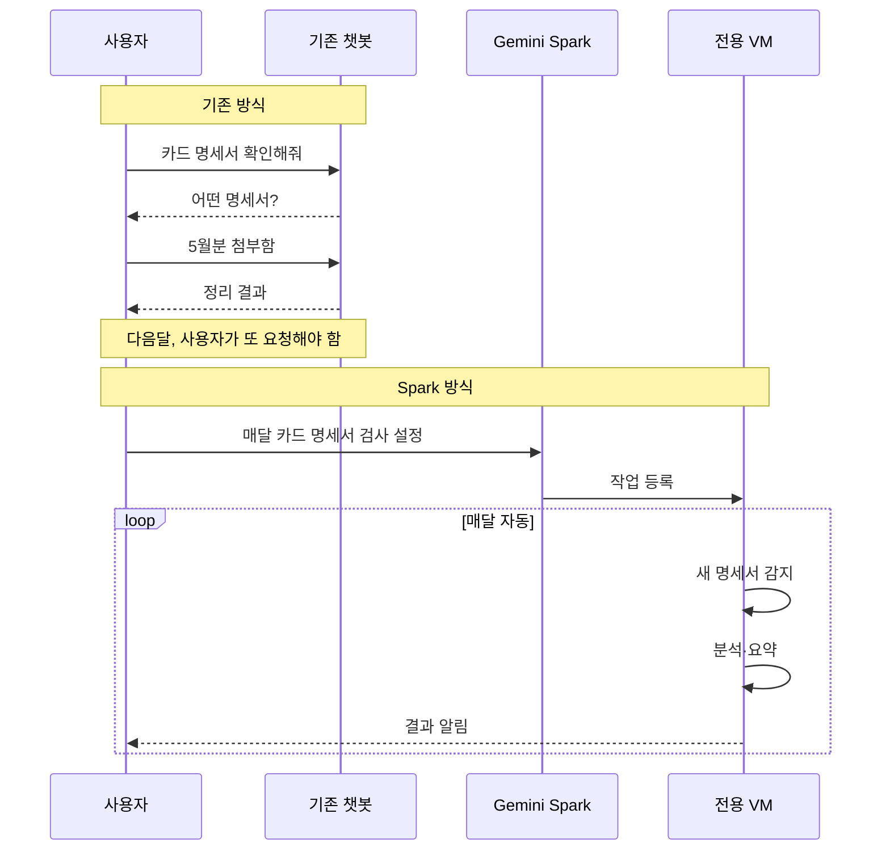

지금까지 우리가 쓰던 AI는 본질적으로 **자판기**에 가까웠다. 동전을 넣고(질문을 입력하고) 버튼을 누르면(엔터를 치면) 음료가 나오는(답이 나오는) 구조다. 안 누르면 아무 일도 안 벌어진다. 구글이 지난주 I/O 2026에서 공개한 **Gemini Spark**는 이 구조를 깨겠다는 선언에 가깝다. 사용자가 앱을 끄고 잠들어 있는 동안에도, 클라우드의 전용 가상 머신에서 Spark가 계속 돌면서 일을 처리한다.

키노트에서 Sundar Pichai가 "agentic Gemini era"라는 표현을 쓴 게 단순한 슬로건이 아닌 이유다. 모델 자체를 새로 만든 게 아니라, **모델을 두는 자리를 옮긴 변화**다.

## Spark가 뭘 하는지 — 발표된 구체적 예시

구글이 공식 블로그에서 든 예시 세 가지가 토픽의 결을 잘 보여준다.

- **신용카드 명세서 자동 검사**: 매달 들어오는 카드 명세서를 Spark가 알아서 파싱해서, 새로 생긴 구독료나 숨어 있던 자동결제를 사용자에게 정리해서 알려준다.
- **학교 안내 통합 다이제스트**: 자녀 학교에서 오는 이메일·공지·일정을 모아 마감일을 뽑아내고, 가족 구성원에게 일일 요약본을 보낸다.
- **회의 기록 → 결과물 자동 생성**: 이메일·채팅에 흩어진 회의 내용을 Spark가 종합해서 문서로 정리하고, 후속 메일까지 초안을 만든다.

세 예시의 공통점은 **사용자가 매번 "해줘"라고 명령하지 않는다**는 점이다. 한 번 설정해두면 그 뒤로 Spark가 알아서 반복한다. 한국 사용자에게 친숙한 비유로 보면, 카카오톡에 "내일 아침 9시 알람"을 한 번 설정해두는 것과 비슷하다. 단지 알람 대신 "매달 카드 명세서 정리"가 들어가는 거다.

기술적으로 이걸 가능하게 만드는 핵심은 **전용 가상 머신**이다. 기존 챗봇은 사용자가 메시지를 보내는 순간에만 잠깐 깨어났다 잠드는 구조였다. Spark는 사용자 한 명마다 구글 클라우드에 작은 컴퓨터 한 대가 배정돼서, 거기서 계속 돌고 있다. 채팅창이 닫혀 있어도, 휴대폰이 잠겨 있어도 작동한다.

## 왜 이게 지금 핫한가 — 세 회사가 같은 방향을 향한다

Spark만 따로 보면 그냥 "구글이 비서 기능을 추가했네" 수준으로 보일 수 있지만, 같은 흐름이 다른 주요 AI 회사에서도 동시에 일어나고 있는 게 중요하다.

- **Anthropic**: Claude의 **Computer Use**(2024년 말 공개) — Claude가 화면을 보고 마우스·키보드를 직접 조작해서 사람처럼 컴퓨터를 다루는 기능. 작년부터 계속 확장 중이다.
- **OpenAI**: ChatGPT의 **Operator / Tasks** 기능 — 예약된 시간에 ChatGPT가 자동으로 작업을 실행하는 흐름.
- **Google**: Gemini Spark — 위에서 설명한 24/7 전용 VM 비서.

세 회사가 같은 패턴(요청-응답 → 백그라운드 자동 실행)으로 움직인다는 건, 한두 회사의 실험이 아니라 **AI 인터페이스의 구조 자체가 바뀌고 있다**는 신호로 봐야 한다. 이 흐름이 자리 잡으면, 우리가 "AI 쓴다"고 할 때 떠올리는 그림이 챗봇 창에서 → 백그라운드에서 알아서 도는 비서로 바뀌게 된다.

## 기존 챗봇과 Spark는 어떻게 다른가

말로만 설명하면 와닿지 않으니 메시지 흐름으로 비교해보자.

차이는 한 줄로 요약된다. **기존은 매번 사용자가 시작점**이고, **Spark는 한 번 설정한 뒤로는 클라우드가 시작점**이다.

## 그래서 일반 사용자에게 뭐가 바뀌나

당장 한국 사용자 입장에서 Spark가 얼마나 잘 동작할지는 미지수다. 한국어 처리·국내 서비스 연동(네이버 메일, 카카오, 토스 같은 것들)이 얼마나 매끄러울지는 추측 영역이다. 구글 발표는 영어 중심 시나리오 위주였다.

다만 한 가지는 분명하다. AI 회사들이 이번 분기에 **"비서를 더 똑똑하게"가 아니라 "비서를 항상 켜둔다"** 쪽으로 자원을 쏟고 있다. 모델 성능 경쟁(GPT-4 vs Claude vs Gemini)에서 **사용 방식 경쟁**으로 한 단계 옮겨가는 중이다.

자판기에서 음료를 사는 대신, 냉장고가 알아서 음료를 채워두는 시대로 가는 길목이다. 그 첫 큰 발이 Spark다.

## 출처

- Google, [I/O 2026: Welcome to the agentic Gemini era](https://blog.google/innovation-and-ai/sundar-pichai-io-2026/)
- Google, [The Gemini app becomes more agentic, delivering proactive, 24/7 help](https://blog.google/innovation-and-ai/products/gemini-app/next-evolution-gemini-app/)
- Google, [Introducing Managed Agents in the Gemini API](https://blog.google/innovation-and-ai/technology/developers-tools/managed-agents-gemini-api/)
