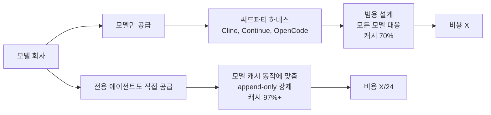

OpenAI가 Codex CLI를 내고 Anthropic이 Claude Code를 내는 동안, DeepSeek은 자기 모델 위에서 도는 외부 도구(Cline, Continue, OpenCode 등)에 얹혀 있었다. 5월 25일 그게 바뀌었다 — DeepSeek 전용으로 설계된 터미널 코딩 에이전트 Reasonix가 GitHub에 공개됐고, 같은 날 V4 Pro API의 75% 할인이 5월 31일자로 영구 적용된다는 발표가 따라붙었다. Hacker News 첫날 684점.

핵심은 가격이 아니라 "모델 회사가 직접 자기 모델 캐시 동작에 맞춰 에이전트를 짠다"는 패턴이다. 같은 V4 Pro를 일반 코딩 하네스(harness, LLM에 도구·파일시스템·실행 권한을 묶어주는 외부 래퍼)로 돌릴 때와 Reasonix로 돌릴 때 캐시 적중률이 두 배 가까이 차이 난다는 사용자 보고가 줄을 잇고 있다.

## 가격이 뒤집힌 게 아니라 캐시가 뒤집혔다

DeepSeek은 prefix-cache(프리픽스 캐시, 직전 요청과 동일한 앞부분 토큰을 재사용해 다시 계산하지 않는 메커니즘)를 매우 공격적으로 굴린다. 캐시 적중 토큰은 미적중 토큰의 1/10 가격. Anthropic도 OpenAI도 비슷한 메커니즘이 있지만, DeepSeek의 가격차가 가장 가파르다.

그래서 "캐시를 얼마나 안 깨고 유지하느냐"가 비용을 결정한다. Reasonix는 이 한 가지를 위해 설계됐다 — append-only 루프(매 턴마다 컨텍스트를 뒤에서만 늘리고 중간을 건드리지 않는 구조), 도구 호출 결과의 결정적 직렬화, 시스템 프롬프트·툴 정의·파일 트리의 위치 고정. 모두 "프리픽스가 절대 바뀌지 않게" 만드는 장치다.

Hacker News에 올라온 한 사용자의 실측:

- 같은 코딩 세션을 Reasonix + DeepSeek V4 Pro로: **캐시 적중률 97.27%, 총 비용 $10**
- 동일 워크로드를 Claude Sonnet 가격으로 환산: **$241.79**
- 캐시 적중 토큰 472M vs 미적중 토큰 13.3M

24배 차. 다른 OpenCode 사용자는 일반 사용 70%, 잘 튜닝된 셋업에서 98.6%까지 보고했고, 직접 짠 루프에서는 99.5–99.9%까지 올라간다.

회의적인 의견도 있다 — "캐시 깨지지 않게 컨텍스트를 안정적으로 유지하는 건 기본 원칙이고, Reasonix만의 혁신은 아니다." 맞는 지적이다. 다만 기본 원칙을 모든 다른 모델·하네스 호환성을 포기하고 한 모델에 맞춰 끝까지 밀어붙인 게 이번 결과를 만든 것 같다.

## "모델 회사가 직접 에이전트를 만든다"의 의미

지난 2년 동안 코딩 에이전트 시장의 구조는 "모델은 추상화된 API, 에이전트는 외부 회사"였다. Cline, Continue, Aider, OpenCode 같은 하네스는 GPT·Claude·Gemini·DeepSeek 어느 모델이든 끼울 수 있도록 추상화돼 있다.

이 추상화에는 대가가 있다. 모델마다 캐시 무효화 조건, 도구 호출 직렬화 포맷, 시스템 프롬프트 처리 방식이 다른데, 범용 하네스는 "어느 모델에 끼워도 돌아가는" 공통분모로 설계할 수밖에 없다. 그래서 캐시 적중률이 어느 모델에서도 최적이 아니다.

Anthropic의 Claude Code, OpenAI의 Codex CLI도 같은 방향이었다 — 자기 모델 동작에 맞춰 튜닝한 1st-party 에이전트. Reasonix는 그 흐름에 DeepSeek이 합류했다는 신호고, 가격차가 가장 큰 모델이라 효과가 가장 극적으로 드러났을 뿐이다.

## 사용자한테 뭐가 바뀌나

당장은 "DeepSeek V4 Pro로 코딩하던 사람들의 비용이 1/2–1/3로 더 떨어진다" 정도다. Claude Code 사용자가 갈아탈 만한 일은 아니다 — Reasonix는 DeepSeek 전용이고, V4 Pro의 한국어 도구 호출 안정성, Long context 디버깅 능력은 Sonnet 4.6 / Opus 4.7과 동급이 아니다.

다만 중기적으로는 두 가지 변화를 예고한다. (1) 다른 모델 회사들도 자기 모델 전용 에이전트를 따로 낼 가능성이 커진다. Gemini가 비슷한 도구를 낼지가 다음 관전 포인트. (2) 범용 하네스(Cline·Continue·OpenCode)는 "어떤 모델에 끼워도 캐시 최적이 안 나오는 추상화 비용"이라는 정체성 문제를 떠안게 된다. 이들이 어떻게 대응할지가 코딩 에이전트 시장의 다음 라운드다.

가격 자체가 뉴스가 아니다 — DeepSeek은 작년부터 가격 파괴자였다. 진짜 뉴스는 모델 회사가 "내 모델은 우리가 짠 도구로 써야 제값"이라는 자세를 공식화한 것이다.

## 출처

- [DeepSeek Reasonix 공식 사이트](https://esengine.github.io/DeepSeek-Reasonix/)
- [DeepSeek Reasonix GitHub](https://github.com/esengine/DeepSeek-Reasonix)
- [Hacker News 스레드 — DeepSeek reasonix, DeepSeek native coding agent with high caching and low cost](https://news.ycombinator.com/item?id=48256953)
- [Hacker News 스레드 — DeepSeek makes the V4 Pro price discount permanent](https://news.ycombinator.com/item?id=48237663)
