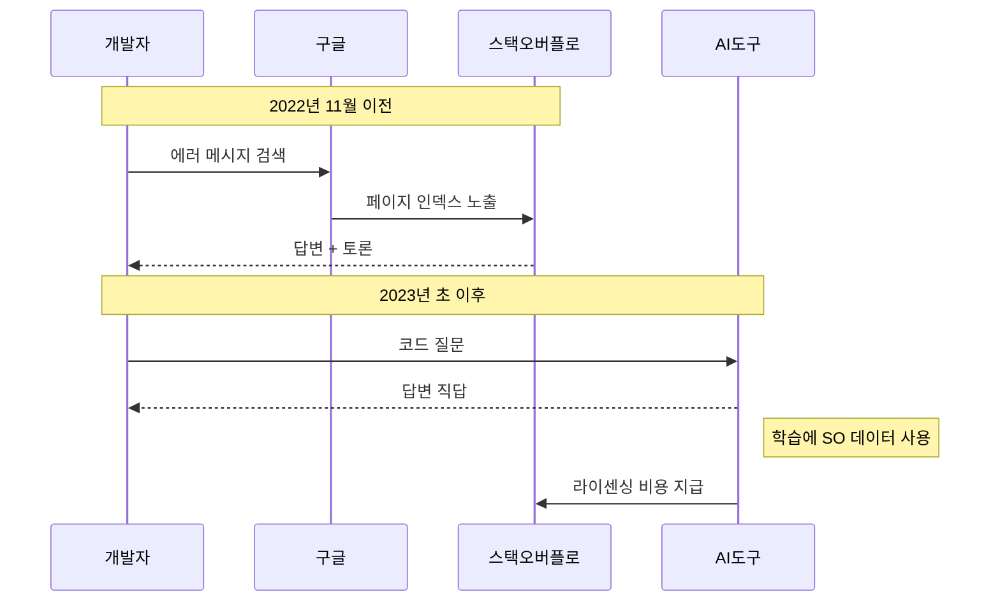

코딩하다 막히면 일단 구글에 에러 메시지를 붙여 넣고, 빨간 새 아이콘이 박힌 페이지를 열던 시절이 있었다. 그 사이트의 이름은 스택오버플로(Stack Overflow). 한 달에 6,866개. 지난달 이 사이트에 새로 올라온 질문 수다. 2008년 사이트가 처음 문을 열었을 때와 같은 수준이다. 18년치 성장이 한 줄로 지워졌다.

그런데 회사는 망하지 않았다. 매출은 오히려 두 배가 돼서 1억 1,500만 달러를 찍었다. 작년에 8,400만 달러 적자였던 손실은 2,200만 달러까지 줄었다. 트래픽이 무너진 회사가 어떻게 더 많이 벌고 있는지 — 이게 오늘 글의 주제다.

## 질문이 사라진 시점은 정확히 ChatGPT 데뷔 직후

CEO 프라샨스 찬드라세카르는 작년 12월 인터뷰에서 시점을 짚었다. "질문이 감소하는 걸 본 건 2023년 초였고, 사라진 건 전부 매우 단순한 질문이었다. 복잡한 질문은 여전히 우리 쪽에서 묻는다." ChatGPT가 2022년 11월에 데뷔했으니 시차가 두세 달 정도다.

그 후 시장에 들어온 코딩 AI 도구들 — ChatGPT, Claude, Gemini, Microsoft Copilot, Cursor — 이 차례로 스택오버플로의 검색 트래픽을 흡수해 갔다. 일론 머스크는 2023년 7월에 이 흐름을 "LLM(Large Language Model, 대규모 언어 모델)에 의한 죽음"이라고 표현했다. 거칠지만 사실관계는 정확했다.

남은 건 정확히 CEO가 말한 그대로다. AI가 못 푸는 것, 또는 풀어도 틀리는 것 — 그런 질문만 사람들이 사이트에 올린다. 1차 자료를 만드는 거대 커뮤니티가 'AI 보조선' 정도로 좁아진 셈이다.

## 살아남은 비결 두 가지 — 사내용 + 데이터 판매

회사가 적자를 줄인 방식은 두 갈래다.

**첫째, Stack Internal.** 회사 안에서만 쓰는 비공개 Q&A 시스템을 SaaS로 판다. 코드 노하우가 외부 공개 사이트로 새는 걸 막고 싶은 기업들에게는 매력적인 상품이다. 현재 25,000개 기업이 쓰고 있다. 외부 커뮤니티는 죽었지만 '사내 커뮤니티' 수요는 오히려 AI 시대에 더 커졌다.

**둘째, AI 회사에 데이터를 판다.** 스택오버플로가 17년간 축적한 수천만 개의 질문-답변은 코딩 모델 학습의 1급 자료다. 라이센싱 계약이 매출의 큰 축이 됐다.

레딧(Reddit)이 먼저 닦아둔 길을 따라간 셈이다. 레딧의 2024년 데이터 라이센싱 매출은 2억 300만 달러를 넘겼다. 다만 시장의 평가는 두 갈래다. 레딧 주가는 올해 들어 약 40% 빠졌다. "라이센싱 매출은 한 번 팔면 끝이라 반복성이 약하다"는 회의론이 있고, 그 의심이 가격에 반영돼 있다.

## 흐름이 어떻게 바뀌었나

흐름의 핵심은 트래픽 종착지가 바뀐 것만이 아니다. **돈의 방향**이 바뀌었다. 예전엔 광고주가 개발자 트래픽을 따라 스택오버플로에 돈을 냈다. 지금은 AI 회사가 그 사이트의 '축적된 과거'를 사 가는 구조다. 사람이 모이는 광장이 아니라 데이터가 저장된 창고로서 가치를 인정받는 것이다.

## 일반화하면 — 콘텐츠 플랫폼의 두 갈래 미래

같은 패러독스가 다른 곳에서도 보인다. 레딧이 이미 그랬고, 위키미디어 재단(Wikimedia Foundation, 위키백과 운영 비영리)도 라이센싱과 정책 논의를 강화하고 있다. 뉴스 매체들의 OpenAI·Anthropic 상대 협상도 같은 맥락이다.

콘텐츠 플랫폼이 AI 시대에 갈 길은 둘 중 하나로 좁혀지는 모양새다. 하나는 사용자가 직접 가서 머무는 광장의 정체성을 지키는 것 — 인스타그램·유튜브처럼 영상·실시간성·소셜 그래프 같은 'AI가 복제 못 하는 것'으로 묶어두는 길. 다른 하나는 스택오버플로처럼 데이터 자산을 라이센싱하는 공급자로 전환하는 길.

스택오버플로가 사실상 후자를 택한 것 자체가 신호다. 그래도 적자가 줄었으니 어쨌든 단기적 답은 됐다. 다만 라이센싱 매출이 일회성에 가깝다는 시장의 의심을 어떻게 풀어낼지는 다음 몇 분기에 드러날 것이다.

## 출처

- 셔우드 뉴스, "Stack Overflow's forum is dead but the company's still kicking" (2026-01-07): https://sherwood.news/tech/stack-overflow-forum-dead-thanks-ai-but-companys-still-kicking-ai/
- 해커뉴스 토론: https://news.ycombinator.com/item?id=top
