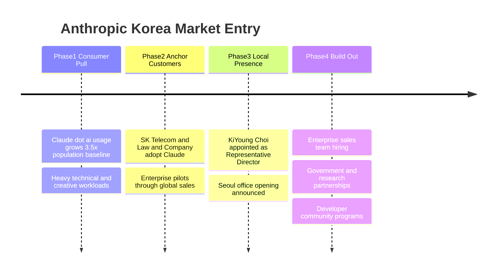

미국 AI 회사가 "한국이 인구 대비 자사 제품을 3.5배 더 많이 쓴다"고 공식 발표하는 일은 흔치 않다. 그런데 어제(5월 26일) Anthropic이 정확히 그 말을 했다. 그러면서 KiYoung Choi를 한국 대표(Representative Director)로 임명하고, 서울 사무소를 곧 연다고 알렸다. Claude를 만드는 그 Anthropic이 한국에 첫 해외 거점 중 하나를 차린다는 얘기다.

ChatGPT가 한국에 사실상 가장 많이 쓰이는 외산 AI 서비스라는 인식이 우세한 가운데, Anthropic이 "한국이 우리에게 핵심 시장"이라는 신호를 꽤 분명하게 던졌다. 단순히 마케팅용 문구가 아니라, 사무소·전임 임원·기업 영업을 동시에 묶은 진짜 투자다.

## "3.5배"라는 숫자가 뜻하는 것

Anthropic이 발표문에서 인용한 자체 지표(Economic Index, Anthropic이 자사 모델 사용 패턴을 측정해 공개하는 분기 데이터)에 따르면, 한국인은 인구 비례로 기대되는 사용량보다 3.5배 더 많이 Claude.ai를 쓴다. 그리고 그 사용의 무게중심이 기술·창작 영역으로 기울어 있다고 했다.

이 두 줄을 풀면 이렇게 읽힌다.

- 한국은 Anthropic 입장에서 "마진이 나는" 시장이다. 단순 채팅 트래픽이 아니라 코드·문서·번역 같은 무거운 워크로드를 돌리는 사용자 비중이 크다는 뜻이다. API 매출 잠재력이 큰 패턴.
- 그래서 "마케팅 사무소"가 아니라 **엔터프라이즈 영업 거점**을 깔 가치가 있다. 임원 한 명을 풀타임 채용한다는 건 그 신호다.

다만 이 3.5배는 Anthropic이 자기 데이터로 산출한 수치라는 점은 명시할 필요가 있다. 외부 감사가 들어간 시장 점유율이 아니라, "우리 서비스 쓰는 비율이 이렇다"는 1차 자료다.

## 한국지사장 이력 — '엔터프라이즈 영업' 베테랑

KiYoung Choi의 직전 직장은 **Snowflake**(클라우드 데이터 웨어하우스 회사)의 한국 General Manager. 그 전에는 Google Cloud, Adobe, Autodesk, Microsoft에서 한국·아태 지역 리더 역할을 거쳤다. 30년 넘게 미국 B2B 소프트웨어 회사의 한국 진입을 직접 지휘해온 사람이다.

이 이력은 Anthropic이 한국에서 무엇을 하려는지 거의 그대로 드러낸다.

- 컨슈머 마케팅(앱스토어 광고, 인플루언서 협찬)을 키우려는 게 아니다. 그건 Snowflake·Autodesk 출신 임원이 할 일이 아니다.
- 대신 **대기업·중견기업 영업, 정부·연구기관 파트너십, 한국어 컴플라이언스**가 메인이다. 이미 발표문에서 정부·연구기관 engagement를 언급했다.

쉽게 말해 Anthropic은 한국을 "이미 개인 사용자는 알아서 쓰고 있으니, 이제 B2B 매출을 본격적으로 긁어모을 시장"으로 본다.

## 이미 Claude를 쓰는 한국 기업들

발표문에 두 한국 고객사가 명시적으로 등장한다.

- **로앤컴퍼니(Law&amp;Company)**: 로톡으로 알려진 법률 플랫폼. AI 법률 어시스턴트에 Claude를 쓴다고 밝혔다. 변호사의 리서치·문서 작성 시간을 줄이는 용도.
- **SK Telecom**: 한국 1위 통신사. 고객센터용 커스텀 AI 시스템에 Claude를 채택했다. SKT는 이전에도 Anthropic과 별도 파트너십을 발표한 바 있다.

두 사례의 공통점은 **한국어·도메인 특화 데이터에 LLM을 얹는 패턴**이다. 법률 문서, 통신 약관·고객 응대 매뉴얼처럼 외산 LLM이 그대로는 잘 다루지 못하는 영역에 한국 기업이 자체 데이터를 결합해 Claude 위에 구축한다. Anthropic이 한국에 영업팀을 두려는 이유가 여기서 또 명확해진다 — 일반 챗 사용자는 본사 셀프서브로 충분하지만, 이런 엔터프라이즈 통합 프로젝트는 현지 영업·솔루션 엔지니어 없이는 안 굴러간다.

## 사용자에게 실제로 뭐가 바뀔까

이 부분은 발표에 명시되지 않아 일부 추측이 섞인다.

- **한국어 고객 지원·결제**: 현재 Claude.ai 결제는 USD, 영수증·문의도 영어 위주다. 한국 법인이 생기면 원화 결제·세금계산서·한국어 문의 채널이 단계적으로 붙을 가능성이 높다(추측).
- **컴플라이언스·데이터 거버넌스**: 개인정보보호법, 금융권 클라우드 가이드라인 등 한국 특유의 규제에 맞춘 안내가 정식 문서화될 가능성. 엔터프라이즈 계약을 따려면 필수.
- **컨슈머 가격**: 한국 단독 가격 책정이 들어갈지는 미지수. Anthropic은 글로벌 단일 가격에 가까운 정책을 써왔다.

가장 확실한 변화는 **B2B 영업 접점이 생긴다**는 점이다. 그동안 한국 기업이 Claude를 도입하려면 사실상 본사 영업팀과 영어로 직접 거래하거나 AWS Bedrock·Vertex AI 같은 클라우드 마켓플레이스를 경유해야 했다. 이제 서울에 직통 라인이 생긴다.

## Anthropic의 한국 시장 진입 단계

흐름은 명확하다. 한국 사용자가 먼저 자발적으로 쓰기 시작했고, 그 위에 SK Telecom·Law&amp;Company 같은 앵커 고객사가 붙었고, 이제 본격적인 현지 조직이 들어선다.

## 의미와 시사점

외국 frontier AI 회사가 한국에 정식 사무소를 두는 첫 사례에 가깝다(OpenAI는 2025년 6월 도쿄·서울 사무소 계획을 발표했으나 진행 속도와 규모는 별도 추적이 필요). 중요한 건 Anthropic이 한국을 **"본사가 직접 챙겨야 할 만큼 큰 시장"**으로 명시했다는 사실이다.

한국 개발자·기업 입장에서 단기적으로 가장 체감되는 변화는 영업 접점일 것이고, 중기적으로는 한국어·한국 법규에 맞춘 제품·계약 옵션이 늘어날 가능성이다. 외산 AI 회사들이 한국을 후순위 시장으로 두던 시기는 끝났다고 보는 게 자연스럽다.

채용 페이지는 anthropic.com/careers에 열려 있다. 한국 거점이 어떤 직군부터 채우는지 보면 앞으로 한국에서 무엇을 팔려는지가 더 분명해질 것이다.

## 출처

- Anthropic, "Anthropic appoints KiYoung Choi as Representative Director of Korea ahead of Seoul office opening" (2026-05-26): https://www.anthropic.com/news/kiyoung-choi-representative-director-anthropic-korea
- Anthropic Economic Index: https://www.anthropic.com/economic-index
- Anthropic Careers (Seoul): https://www.anthropic.com/careers
