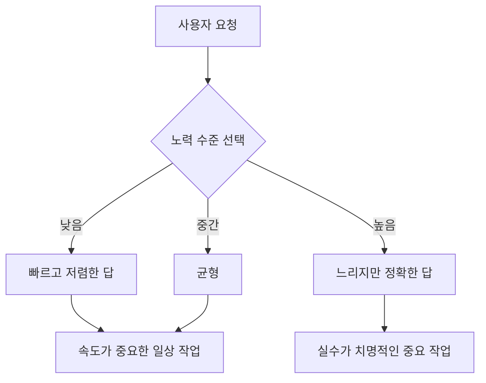

Anthropic이 자사 최상위 AI 모델인 클로드(Claude)의 새 버전 **오푸스(Opus) 4.8**을 공개했다. 오푸스는 Anthropic 모델 라인 중 가장 크고 똑똑한 등급으로, 글쓰기·코딩·복잡한 추론을 맡는 간판 모델이다. 직전 버전인 4.7이 나온 지 얼마 되지 않아 등장한 소수점 업데이트인데도, 발표 당일 해커뉴스(Hacker News, 개발자 커뮤니티) 1위에 941점으로 올라설 만큼 주목을 받았다.

흥미로운 건 발표의 무게중심이다. "전보다 훨씬 똑똑해졌다"는 자랑이 아니라 **"더 믿고 부릴 수 있게 됐다"**가 핵심 메시지다. AI 모델 경쟁이 raw(순수) 지능 점프에서 신뢰성과 제어 가능성 쪽으로 이동하고 있다는 신호여서, 일반 사용자 입장에서도 이번 변화가 의미가 있다.

## 무엇이 달라졌나

가장 눈에 띄는 수치는 **신뢰성**이다. Anthropic은 오푸스 4.8이 직전 버전보다 코드의 결함을 놓칠 확률이 약 4배 낮다고 밝혔다. 단순히 답을 잘 내는 게 아니라, 잘못된 계획이나 실수를 스스로 의심하고 짚어내는 판단력이 좋아졌다는 설명이다. AI에게 일을 맡길 때 가장 무서운 게 "틀린 걸 자신 있게 내놓는" 상황인데, 바로 그 지점을 겨냥했다.

벤치마크(성능 측정 시험) 수치도 함께 공개됐다. 웹 작업 자동화 능력을 재는 **Online-Mind2Web**(AI가 실제 웹사이트에서 주어진 일을 처음부터 끝까지 해내는지 측정하는 시험)에서 84%를 기록해, 4.7은 물론 경쟁작인 OpenAI의 GPT-5.5도 앞섰다고 한다. 법률 업무 벤치마크에서도 최고점을 받았다.

가격은 그대로 묶였다. 입력 100만 토큰당 5달러, 출력 100만 토큰당 25달러로 4.7과 동일하다. 오히려 빠른 응답을 위한 **fast mode**(속도 우선 모드) 요금은 이전보다 3배 저렴해졌다. 성능은 올리고 값은 동결하거나 내린 셈이다.

## 똑똑함보다 '조절'과 '운영'

이번 발표에서 가장 구조적인 변화는 두 가지 새 기능이다.

첫째, **노력 조절(effort control)**이다. 사용자가 모델에게 "얼마나 힘을 쓸지"를 직접 고를 수 있다. 빠르고 싼 답이 필요하면 노력을 낮추고, 정확도가 중요하면 노력을 높이는 식으로 속도와 품질을 맞바꾼다. 그동안 AI 모델은 "알아서 적당히" 생각했는데, 이제 그 다이얼을 사용자 손에 쥐여준 것이다.

둘째, **동적 워크플로(dynamic workflows)**다. 큰 작업을 잘게 쪼개 수백 개의 보조 에이전트(subagent, 큰 작업을 나눠 맡는 작은 AI 일꾼)를 동시에 돌릴 수 있게 됐다. 한 번에 한 줄씩 처리하던 방식에서, 여러 갈래를 병렬로 펼쳐 한꺼번에 처리하는 방식으로 넓어진 것이다.

두 기능 모두 "모델이 얼마나 천재인가"보다 **"모델을 얼마나 잘 부리느냐"**에 관한 것이다. 이는 최근 AI 업계의 큰 흐름과 맞닿아 있다. 모델 간 순수 지능 격차가 좁아지면서, 경쟁의 축이 신뢰성·제어·비용·운영 편의 쪽으로 옮겨가고 있다.

## 왜 중요한가

소수점 한 자리 올라간 업데이트치고 메시지가 분명하다. AI 모델의 가치가 "시험 점수 몇 점 더"에서 **"믿고 맡길 수 있는가, 내 상황에 맞게 조절할 수 있는가"**로 이동하고 있다는 것이다. 같은 값에 실수를 4배 줄이고, 속도와 품질을 직접 고르게 하고, 여러 작업을 동시에 펼치게 한 이번 업데이트는 그 방향을 그대로 보여준다.

화려한 신기능 한 방보다 이런 quality-of-life(사용성 개선) 업데이트가 실제 사용자 경험에는 더 크게 와닿는 경우가 많다. 다음 경쟁의 무대는 "누가 더 똑똑한가"가 아니라 "누가 더 다루기 쉬운가"가 될 가능성이 높다.

## 출처

- Anthropic, "Claude Opus 4.8" — https://www.anthropic.com/news/claude-opus-4-8
- Hacker News, "Claude Opus 4.8" 토론 (941점, 1위) — https://news.ycombinator.com/
