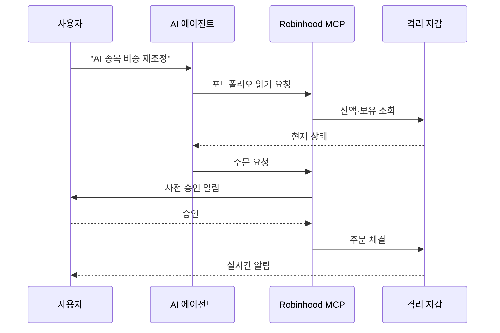

지금까지 AI 비서가 주식과 관련해 해온 일은 대부분 "이 종목 어떻게 보세요?" 같은 대화였다. 추천하고, 보고서 정리해주고, 차트 설명해주는 정도. 매수·매도 버튼은 결국 사람이 눌렀다. 그런데 미국 1위 개인 투자자용 주식 앱 Robinhood가 2026년 5월 27일 그 마지막 한 칸을 치웠다. **AI 에이전트가 직접 주문을 낼 수 있게 된다.**

이게 왜 분기점인지부터 정리해보자. 지난주 우리가 다뤘던 MCP(Model Context Protocol, Anthropic이 제안한 AI 모델과 외부 서비스를 연결하는 표준 규격) 글에서 "AI의 USB-C"라는 표현을 썼다. 표준은 깔렸지만 실제로 그 표준 위에서 '돈이 움직이는' 사례는 거의 없었다. Robinhood Agentic Trading은 그 첫 번째 메이저 사례다. 사용 가능 대상은 Robinhood의 2,700만 입금 사용자 전원.

## 어떻게 작동하나

핵심은 **샌드박스 계좌(sandboxed brokerage account)** 구조다. 메인 포트폴리오와 별개로 'agent 전용 지갑'을 새로 만든다. 거기 입금된 금액 안에서만 에이전트가 주문을 낼 수 있다. 메인 잔액에는 손이 안 닿는다.

사용자는 자기가 쓰던 도구를 그대로 가져온다. Robinhood가 공개한 자료에서 명시적으로 언급된 에이전트는 Claude와 ChatGPT. 둘 다 MCP 클라이언트를 지원하므로 사용자가 자기 Claude·ChatGPT 세션에 Robinhood MCP 엔드포인트만 연결하면 끝이다. Robinhood 제품담당 VP Abhishek Fatehpuria의 말은 이 그림을 그대로 보여준다 — "고객들은 자기 도구·LLM·에이전트를 Robinhood에 연결하고 싶어 한다."

지시 형태도 단순해진다.

- "AI 관련 종목 중심으로 비중 재조정해줘"
- "내 지갑에서 분산이 너무 한쪽으로 쏠리지 않게 관리해줘"
- "이 전략대로 자동 실행해줘"

에이전트는 포트폴리오를 읽고, 집중도 위험을 분석하고, 직접 주문 API를 호출한다.

## 사람은 어디서 끼어드나

전부 자동이면 무섭다. Robinhood가 끼워 넣은 안전장치는 네 단계다.

1. **격리 지갑**: 에이전트는 사전 입금된 금액 외엔 손댈 수 없다.
2. **실시간 알림**: 모든 거래가 푸시로 즉시 통보된다. P&L(profit and loss, 손익) 피드도 따로 본다.
3. **사전 승인**: 일부 거래는 실행 전 사용자 승인이 필요한 미리보기로 뜬다.
4. **One-tap 해제**: 이상하면 한 번에 연결을 끊을 수 있다. 별도로 부정거래 탐지팀이 의심 거래를 검토한다.

격리 지갑·실시간 알림·one-tap 해제는 사실상 "에이전트도 결국 카드 한 장 쥐여준 직원" 같은 모델이다. 한도가 정해진 법인카드와 닮았다.

## 흐름도

## 지금이 분기점인 이유

세 가지가 동시에 일어나고 있다.

첫째, **표준이 깔렸다.** MCP가 정착하면서 "내 AI 비서를 외부 서비스에 붙인다"는 동작이 사용자에게 직관적인 시나리오가 됐다. 작년이면 무슨 말인지 설명부터 해야 했다.

둘째, **실제 행동 권한이 열렸다.** 추천·요약·정리는 작년에도 충분했다. 부족했던 건 '실행'이었고, 실행은 늘 사람 한 번을 거쳤다. Robinhood는 그 사이에 격리 지갑이라는 안전망 하나만 끼우고 자동 실행을 풀었다.

셋째, **대상이 일반 사용자다.** 지금까지 알고리즘 매매는 헤지펀드와 퀀트 트레이더의 영역이었다. CEO Vlad Tenev는 이걸 "헤지펀드만 쓰던 자동화의 일반화"로 프레이밍했다. 마케팅 표현이긴 한데, 실제로 2,700만 명에게 풀린다는 건 가벼운 숫자가 아니다.

현재 베타는 주식만 지원. 옵션·암호화폐·이벤트 컨트랙트·선물은 곧 추가 예정이라고 명시했지만 시점은 공개하지 않았다.

## 그래서 한국 독자 입장에선

Robinhood는 한국 서비스가 아니라 한국에서 바로 쓸 수 있는 건 아니다. 그래도 주목할 이유는 두 가지다.

하나는 **AI 비서가 '실행하는 행위자'로 넘어가는 첫 큰 사례**라는 것. 다음 차례는 쇼핑, 예약, 송금일 가능성이 높다. Robinhood는 같은 발표에서 'agentic 신용카드'도 같이 공개했는데, AI가 내 카드로 결제까지 하는 그림이 따라온다.

다른 하나는 **국내 증권사·핀테크의 반응**이다. 토스증권·카카오페이증권 등이 비슷한 'AI 에이전트 연결' 구조를 만들지, 만든다면 어떤 안전장치를 끼울지가 다음 몇 분기의 관전 포인트가 된다. 한국은 금융 규제가 더 보수적이라 격리 지갑보다 더 빡빡한 한도·승인 구조가 붙을 가능성이 높다.

추측 한 줄 — 이 흐름의 진짜 병목은 기술이 아니라 책임 소재다. 에이전트가 잘못된 주문을 냈을 때 누구 책임인지(사용자? 에이전트 제공사? 브로커?)는 아직 어느 규제 당국도 깔끔하게 정리 못 했다. Robinhood가 부정거래 탐지팀과 분쟁 해결 프로세스를 강조한 건 그 공백을 자체 흡수하겠다는 신호다.

## 출처

- [Robinhood now lets your AI agents trade stocks — TechCrunch](https://techcrunch.com/2026/05/27/robinhood-now-lets-your-ai-agents-trade-stocks/)
- [Robinhood Launches AI Agent Trading for 27 Million Customers — Bitcoin.com News](https://news.bitcoin.com/robinhood-launches-ai-agent-trading-for-27-million-customers-options-and-crypto-next/)
- [Robinhood Unveils AI Agents for Stock Trading — Bloomberg](https://www.bloomberg.com/news/articles/2026-05-27/robinhood-launches-ai-stock-trading-purchases-on-credit-cards)
- [Robinhood will let AI trade stocks and buy stuff for you — Axios](https://www.axios.com/2026/05/27/robinhood-ai-trading-credit-card)
