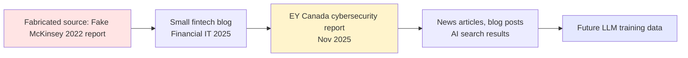

회계 컨설팅 업계의 'Big 4'(글로벌 4대 회계·컨설팅 펌 — Deloitte, PwC, EY, KPMG) 중 하나인 EY(Ernst & Young)의 캐나다 법인이 작년 말에 낸 44페이지 사이버보안 보고서가 있다. 제목은 *Points of Attack: Uncovering Cyber Threats and Fraud in Loyalty Systems* — 항공사 마일리지나 신용카드 포인트 같은 로열티 시스템을 노린 사이버 공격을 정리한 문서다. 파트너 2명과 시니어 매니저 1명이 저자로 이름을 올렸고, 캐나다 정부에 매년 수백만 달러 규모로 컨설팅을 파는 회사가 만든 자료라 무게가 있는 보고서다.

그런데 AI 탐지 회사 GPTZero가 5월 14일에 이 보고서의 모든 인용을 하나씩 추적해봤다. 결과는 거칠게 말해 **"인용이 거의 다 가짜였다"** 였다. URL은 404, 출처라고 적힌 글은 존재하지 않고, 같은 보고서 안에서 통계가 서로 모순됐다. Big 4 이름값이 붙은 공식 문서가 이렇게 무너지는 모습은 흔치 않다.

## 무엇이 가짜였나

GPTZero는 보고서가 인용한 출처 27개를 하나씩 손으로 확인했다. 자기들이 만든 Hallucination Check(할루시네이션 — AI가 사실이 아닌 내용을 그럴듯하게 만들어내는 현상을 자동으로 잡는 도구)가 1차로 찾아낸 결과를, 사람이 다시 검증하는 방식이었다. 본문의 AI 작성 비율은 72%로 측정됐다.

가짜로 판정된 인용의 면면이 인상적이다.

- **Wired**: "AI Voice Deepfakes Targeting Call Centers"라는 기사를 인용. URL이 404. 그런 제목의 Wired 기사는 없다.
- **Gartner**: "Market Trends – Loyalty Fraud"라는 보고서 인용. URL이 Gartner 메인 페이지로 가버린다. 일치하는 Gartner 보고서가 존재하지 않는다.
- **Forbes**: "$200 Billion Loyalty Economy" 기사 인용. URL 깨짐. 비슷한 이름의 글은 다른 저자가 2020년에 쓴 것이고, 보고서가 인용한 글과는 다르다.
- **McKinsey**: "Loyalty Economics Report (2022)" 인용. 그런 보고서 자체가 존재하지 않는다.
- **Cisco Talos**: 보안 블로그 글 인용. URL 404.
- **BleepingComputer**: 항공사 마일리지 해킹 기사 인용. URL 404.
- **TechCrunch**: 로열티 프로그램 침해 기사 인용. URL은 그냥 "loyalty-program" 태그 검색 페이지로 가버린다.

여기까지가 GPTZero가 보고서 한 페이지에서 뽑아낸 가짜들이다. 그리고 보고서 본문 자체도 모순이 있다.

## 같은 보고서 안에서 통계가 충돌한다

EY 보고서 4페이지의 Executive Summary는 "글로벌 로열티 포인트 시장이 2,000억 달러 규모"라고 적었다. 그리고 그 중 30~50%가 사용되지 않는다고 했다.

그런데 10페이지로 넘어가면 그 똑같은 2,000억 달러가 이번에는 "사용되지 않은 포인트의 가치"로 바뀌어 있다. 즉, 4페이지의 주장이 맞으려면 글로벌 시장 규모가 최소 4,000억 달러여야 한다. 같은 보고서가 자기 모순을 일으킨다.

GPTZero는 이 2,000억 달러 숫자의 출처를 끝까지 추적했다. 결과가 이 사건의 진짜 핵심이다.

## '정보 세탁' 메커니즘

추적해보니, 2,000억 달러라는 숫자는 EY가 보고서를 낸 6개월 전, *Financial IT* 라는 영국의 핀테크 잡지 블로그에 등장했다. 거의 같은 문장이었다. 그리고 그 Financial IT 블로그도 "McKinsey & Company: Loyalty Economics Report (2022)" 라는 가짜 출처를 적어두고 있었다.

존재하지 않는 McKinsey 보고서를 인용한 무명 핀테크 블로그 → 6개월 후 EY 캐나다의 공식 보고서가 그 블로그를 (그리고 그 가짜 McKinsey 인용을) 그대로 가져옴 → EY 이름이 붙은 자료가 신문·블로그·AI 검색 결과에서 다시 인용됨. GPTZero는 이걸 **"세탁(laundering)"** 이라고 표현했다. 출처 없는 추측이 Big 4 로고를 거치면서 "사실"로 둔갑하는 과정이다.

GPTZero가 부르는 이름은 **"바이브 인용(vibe citing)"** 이다. 사람이 LLM(Large Language Model, 대형 언어 모델 — Claude·ChatGPT 같이 텍스트를 생성하는 AI)에게 "이 주제에 맞는 인용 좀 만들어줘"라고 시키면, 모델은 그럴듯한 출처 이름과 URL을 만들어낸다. 검증 없이 그대로 보고서에 박으면 이런 결과가 나온다.

이 EY 사건은 GPTZero의 첫 폭로가 아니다. 작년부터 정부 publication 1건, Deloitte 보고서 2건, NeurIPS와 ICLR 같은 머신러닝 학회 논문에서도 같은 패턴을 잡아냈다고 한다. 컨설팅펌·정부·학계 가리지 않고 퍼지고 있다는 얘기다.

## 왜 사람이 못 잡았나

해당 보고서에는 EY 정규 파트너 2명과 시니어 매니저 1명의 이름이 올라가 있다. 즉, 결과물에 책임지는 사람 3명이 있었는데 가짜 URL과 모순된 통계가 그대로 통과했다.

LLM이 매끄러운 문장을 만들어주면 사람의 검증 본능이 한 칸씩 무뎌진다는 게 GPTZero 분석가들이 강조한 지점이다. 출처 27개의 URL을 하나씩 클릭해보는 건 사람한테 가장 지루한 일이고, 그 일을 안 하면 1시간 안에 보고서를 마칠 수 있다. 그래서 안 한다. 모델이 만들어낸 "있어 보이는" 인용표를 누구도 검증하지 않는다.

여기서 흥미로운 역설이 생긴다. AI를 부정적으로 쓴 결과를 검증하기 위해 또 다른 AI 회사(GPTZero)가 자동화된 파이프라인을 돌리고 있다. 사람이 손으로 못 따라가는 검증을, 결국 AI가 AI를 감시하는 구도다.

## 시사점

이 사건의 메시지는 단순하다. **"Big 4 로고가 붙은 보고서라고 해서 인용이 진짜라는 보증은 사라졌다."** 한국에서도 컨설팅펌·로펌·정부 부처가 점점 LLM을 글 작성에 쓰는 추세인데, 검증 절차가 없다면 EY 캐나다와 같은 사례가 나올 수밖에 없다.

독자 입장에서는 이렇게 읽힌다. AI 검색이나 보고서에서 "출처: 어디어디"라는 표시를 봤다고 안심하지 말고, 정말 중요한 통계라면 URL을 한 번 더 클릭해보는 게 안전하다. 너무 그럴듯하게 떨어지는 숫자(예: 정확히 2,000억 달러처럼 동그란 숫자에 출처가 메이저 회사인 경우)는 특히 의심해볼 만하다.

GPTZero는 앞으로도 컨설팅펌 보고서를 한 건씩 공개할 예정이라고 밝혔다. 다음에 어디가 나올지 — 그리고 한국 시장에서 비슷한 폭로가 나올 가능성도 — 지켜볼 만한 시리즈다.

## 출처

- [Investigation: Hallucinations in Ernst & Young Report on Loyalty Fraud — GPTZero](https://gptzero.me/investigations/ey)
- [Hacker News 토론 — EY Canada published a cybersecurity report and most citations were hallucinated](https://news.ycombinator.com/item?id=48334515)
