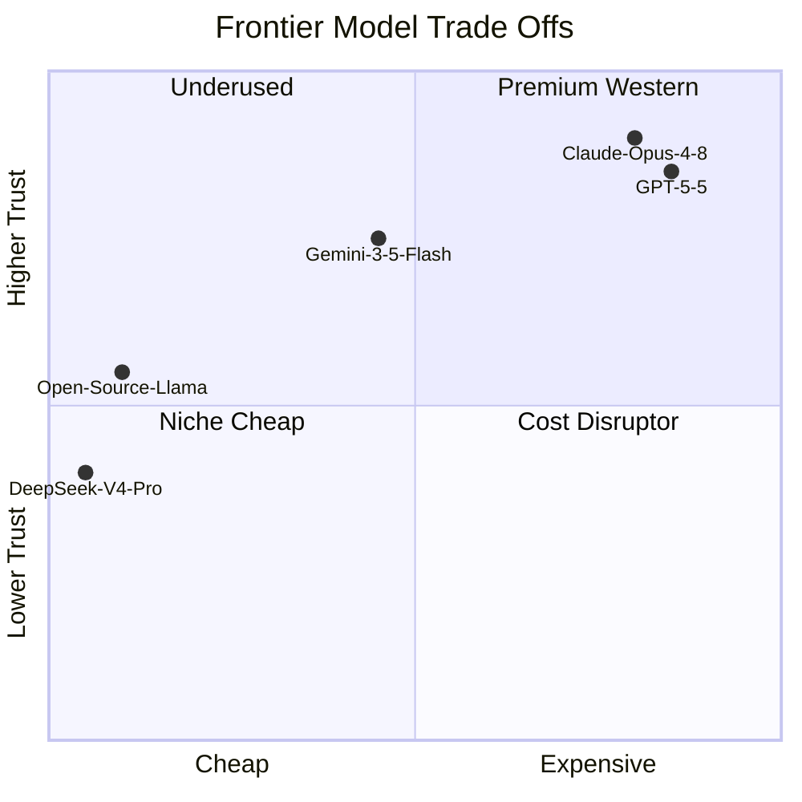

## 출력 토큰이 GPT-5.5보다 34배 싸다

택시비가 어느 날 갑자기 1/34 수준이 됐다고 해보자. 비행기 대신 택시 타는 사람이 생긴다. 5월 22일 중국 DeepSeek가 자사 플래그십 모델 V4-Pro의 75% 가격 할인을 영구화하면서, AI 모델 시장에서 비슷한 일이 일어나고 있다.

원래 5월 31일 종료 예정이던 한시 프로모션을 마감 9일 전에 "이게 새 가격"이라고 못 박았다. 이번 인하로 V4-Pro는 OpenAI GPT-5.5 대비 **입력 토큰 11.5배, 출력 토큰 34.5배 싸졌다.**

## 가격 구조

새 V4-Pro 요금은 다음과 같다 (백만 토큰 기준).

- 입력 (cache miss, 새 텍스트): $0.435
- 입력 (cache hit, 이미 처리한 텍스트 재활용): $0.003625
- 출력: $0.87

GPT-5.5는 입력 $5–$10, 출력 $30 수준이다. 캐시 hit($0.003625) 기준으로 같은 1M 토큰 처리 비용이 V4-Pro는 0.5센트, GPT-5.5는 5천 원 — 천 배 가까운 격차다.

캐시 hit 가격은 "재방문 할인"이다. 같은 문서를 여러 번 LLM(Large Language Model, 거대 언어 모델)에 보내는 RAG(Retrieval-Augmented Generation, 외부 문서를 검색해 답변에 붙이는 방식) 시스템이나 멀티턴 대화에서, 한 번 본 텍스트는 거의 무료에 가깝게 처리해준다.

## 성능은 어떻게 됐나

가격이 30배 싸면 성능도 30분의 1이어야 균형이 맞을 것 같지만, 실제는 그렇게 안 갈렸다.

- GPQA Diamond(Graduate-level Q&A, 대학원 수준 과학 문제 벤치마크): GPT-5.5 93.6% / V4-Pro 90.1%
- MRCR(Multi-Round Coreference Resolution, 긴 문서에서 특정 정보를 찾는 능력): V4-Pro 83.5% — Gemini 3.1 Pro 초과
- 컨텍스트 윈도우(한 번에 처리 가능한 토큰 수): V4-Pro 100만 / GPT-5.5 110만

최고 난이도 추론에서 GPT-5.5가 3.5포인트 앞선다. 다만 "이 3.5포인트 차이가 34배 비싼 값을 정당화하느냐"는 질문이 기업 IT 부서들 사이에서 본격적으로 등장했다. InfoWorld에 인용된 한 애널리스트의 말이다.

> "Anthropic과 OpenAI의 고마진·고소비 토큰 가격 모델은 다수의 기업 워크로드에서 정당화하기 점점 어려워지고 있다."

## 모델 선택의 축이 다층화된다

"그럼 다들 DeepSeek로 갈아탄다"가 답이면 글이 짧게 끝나지만, 실제 구도는 복잡하다. 미국·유럽 기업이 전면 이전하지 못하는 이유 세 가지가 같은 InfoWorld 기사에 정리돼 있다.

1. **데이터 주권**: API 호출 시 데이터가 어느 나라 서버를 거치는지 불투명.
2. **지식재산 유출 위험**: 입력한 코드·문서가 모델 학습에 재활용될 가능성을 계약서로 배제하기 어려움.
3. **규제 컴플라이언스**: 데이터 처리 위치가 불투명해 GDPR·금융권 규정 통과 난항.

시장이 가는 방향은 "단일 최강 모델 채택" 종료, "다중 모델 전략" 정착이다. 민감한 고부가가치 작업은 GPT-5.5나 Claude Opus 4.8 같은 프리미엄 모델, 대량 반복 작업은 V4-Pro 같은 저가 모델로 분산하는 식이다.

## 가격 vs 성능 vs 신뢰

V4-Pro는 우하단(Cost Disruptor) 자리다. 가격은 압도적으로 싼데, 서구 기업이 무비판적으로 신뢰하기엔 데이터·규제 변수가 있다. 반대편 우상단(Premium Western)에는 비싸지만 컴플라이언스가 정리된 GPT-5.5·Claude Opus 4.8이 있다. 다중 모델 전략은 이 두 사분면을 동시에 채택하는 패턴이다.

## OpenAI·Anthropic은 무엇을 할까

가격을 같이 내릴 가능성보다, **결과 기반 과금(outcome-based pricing)**으로 옮길 가능성이 더 자주 언급된다. 토큰 단위 경쟁에선 중국 모델을 이길 수 없으니, "문서 1건 처리당 얼마", "에이전트 1회 임무 완수당 얼마" 식으로 단위를 바꾸려는 시도다. OpenAI가 광고 비즈니스로 무게 중심을 옮긴 것도 같은 맥락이다.

한국 스타트업 입장에서는 선택지가 늘었다. 같은 예산으로 30배 큰 워크로드를 돌릴 수 있다는 건 가설 검증 속도가 30배 빨라진다는 뜻이다. 다만 고객 데이터·내부 문서를 V4-Pro 외부 API에 통째로 보내는 시스템을 만들 때는, 가격표 옆에 데이터 흐름도를 같이 펴놓고 봐야 한다. 비용을 1/34로 줄이는 결정과 데이터 주권을 1/34로 줄이는 결정은 분리해야 한다.

## 결론

이번 인하는 가격 조정이 아니라, 모델 선택의 축이 "성능" 1차원에서 "가성비·신뢰·규제" 3차원으로 확장된 사건이다. "가장 똑똑한 모델 1개"가 시장을 다 먹는 시대는 끝나가고, 그 빈 자리를 채우는 건 워크로드별·리스크별 다중 모델 포트폴리오다. 다음 볼거리는 OpenAI·Anthropic의 응답 — 가격을 따라 내릴지, 단위를 바꿀지, 다른 축으로 도망갈지에 따라 구도가 다시 정리된다.

## 출처

- [DeepSeek permanently reduces the price of its flagship V4 model by 75 percent — Engadget](https://www.engadget.com/2180062/deepseek-permanently-reduces-the-price-of-its-flagship-v4-model-by-75-percent/)
- [DeepSeek's steep V4-Pro price cut escalates AI pricing war — InfoWorld](https://www.infoworld.com/article/4176709/deepseeks-steep-v4-pro-price-cut-escalates-ai-pricing-war.html)
- [GPT-5.5 vs DeepSeek V4: Benchmarks, Pricing — DataCamp](https://www.datacamp.com/blog/deepseek-v4-vs-gpt-5-5)
- [DeepSeek V4-Pro 75% Price Cut Goes Permanent — Codersera](https://codersera.com/blog/deepseek-v4-pro-permanent-price-cut-may-2026/)
