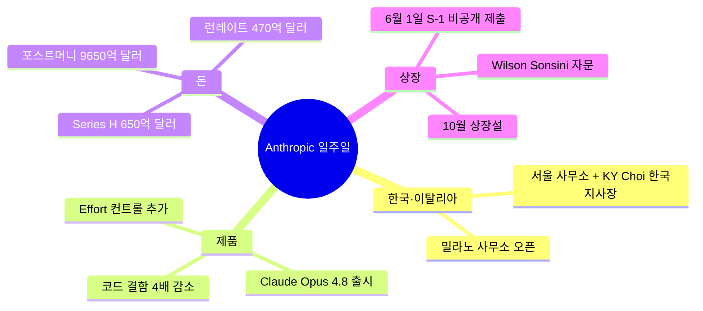

## 6월 1일, 비공개 S-1 한 장이 던진 신호

6월 1일 Anthropic이 미국 증권거래위원회(SEC, Securities and Exchange Commission, 미국 주식·채권 시장을 감독하는 연방기구)에 **S-1 양식**을 비공개로 제출했다. S-1은 미국에서 회사가 처음으로 주식을 일반 투자자에게 팔기 위해 내는 등록 신청서다. 즉 Anthropic이 본격적인 상장(IPO, Initial Public Offering, 비상장 회사가 처음으로 일반 투자자에게 주식을 공모하는 것) 준비에 들어갔다는 뜻이다.

"비공개(confidential)" 제출이라는 단어가 붙은 게 포인트다. JOBS Act라는 미국 법에 따라 매출 12억 달러 미만 회사는 SEC와 먼저 비공개로 서류를 주고받으며 수정을 거칠 수 있다. 일반 투자자가 볼 수 있는 공개판 S-1은 실제 IPO 로드쇼(투자자 모집 설명회) 직전에야 풀린다. 지금은 SEC와 Anthropic 사이의 사전 조율 단계라는 뜻.

Anthropic은 발표문에서 상장 시점·주식 수·가격 범위를 명시하지 않았다. 다만 외부 보도(NBC, CNBC, TipRanks)는 빠르면 **2026년 10월** 상장 가능성을 거론한다. 또한 Anthropic이 2004년 Google IPO를 진행했던 로펌 Wilson Sonsini를 외부 자문으로 고용했다는 점도 함께 알려졌다.

## 일주일 사이에 일어난 4가지

이번 S-1 한 건만 떼어 보면 임팩트가 약해진다. 같은 일주일 안에 묶어 보면 그림이 다르다.

- **5월 26일**: 한국지사장(KiYoung Choi) 임명 + 서울 사무소 개설 예고
- **5월 27일**: 밀라노 사무소 오픈
- **5월 28일**: Claude Opus 4.8 출시 + Series H 펀딩 650억 달러(약 89조 원) 마감, 포스트머니 9,650억 달러(약 1,323조 원) 밸류 공시
- **6월 1일**: SEC에 비공개 S-1 제출

해외 거점 두 곳을 깔고, 새 플래그십 모델을 풀고, 그 와중에 650억 달러 신주를 발행하고, 끝에 IPO 신청서까지 낸 게 정확히 일주일이다. **상장 직전 회사가 보여줘야 할 "성장·매출·국제화·제품"을 한 묶음으로 외부에 던졌다고 봐도 된다.**

## 9,650억 달러라는 숫자가 의미하는 것

이번 Series H의 **포스트머니 밸류**(post-money valuation, 신주 발행 직후 회사 전체 가치)는 9,650억 달러다. 한국 원화로 환산하면 약 **1,323조 원**. 같은 시점 삼성전자 시가총액(약 470조 원)의 두 배 후반대다.

밸류만큼 중요한 게 매출 지표다. Anthropic이 공식적으로 언급한 **런레이트(run-rate, 최근 한 달 매출에 12를 곱해 연환산한 매출)는 470억 달러(약 64조 원).** 1년 전 같은 시점 런레이트는 약 10억 달러였다. 12개월 사이에 47배가 늘었다.

벤처 캐피털 입장에서 매출/밸류 비율은 약 20배다. 일반 SaaS 기업이 매출의 10-15배 정도에서 상장 밸류가 책정되는 점을 감안하면, Anthropic은 "AI 1티어 모델 회사 프리미엄" 약 1.3-2배를 얹어 받았다고 해석할 수 있다.

이번 라운드의 리드 투자자는 Altimeter Capital, Dragoneer, Greenoaks, Sequoia Capital이다. 이미 OpenAI 비지분 투자자인 곳들이 Anthropic 쪽에 대규모로 들어왔다는 점이 한국 투자자 관점에서도 의미가 있다 — AI 모델 회사 분산 베팅의 신호다.

## 왜 OpenAI보다 먼저 신청했나

미국 매체들은 이번 신청이 OpenAI보다 앞선다는 점을 반복적으로 짚는다. OpenAI도 2026년 하반기 상장설이 도는데, Anthropic이 먼저 SEC와 비공개 대화를 시작한 것이다. Anthropic은 PBC(Public Benefit Corporation, 일반 주주 이익뿐 아니라 정관에 명시한 공익 목적을 함께 추구해야 하는 미국 법인 형태)로 등록된 회사다. OpenAI는 같은 시기에 비영리 → 영리 전환을 둘러싼 법적 분쟁을 겪고 있어, "법적으로 깔끔한 쪽"이 먼저 상장 절차에 들어간 모양새다. 추측이다.

## 한국 독자가 봐야 할 것

상장 자체보다 **공개판 S-1에 들어갈 숫자**가 더 흥미롭다. 비공개 단계에서는 Anthropic이 공개한 470억 달러 런레이트 외엔 내부 손익이 거의 안 보인다. 공개판이 풀리는 시점(보통 로드쇼 2-4주 전)에 매출 구성(API vs Claude.ai 구독), 대형 파트너 의존도(Amazon·Google 비중), 인프라 비용 비율(일반 SaaS는 20-30%, AI 회사는 50% 초과 흔함), 순손실 규모가 한꺼번에 드러난다. 9,650억 밸류를 정당화하는 건 매출 성장률이지 흑자가 아니다.

이번 일주일은 "AI 회사가 IPO 가능한 재무 형태로 성숙했나"라는 질문이 본격적으로 시장에 던져진 순간이다. 답은 공개 S-1이 풀리는 가을에야 나온다.

## 출처

- [Anthropic — Confidential draft S-1 submission (공식)](https://www.anthropic.com/news/confidential-draft-s1-sec)
- [Anthropic — Series H funding announcement](https://www.anthropic.com/news/series-h)
- [Anthropic — Claude Opus 4.8 release](https://www.anthropic.com/news/claude-opus-4-8)
- [Anthropic — Korea representative director appointment](https://www.anthropic.com/news/kiyoung-choi-representative-director-anthropic-korea)
- [CNBC — Anthropic confidentially files IPO prospectus with SEC](https://www.cnbc.com/2026/06/01/anthropic-ipo-s1-prospectus.html)
- [NBC News — Anthropic files for IPO before OpenAI](https://www.nbcnews.com/business/corporations/anthropic-files-ipo-openai-rcna347897)
- [TipRanks — Anthropic Pulls the Trigger on 2026 IPO With Confidential SEC S-1 Filing](https://www.tipranks.com/news/anthropic-pulls-the-trigger-on-2026-ipo-with-confidential-sec-s-1-filing)
- [CBS News — Claude maker Anthropic files for IPO](https://www.cbsnews.com/news/anthropic-ipo-confidential-filing-claude-ai/)
