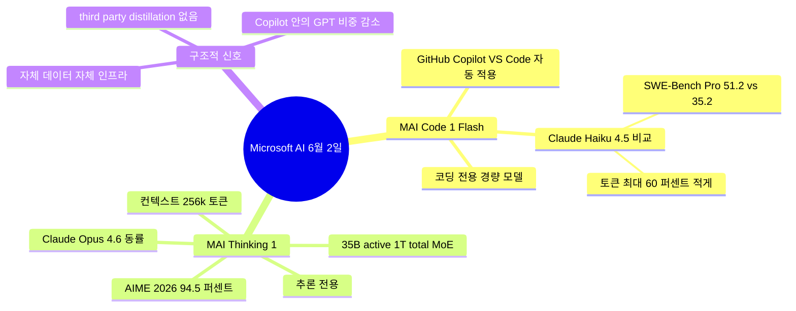

## 6월 2일, Microsoft가 한 번에 두 개를 풀었다

Microsoft가 같은 날 두 개의 자체 AI 모델을 발표했다.

- **MAI-Code-1-Flash**: 코딩 전용. GitHub Copilot과 VS Code 안에 바로 들어간다.
- **MAI-Thinking-1**: 일반 추론용. 수학·소프트웨어 엔지니어링·일반 질문에 쓰인다.

Microsoft가 자체 모델을 내놓는 게 처음은 아니다. 2024년부터 MAI-1 라인을 조금씩 공개해 왔다. 그래서 출시 자체보다 **누가 만들었고 어디 들어가느냐**가 중요한 신호다. Microsoft는 OpenAI에 130억 달러 넘게 투자한 최대 주주이고, 그동안 Copilot이라는 제품은 사실상 GPT 위에 얹은 껍데기에 가까웠다. 그런데 이제 그 Copilot 안에 Microsoft가 직접 만든 모델이 들어가기 시작했다.

## MAI-Code-1-Flash — Copilot 안의 작은 변화

MAI-Code-1-Flash는 **GitHub Copilot 개인 사용자에게 별도 설정 없이** 굴러떨어진다. VS Code에서 Copilot을 켜놓고 있던 사람이라면, 오늘부터 답변이 살짝 달라질 수 있다는 뜻이다.

Microsoft가 공개한 수치는 Claude Haiku 4.5(Anthropic의 경량 모델)와 정면 비교다. 약어 없이 풀면, Haiku 4.5는 Anthropic이 빠르고 싸게 굴리도록 만든 작은 모델이고, MAI-Code-1-Flash도 같은 "빠르고 싼" 영역을 노린다.

- **SWE-Bench Pro**(실제 깃허브 이슈를 코드로 고치는 능력 벤치마크): MAI-Code-1-Flash 51.2% / Claude Haiku 4.5 35.2%
- **IF Bench**(지시문을 얼마나 정확히 따르는지 측정하는 벤치마크): Haiku 대비 +28.9점
- **토큰 효율**: 같은 문제를 풀 때 Haiku 4.5보다 **최대 60% 적은 토큰**을 사용

수치만 보면 Claude Haiku 4.5를 모든 항목에서 앞선다. 단, Microsoft가 직접 선택한 비교 대상이라는 점은 감안해야 한다. 같은 가격대의 Gemini Flash나 GPT-4o mini와의 비교는 발표문에 없다.

흥미로운 디테일 하나. Microsoft는 이 모델이 "GitHub Copilot 프로덕션 하네스(production harness, 모델이 실제 IDE 안에서 코드를 읽고 고치는 운영 환경) 위에서 직접 학습됐다"고 명시했다. 벤치마크가 아니라 진짜 Copilot 사용 패턴으로 훈련했다는 뜻이다. 일반론으론 잘 풀어도 IDE 안에서는 헛도는 모델들이 있는데, 그 격차를 메우려는 설계로 보인다.

## MAI-Thinking-1 — Claude Opus 4.6과 같은 줄

MAI-Thinking-1은 코딩이 아니라 **추론 전용** 모델이다. 즉 어려운 수학, 복잡한 SW 디버깅, 단계가 많은 문제 해결용.

- **아키텍처**: 35B active / 1T total **MoE**(Mixture of Experts, 거대한 모델 안에 여러 전문가 sub-network를 두고 입력마다 일부만 활성화하는 구조). 즉 매 요청에 1조 개 파라미터 전부가 도는 게 아니라 350억 개 정도만 도는, 가성비 중심 설계.
- **컨텍스트 창**: 256k 토큰. 책 600쪽 분량의 글을 한 번에 읽어들일 수 있다는 의미.
- **AIME 2025**(미국 수학경시대회 문제 세트): 97.0%
- **AIME 2026**: 94.5%
- **SWE-Bench Pro**: Claude Opus 4.6과 동률
- **블라인드 사람 평가** (1,276회): Claude Sonnet 4.6보다 사용자가 MAI-Thinking-1 답변을 선호

발표문에서 한 줄이 눈에 띈다. **"third-party distillation 없이 학습했다."** Distillation은 큰 모델의 답변을 작은 모델에게 따라하게 시켜서 빠르게 성능을 끌어올리는 기법이다. "third-party"라는 단어는 사실상 **OpenAI 모델로 우리 모델을 가르치지 않았다**는 선언에 가깝다. OpenAI에 투자한 회사가 자기 모델을 발표하면서 "걔네 도움 안 받고 만들었다"고 굳이 명시하는 그림이다.

## 한 발 더 — 왜 지금 두 개를 같은 날 던졌나

Microsoft 입장에서 가능한 시나리오 두 가지. (이 부분은 추측이다.)

1. **OpenAI와의 협상 카드 만들기.** OpenAI는 2026년 하반기 상장설이 도는 중이고, 영리 전환을 둘러싼 법적 분쟁도 진행형이다. Microsoft 입장에선 OpenAI 의존도를 줄여 놓을수록 다음 계약·지분 협상에서 유리하다.
2. **자체 비전 선언.** Microsoft AI를 이끄는 Mustafa Suleyman(전 DeepMind·Inflection 공동창업자)이 "Humanist Superintelligence(인간 가치 친화형 초지능)"이라는 자체 표어를 밀고 있다. OpenAI와 다른 색깔의 AI 노선을 갖고 싶다는 메시지가 그동안 누적돼 왔다.

두 가지가 동시에 작용 중이라고 보는 게 자연스럽다.

## 한국 사용자 시각에서 무엇이 달라지나

당장 가장 가까운 변화는 **GitHub Copilot을 쓰는 한국 개발자**가 느낄 미묘한 답변 톤·속도 차이다. MAI-Code-1-Flash가 백엔드 어딘가에서 가벼운 자동완성·간단한 리팩터링을 담당하기 시작하면, 응답이 약간 빠르고 살짝 간결해질 가능성이 높다. 큰 변경은 없다.

더 큰 그림은 **AI 모델 시장의 무게중심**이다. Anthropic이 이번 주에 IPO 신청을 했고, Google은 Gemini 3.5 Flash를 풀었고, DeepSeek은 가격을 한 번 더 내렸고, 거기에 Microsoft가 자체 모델 두 개를 같은 날 더했다. 한 회사의 일은 작은 뉴스지만, 같은 주에 네 회사가 같이 움직인 건 흔치 않다. 모델 회사들이 각자 자기 색깔을 분명히 하려고 가속을 밟는 시기라는 신호다.

OpenAI는 같은 주에 큰 발표가 없었다. 그 침묵이 다음 한두 달의 관전 포인트다.

## 출처

- Microsoft AI 공식 발표 — MAI-Code-1-Flash: https://microsoft.ai/news/introducingmai-code-1-flash/
- Microsoft AI 공식 발표 — MAI-Thinking-1: https://microsoft.ai/news/introducing-mai-thinking-1/
- Hacker News 종합 (2026년 6월 2일 top stories): https://news.ycombinator.com/
