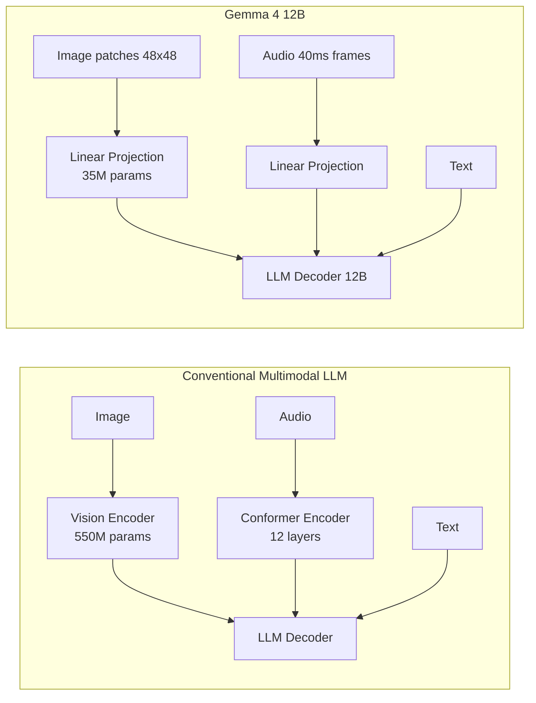

## 6월 3일 Google이 Gemma 4 12B를 풀었다

Google이 자체 오픈 모델 가족인 Gemma의 신작 **Gemma 4 12B**를 공개했다. 라이선스는 Apache 2.0, 상업 사용까지 자유다. 발표문이 가장 강조한 메시지는 두 가지다.

- **텍스트·이미지·오디오를 한 모델이 동시에 처리한다** (멀티모달).
- **16GB 메모리 노트북에서 돌아간다**.

여기까지는 "오, 노트북에서 굴러가는 멀티모달 오픈 모델이네" 정도다. 그런데 모델 카드를 들춰보면 구조가 좀 특이하다. 보통 멀티모달 모델은 이미지 보는 부분(비전 인코더)과 소리 듣는 부분(오디오 인코더)을 별도 신경망으로 두고 LLM에 붙인다. Gemma 4 12B는 **그 별도 신경망을 통째로 빼버렸다**. Hacker News에서 519점을 모으며 화제가 된 지점도 여기였다 ([HN 토론](https://news.ycombinator.com/item?id=48385906)).

## 인코더가 뭐고, 왜 빼는 게 뉴스인가

비전 인코더(vision encoder, 이미지를 LLM이 이해할 수 있는 벡터로 바꾸는 별도 신경망)는 멀티모달 LLM의 표준 부품이다. Google 자기 모델인 Gemma 3는 SigLIP이라는 ViT(Vision Transformer, 이미지를 패치 단위로 잘라 어텐션을 돌리는 비전 모델) 계열 인코더를 약 5억 5천만 파라미터 규모로 붙여 썼다. 오디오도 마찬가지다. 보통 Conformer(컨포머, 음성용으로 컨볼루션과 어텐션을 결합한 구조)를 12층쯤 쌓아 별도 모듈로 둔다.

Gemma 4 12B는 이걸 다 빼고 **얇은 선형 투영(linear projection, 행렬 곱셈 한 번)만 남겼다**.

- **이미지**: 48×48 픽셀 패치로 자르고 → 행렬 곱셈 한 번으로 LLM 임베딩 공간에 꽂아 넣는다. 파라미터는 3,500만 개. 어텐션 레이어 없음. X·Y 좌표는 별도 lookup 테이블로 처리.
- **오디오**: 16kHz 원음을 40ms(0.04초) 프레임으로 잘라 → 역시 선형 투영. 위치 정보는 LLM 본체가 이미 갖고 있는 RoPE(Rotary Position Embedding)를 재사용.

HN의 일부 개발자가 지적했듯 엄밀히 말하면 선형 투영도 "임베딩 레이어"라 "완전히 인코더가 없다"는 말은 마케팅 과장이다. 다만 **별도의 ViT/Conformer 신경망이 빠졌다**는 의미로는 정확하다.

왜 빼느냐. 단순하다. **메모리·연산 절약**. 5억 5천만 파라미터짜리 비전 인코더가 빠지면 그만큼 가중치 파일이 줄고, 추론할 때 도는 신경망도 줄어든다. 12B 본체에 35M 짜리 투영만 추가되니, 동일 메모리에서 더 큰 디코더를 굴릴 수 있다는 계산이다.

## 이게 처음은 아니다 — Fuyu, Chameleon, EVE

인코더 없는 멀티모달이라는 발상 자체는 2023년부터 있었다.

- **Adept Fuyu-8B** (2023): 이미지 패치 → 선형 투영 → LLM. 이번 Gemma 4가 차용한 패러다임의 원조.
- **Meta Chameleon** (2024, [arXiv 2405.09818](https://arxiv.org/abs/2405.09818)): 이미지를 VQ-VAE(Vector-Quantized Variational Autoencoder, 이미지를 토큰처럼 이산 코드로 바꾸는 압축 모델)로 토큰화해서 LLM이 텍스트 토큰처럼 그냥 먹게 한 early fusion 구조.
- **EVE / EVEv2** (2024-2025, [arXiv 2406.11832](https://arxiv.org/abs/2406.11832)): 비전 인코더 없이 35M 정도의 공개 데이터로 비전-언어 정렬을 달성, 인코더 있는 모델과 동등 성능 보고. ICCV 2025 채택.

차이는 **규모와 누가 푸느냐**다. 위 셋은 8B 안팎, 혹은 Meta가 가중치 일부만 푼 연구 프로젝트였다. Gemma 4 12B는 **dense 12B에 오디오까지 묶고, Google이라는 메이저가 Apache 2.0으로 풀었다**. 인코더-프리 구조가 "연구실 호기심"에서 "기업이 정식 배포하는 제품"으로 넘어온 첫 사례에 가깝다.

## "16GB 노트북에서 돌아간다"는 어디까지 사실인가

Google이 강조한 셀링 포인트는 노트북 실행이다. M2·M3 MacBook이나 RTX 4060 노트북 정도면 돌아간다는 그림. 한국 개발자 입장에서 매력적인 포인트인 건 맞는데, HN 댓글들이 짚어준 현실은 좀 더 까칠하다.

- **원본 BF16 가중치는 약 24GB가 필요하다**. 16GB 시스템에서 그대로 못 돌린다.
- **int8/Q4 양자화(가중치를 8비트나 4비트로 압축해 메모리를 줄이는 기법)** 를 해야 12GB 정도로 줄어든다. 그래도 OS·캐시·다른 앱이 같이 도는 16GB에선 빠듯하다는 보고가 다수.
- **속도**: Q4 양자화 + 12GB VRAM 소비자 GPU에서 약 **초당 5토큰**. 글자로 치면 답변 한 줄 나오는 데 한참 걸리는 속도다.

비전 성능에 대한 의견도 갈린다. 일부 개발자는 "같은 이미지 분석에서 Alibaba Qwen 3.5 0.8B가 더 잘한다"고 보고했다. 한 명의 체감이라 일반화는 어렵지만, **Gemma 시리즈가 vision 쪽에서 Qwen·Llama 대비 약했던 흐름이 이번에도 이어진다는 인상**은 여러 댓글에서 반복된다.

그리고 **공식 벤치마크 수치를 Google이 거의 공개하지 않았다**. MMLU(Massive Multitask Language Understanding, 다분야 지식 벤치마크), MMMU(Multimodal MMLU, 멀티모달 버전), GPQA(대학원 수준 과학 QA 벤치마크) 같은 표준 점수가 발표문에 없다. "26B MoE 모델에 근접한다"는 표현이 전부였다. 이건 추측인데, 정식 model card에 수치가 붙는 건 며칠~몇 주 뒤가 될 가능성이 크다.

## 한 발 더 — Google이 왜 이걸 오픈으로 풀었나

Google은 Gemini라는 폐쇄형 주력 모델 라인을 따로 갖고 있다. Gemma는 그 옆에 둔 오픈 라인이다. **오픈으로 풀어도 Gemini 매출을 직접 갉아먹지 않는 가벼운 영역**(노트북 실행, 엣지 디바이스, 연구)에 정확히 자리잡고 있다는 점이 이번에도 분명하다.

여기에 더해 인코더-프리 같은 **구조 실험을 오픈 모델로 먼저 던지는 패턴**도 눈에 띈다. 폐쇄 주력 모델은 안정성·일관성이 중요하니 검증된 구조로 가고, Gemma 같은 오픈 라인에서 새 구조를 시장에 풀어 외부 개발자가 어떻게 쓰는지 본다. 비용을 안 들이고 광범위한 피드백을 받는 셈이다.

## 결론

Gemma 4 12B는 한 문장으로 정리하면 이렇다. **인코더-프리 멀티모달 패러다임이 dense 12B + 오디오까지 묶여 Google이 직접 푸는 단계까지 왔다.** 

- 노트북 실행 가능성과 Apache 2.0 라이선스는 한국 스타트업·연구실 입장에서 의미 있는 카드다.
- 다만 16GB 마케팅은 양자화 전제이고, 비전 성능은 Qwen 계열 대비 우위가 분명치 않다.
- 공식 벤치마크 수치가 빠진 채 출시된 점은 평가를 미뤄둬야 할 부분이다.

며칠 안에 model card가 갱신되고 외부 벤치마크가 모이면 그때 Llama 4·Qwen 3.5와 위치를 다시 그려볼 만하다. 그 전까지는 "Google이 인코더-프리에 dense 12B 규모로 베팅했다"는 사실 자체가 가장 큰 시그널이다.

## 출처

- Google 공식 블로그: <https://blog.google/innovation-and-ai/technology/developers-tools/introducing-gemma-4-12b/>
- Developer Guide: <https://developers.googleblog.com/gemma-4-12b-the-developer-guide/>
- Gemma 모델 문서: <https://ai.google.dev/gemma/docs/core>
- MarkTechPost 기술 분석: <https://www.marktechpost.com/2026/06/03/google-deepmind-releases-gemma-4-12b-an-encoder-free-multimodal-model-with-native-audio-that-runs-on-a-16-gb-laptop/>
- Hacker News 토론: <https://news.ycombinator.com/item?id=48385906>
- 선행 연구 EVE (encoder-free VLM): <https://arxiv.org/abs/2406.11832>
- 선행 연구 Chameleon (Meta FAIR): <https://arxiv.org/abs/2405.09818>
