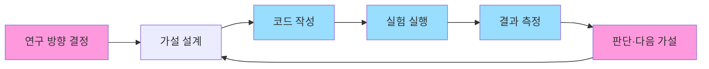

"AI가 AI를 스스로 만든다"는 말은 그동안 SF 같은 추상적인 구호였다. 그런데 6월 3일 Anthropic이 공개한 자료에서 이 추상이 사내 숫자로 바뀐다. **Anthropic 자기 회사에서 production에 머지되는 코드의 80% 이상을 Claude가 직접 짜고**, 엔지니어 1인의 분기 코드 출력이 2024년 대비 8배가 됐다는 것이다.

핵심은 단순히 "AI가 코딩을 잘한다"가 아니라, **AI 회사가 자기 다음 모델을 만드는 일 자체에 본격적으로 자기 AI를 쓴다는 보고**라는 점이다. Anthropic은 이 상태를 "[recursive self-improvement(재귀적 자기 개선, AI가 자기 후속 모델을 자율적으로 설계·개발하는 단계)](https://www.anthropic.com/institute/recursive-self-improvement)로 향하는 길목"이라고 부른다.

## 무엇이 새로 공개됐나

대부분은 외부에서 추정만 가능했던 사내 수치들이다.

- **production 코드의 80% 이상이 Claude 작성** (2026년 5월 기준)
- **엔지니어 1인당 분기 출력 코드량 8배 증가** (2024년 대비 2026년 2분기)
- **사내 연구원 설문 결과 중앙값 4배 생산성 증폭** (2026년 3월)
- **작업 길이 한계(task time horizon) 더블링 주기가 7개월 → 4개월로 단축**

task time horizon은 한 모델이 사람 개입 없이 끝까지 일관되게 완수할 수 있는 작업의 길이를 말한다. 2024년 초 약 4분이던 한계가 [Claude Opus 4.6에서는 12시간](https://www.anthropic.com/institute/recursive-self-improvement)까지 올랐고, 이 한계가 4개월마다 2배씩 늘어난다는 게 Anthropic 측정이다. SWE-bench(실제 GitHub 이슈를 코드로 해결하는 시험)와 CORE-Bench(컴퓨터과학 논문 결과 재현 시험)도 2년 만에 한 자릿수에서 사실상 천장까지 도달했다.

## 더 본격적인 변화 — 연구 자동화

코딩 보조보다 인상적인 건 **실험 자체를 AI가 돌린다**는 부분이다. 코드 최적화 실험에서 모델이 만든 속도 개선이 2025년 5월 약 3배에서 2026년 4월 약 52배로 뛰었고, 정답이 없는 열린 연구 과제에서 에이전트가 인간 연구자 2명 결과 대비 격차의 97%까지 따라잡았다(이전 23%). 핵심은 **연구 사이클(가설 → 실험 → 측정 → 다음 가설)을 사람 개입 없이 한 번 도는 능력**이 측정 가능하게 빨라지고 있다는 점이다.

## 그래서 recursive self-improvement인가

Anthropic은 "지금은 아직 사람이 방향을 잡고 AI가 실행하는 단계"라고 선을 긋지만, 글 안에서 "올해 안에 사람이 며칠 걸리는 작업까지", "2027년에 몇 주짜리 작업까지" 가능해질 거라고 적었다. 그동안 "AGI 임박"은 주로 [OpenAI Sam Altman 쪽](https://openai.com/index/planning-for-agi-and-beyond/) 톤이었는데, 상대적으로 보수적이던 Anthropic이 내부 수치를 풀면서 비슷한 위치로 옮겨왔다.

## 그래도 사람이 안 풀려나는 이유 — Amdahl's law

Anthropic이 글에서 직접 꺼낸 자기 한계는 **실행이 빨라질수록 사람의 판단이 병목으로 떠오른다**는 것이다. [Amdahl's law(아무리 한 부분을 빨라지게 해도 직렬로 남아있는 부분이 전체 속도를 결정한다는 법칙)](https://en.wikipedia.org/wiki/Amdahl%27s_law)를 AI 연구에 적용하면, 모델 학습·실험·코딩이 빨라져도 "이 방향이 맞나"를 정하는 인간 판단이 직렬 단계로 남아있으면 전체가 그 단계에서 잡힌다.

분홍색 단계가 사람이 아직 들고 있는 부분, 파란색이 Claude가 본격적으로 가져간 부분이다. Anthropic의 우려는 분홍색 단계 중 특히 마지막 "판단" 단계가 모델로 넘어가는 순간 사람이 사실상 루프 밖으로 밀려난다는 것이다.

## 안전 쪽 메시지

이 발표는 자랑이 아니라 안전·정책 제안과 한 묶음이다. Anthropic은 다른 [AI 연구소](https://openai.com/)와 같이 협력해야 작동하는 검증 가능한 글로벌 슬로다운 장치를 제안하고, "AI가 후속 AI를 짜기 시작하면 정렬(alignment) 문제를 가장 자신 없어 한다"고 적었다.

## 한국 독자에게 어떤 의미인가

6개월 전만 해도 "AGI" 단어를 자기 입으로 쓰는 곳은 OpenAI 한 곳이었다. 이번에 **두 번째 큰 회사가 사내 수치까지 풀면서 비슷한 톤으로 옮겨왔다**는 게 트렌드 변화다. 당장 뭘 바꿀 필요는 없지만, Claude·GPT·Gemini를 매일 쓰는 팀과 안 쓰는 팀의 격차가 분기 단위로 누적된다는 신호로 잡아두면 좋다.

## 출처

- [Anthropic — When AI Builds Itself: Our progress toward recursive self-improvement](https://www.anthropic.com/institute/recursive-self-improvement) (2026-06-03)
- [Hacker News — When AI Builds Itself 토론 스레드](https://news.ycombinator.com/) (검색: "When AI Builds Itself")
- [OpenAI — Planning for AGI and beyond](https://openai.com/index/planning-for-agi-and-beyond/) (비교 참고)
- [Wikipedia — Amdahl's law](https://en.wikipedia.org/wiki/Amdahl%27s_law)
