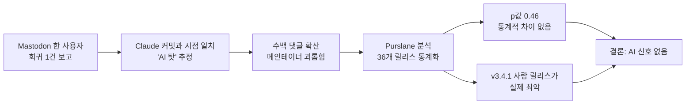

리눅스를 만지는 사람이라면 한 번은 써 봤을 도구가 있다. **rsync**(Unix·Linux에서 가장 널리 쓰이는 파일 동기화 도구, 서버 백업·배포 스크립트 어디에나 들어간다)다. 1996년부터 굴러 온 이 프로젝트가 최근 인터넷에서 한바탕 분노의 대상이 됐다. "메인테이너가 Claude(Anthropic의 AI 코딩 모델)를 쓰기 시작한 뒤로 버그가 늘었다"는 주장이 Mastodon에서 시작돼, 메인테이너 본인에게 향한 괴롭힘으로까지 번졌다.

그리고 6월 초, Alexis Purslane이라는 분석가가 36개 릴리스 전부의 버그 데이터를 끌어모아 통계로 따져본 결과를 공개했다. 결론은 분노한 쪽이 기대했을 그림과 정반대였다.

## 분노는 어디서 시작됐나

Mastodon 사용자 한 명이 rsync 최신 버전으로 업그레이드한 뒤 회귀(regression, 멀쩡하던 기능이 새 버전에서 깨지는 현상) 하나를 만났다. 그는 이 릴리스에 Claude로 작성된 커밋이 섞여 있다는 사실에 주목했고, "AI가 망쳤다"는 짧은 글을 올렸다. 글은 수백 개의 댓글로 퍼졌고, 메인테이너 개인을 겨냥한 비난과 괴롭힘으로 이어졌다.

여기서 한 발짝 떨어져 보면 이 흐름은 익숙하다. AI 코딩 도구를 쓰는 프로젝트에서 무언가 깨지면, 누구든 "AI 때문 아니냐"는 의심을 먼저 떠올린다. 문제는 그 의심이 데이터로 검증된 적이 거의 없다는 점이다.

## 측정 가능한 답을 만드는 법

Purslane은 v2.4.6부터 v3.4.3까지 rsync 릴리스 36개를 모두 데이터셋에 집어넣었다. 핵심 지표는 **sev/10c** — 10개 커밋당 심각도 가중 버그 수다. 단순한 "버그 개수"가 아니라 버그마다 점수를 매겨 합산한 값이다.

버그 심각도는 GitHub 이슈, Bugzilla, 메일링 리스트에서 끌어와 **Qwen 3 35B**(알리바바의 오픈소스 대형 언어 모델)에게 0-100점으로 평가하게 했다. 사람이 점수를 매기면 편향이 들어가니, 같은 기준을 모든 버그에 일괄 적용한 셈이다. 통계 검정은 순열 검정(permutation test, 데이터를 무작위로 뒤섞었을 때 관측값이 얼마나 극단적인지 보는 비모수 검정)과 Fisher's exact test 등을 썼다.

전체 파이프라인은 재현 가능하게 자동화됐고, 분석 본문에 들어가는 숫자도 LLM이 손으로 옮긴 게 아니라 스크립트가 직접 치환했다. 분석가 본인이 "수치를 환각으로 지어낼 위험"을 차단하려고 명시적으로 그렇게 설계했다.

## 핵심 수치

| 릴리스 | Claude 기여 | sev/10c | 백분위 |
|---|---|---|---|
| v3.4.1 | 없음(전부 사람) | **39.39** | 데이터셋 1위 (최악) |
| v3.4.2 | Claude 커밋 9개 | **0.00** | 0번째 백분위 (실 버그 0개) |
| v3.4.3 | Claude 커밋 28개 | **3.29** | 77번째 백분위 (상승했지만 평범) |

- 데이터셋 전체 평균: **2.95 sev/10c**
- Claude 릴리스 평균: **1.65 sev/10c** (전체보다 *낮음*)
- 순열 검정 p값: **0.46** — 동전 던지기 수준, "통계적으로 의미 있는 차이 없음"

가장 흥미로운 행은 첫 줄이다. v3.4.1은 Claude가 한 줄도 안 들어간 릴리스인데 데이터셋 역사상 가장 버그가 많은 릴리스였다. **그런데 이 버전에는 아무 분노도 없었다.** Purslane은 분석 말미에 한 줄로 요약했다: "그땐 화낼 AI가 없었으니까."

## 진짜 원인은 보안 패치 폭주

그럼 v3.4.x 시리즈는 왜 평균보다 변동이 컸나? 메인테이너 본인이 해명한 바로는, 최근 rsync는 CVE(Common Vulnerabilities and Exposures, 공식 보안 취약점 식별 코드) 대응 작업이 폭주한 시기였다. 보안 패치는 한 번에 많은 라인을 건드릴 수밖에 없고, 그 자체로 회귀를 만들 가능성이 높다. AI 사용 여부와는 독립된 변수다.

다시 말해 v3.4.3의 버그가 평소보다 약간 많아진 건 "Claude를 썼기 때문"이 아니라 "그 시기 손볼 게 많았기 때문"에 가깝다.

## 도식으로 보는 분노의 흐름

## 그래도 남는 비판은 있다

Hacker News 토론에서 가장 합리적인 반론은 표본 크기였다. Claude가 들어간 릴리스가 두 개뿐이라 일반화하기엔 데이터가 얕다는 지적이다. 또 "릴리스 단위 버그 귀속"이 부정확할 수 있고, 최신 릴리스는 버그가 더 발견될 시간이 부족했다는 선택 편향(selection bias)도 가능하다.

다만 분석가가 짚은 핵심은 따로 있다. "기존 비난은 데이터가 아예 없었다." 두 개 릴리스로 결론을 단정 짓기는 어렵지만, **분노 쪽도 한 사람의 회귀 보고 한 건으로 시작했다.** 양쪽 다 표본이 약하지만, 적어도 한쪽은 비교 대상이라도 만들었다.

## 시사점

이 사건이 흥미로운 이유는 결론 자체가 아니라 **"AI 책임론을 측정 가능한 형태로 묻기 시작했다"**는 점이다. 지금까지 "AI 코드가 더 버그가 많다"는 주장은 트위터·Mastodon의 직관과 일화로 흘렀다. Purslane의 분석은 그 직관을 같은 프로젝트의 시계열과 맞붙여 보는 첫 시도에 가깝다.

앞으로 다른 오픈소스 프로젝트에서 비슷한 분쟁이 또 일어날 텐데, 그때 "통계로 보면 어떻습니까"라는 질문이 더 자주 등장할 가능성이 높다. 적어도 "AI 있으니 화낼 대상이 있어서" 분노가 증폭되는 패턴은, 이제 한 번 명시적으로 짚여 버렸다.

## 출처

- Alexis Purslane, "Did Claude increase bugs in rsync?" — https://alexispurslane.github.io/rsync-analysis/
- Hacker News 토론 #48411635 — https://news.ycombinator.com/item?id=48411635
- rsync 프로젝트 — https://github.com/RsyncProject/rsync
