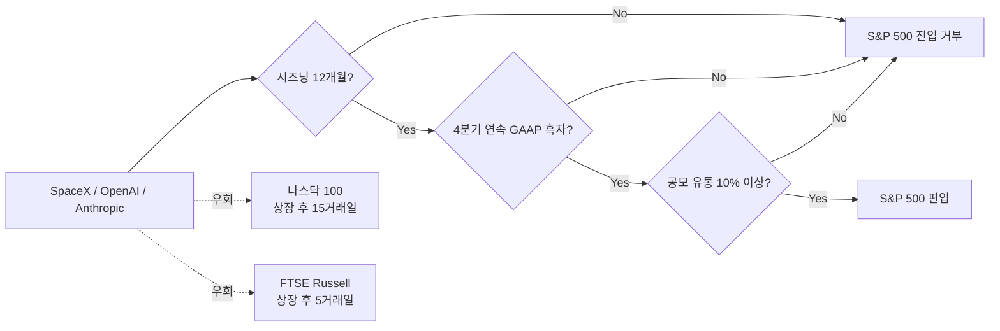

미국 주식 시장의 대표 지수인 S&P 500은 단순한 순위표가 아니다. 이 지수에 새로 편입되면 전 세계 인덱스 펀드(특정 지수를 그대로 따라 사는 자동 매수 펀드)가 강제로 그 종목을 매수해야 한다. 그래서 "S&P 500 편입"은 회사가 받는 가장 큰 일회성 자금 유입 이벤트 중 하나다.

2026년 6월 4일, S&P Dow Jones Indices는 이 편입 룰을 완화해 달라는 요청을 공식 거부했다. 직접적인 대상은 6월 12일 나스닥 상장을 앞둔 SpaceX, 4분기 IPO(기업공개)를 준비 중인 OpenAI, 그리고 6월 1일 미국 증권거래위원회(SEC)에 S-1 서류를 제출한 Anthropic이다. 셋 다 시가총액으로는 충분히 들어오고도 남지만, S&P가 요구하는 다른 조건에서 막혔다.

## 막힌 룰 세 가지

S&P 500에 들어오려면 시총만으로는 부족하고 다음을 모두 만족해야 한다.

1. **상장 후 12개월 이상 거래된 기록**(시즈닝, seasoning이라고 부른다 — 신규 상장 종목의 변동성이 가라앉을 시간을 본다)
2. **GAAP(Generally Accepted Accounting Principles, 미국 표준 회계 기준) 기준 직전 4분기 연속 흑자**
3. **공모 유통 주식 비율 최소 10%**

세 회사 모두 이 조건을 깬다. SpaceX는 상장 자체가 아직이고, OpenAI는 가장 최근 보도 기준 연 90억 달러대 적자, Anthropic도 흑자 분기는 단 한 분기뿐이라 4분기 연속 흑자에 한참 모자란다.

업계에서는 시즈닝 기간 단축과 흑자 요건 면제를 함께 요청했다. 메가캡 IPO에 한해서만 예외를 두자는 안이었다. S&P 위원회는 두 안 모두 기각했다.

## 얼마짜리 거절인가

Bloomberg Intelligence 추정으로 세 회사가 신속 편입에 성공했다면 인덱스 펀드의 강제 매수로 약 270억 달러가 따라왔다. 한국으로 치면 코스피200 신규 편입 종목이 받는 패시브 자금 유입의 대형 버전이다. 강제 매수가 들어오는 동안 주가는 보통 위로 튀고, 그 효과는 회사 자금 조달과 기존 주주 수익에 그대로 반영된다.

## 다른 지수는 어떻게 했나

흥미로운 건 S&P만 보수적이라는 점이다.

- **나스닥 100**: 상장 후 15거래일이면 검토
- **FTSE Russell**: 상장 후 5거래일이면 검토
- **S&P 500**: 12개월 + 4분기 흑자 + 10% 유통

나스닥과 FTSE는 SpaceX·OpenAI·Anthropic을 짧으면 몇 주 안에 흡수할 수 있다. 하지만 가장 자금 규모가 큰 패시브 풀은 S&P 500을 추종한다. 그래서 셋 다 짧은 우회로는 열려 있지만 가장 큰 문은 막힌 상태다.

## 왜 S&P는 안 풀어줬나

S&P 500은 미국 기업의 "검증된 수익 창출 기업" 풀이라는 정체성을 오랫동안 지켜 왔다. 2017년 Snap, 2019년 Uber, 2020년대 초 여러 적자 테크 회사가 같은 식으로 시총 기준은 충족했지만 흑자 요건에서 막혔다. AI 회사라고 특별 대우를 하면 룰의 의미가 사라진다.

또 하나는 거품 부담이다. OpenAI와 Anthropic 비공개 밸류에이션은 합쳐 1조 달러를 넘고, 영업 비용이 매출보다 빠르게 늘고 있다. 지수 운용 입장에서 이런 회사를 패시브 펀드에 강제로 떠넘기는 결정이 부담스럽다.

## 의미

이 사건은 두 가지를 동시에 보여 준다.

첫째, AI 회사들의 시장 가치 평가 방식과 전통적인 흑자 기반 평가 사이 거리가 그대로 노출됐다. 사모 시장과 IPO 시장은 "미래 현금흐름"을 보지만, S&P 500은 "이미 만들어진 흑자"를 본다. 이 둘이 같은 회사를 두고 정반대 결정을 내린 셈이다.

둘째, AI 거품 논쟁의 새 챕터다. 비판자들은 "수조 달러 가치인데 4분기 흑자 하나 못 만드는 회사들"이라는 프레임을, 옹호자들은 "S&P가 시대 변화를 못 따라간다"는 프레임을 들고 나왔다. 다음 분기 OpenAI와 Anthropic이 IPO 후 어떤 실적 가이던스를 내놓는지가 이 논쟁의 다음 분기점이 된다.

S&P가 이번 사이클 안에 룰을 풀어 줄 가능성은 낮다. OpenAI와 Anthropic이 S&P 500에 들어가려면 흑자 4분기를 직접 만들거나, 인덱스 자체가 룰을 바꿔야 한다. 둘 다 빨라야 2027년 이후 이야기다.

## 출처

- S&P 500이 패스트트랙 거부: https://mlq.ai/news/sp-500-rejects-fast-track-entry-for-spacex-blocks-profitability-waivers-for-openai-and-anthropic/
- Fortune 보도(SpaceX·OpenAI·Anthropic 영향): https://fortune.com/2026/06/06/spacex-openai-anthropic-mega-ipo-sp500-inclusion-nasdaq-russell/
- InvestingLive 추가 분석: https://investinglive.com/stock-market-update/spacex-faces-full-sp-500-wait-as-index-giant-rejects-fast-track-entry-rules-20260604/
- Anthropic의 S-1 제출 공지(6월 1일): https://www.anthropic.com/news
