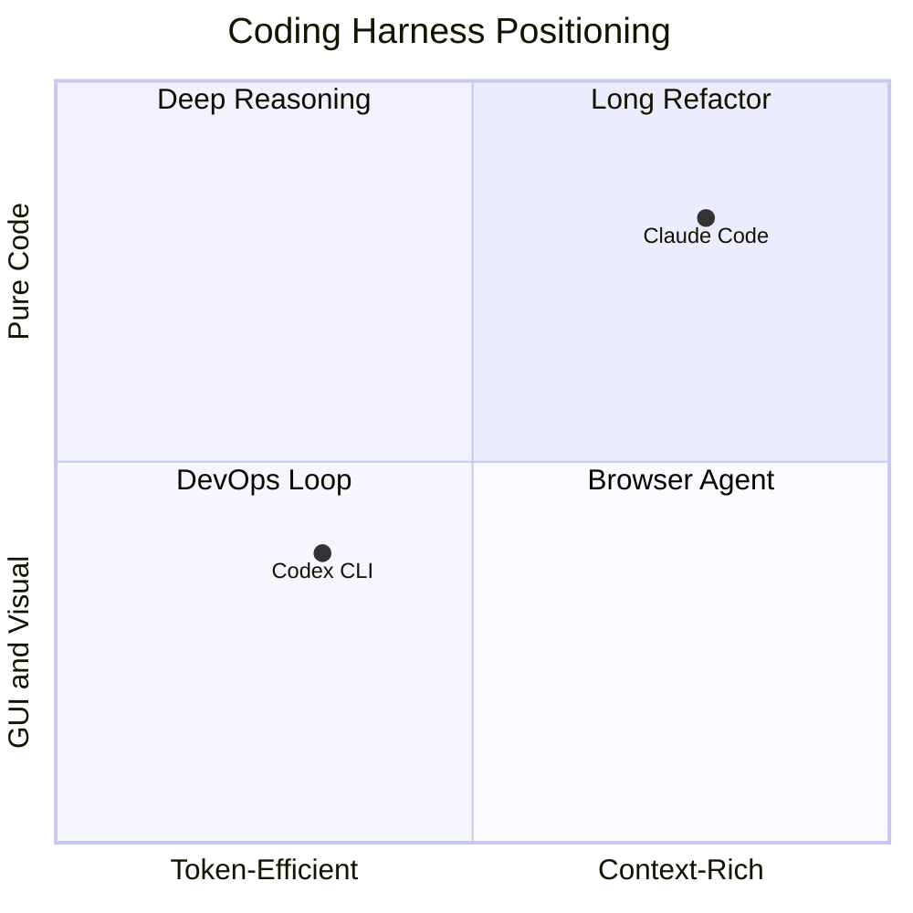

AI 코딩 에이전트 시장이 두 갈래로 정리됐다. Anthropic의 클로드 코드(Claude Code)와 OpenAI의 코덱스(Codex) CLI. 둘 다 "하네스(harness, 모델을 도구·맥락·승인 흐름으로 감싸 실제 작업을 돌리게 하는 외피)"라는 같은 카테고리지만 안을 열어보면 설계 철학이 반대다. 헤비 사용자는 결국 둘을 분업시키는 패턴으로 수렴한다. 이 글은 표면 비교가 아니라 구조 비교다.

## 1. 컨텍스트 용량과 토큰 회계

클로드 코드는 1M(백만) 토큰 컨텍스트를 production 옵션으로 제공한다. 모델 ID에 `[1m]` 접미사를 붙이면(`claude-opus-4-7[1m]`, `claude-sonnet-4-6[1m]` 등) 한 세션이 백만 토큰까지 쌓일 수 있다. 코덱스 CLI는 기본 400K 토큰이고, 1M 모드는 아직 실험 플래그 뒤에 있다.

용량은 클로드가 앞서지만 회계는 반대다. Composio가 2025년 말 공개한 100시간 비교에서 코덱스가 동일 태스크에 평균 약 4배 토큰을 덜 썼다. 한 응답 turn(모델이 사용자에게 한 번 돌려주기까지 사이의 도구 호출 묶음) 안에서 도구를 호출하는 횟수도 코덱스가 적다. 클로드 코드는 도구를 잘게 쪼개 자주 호출하고, 코덱스는 한 번에 큰 작업을 묶어 처리한다. "긴 맥락 한 번에 읽기"는 클로드, "토큰당 효율"은 코덱스가 우위다.

## 2. 서브에이전트 호출

클로드 코드의 Task 툴은 1급 시민이다. 메인 세션이 서브에이전트를 spawn하면 결과가 돌아올 때까지 native 흐름으로 처리되고, `run_in_background`로 비동기 병렬 실행과 결과 통지까지 SDK 내부에서 책임진다.

코덱스에 정식 서브에이전트 개념은 없다. 메인 세션이 `codex exec`(비대화형 모드)를 셸 명령으로 호출해 또 다른 코덱스 인스턴스를 띄우는 우회 패턴이다. 1회성 위탁은 가능하지만, 다중 서브에이전트를 트리 형태로 분기시키는 흐름은 클로드 코드 쪽이 훨씬 자연스럽다.

## 3. 도구 노출 — deferred tools와 skills

클로드 코드는 deferred tools(스키마를 런타임에 lazy fetch하는 도구) + MCP(Model Context Protocol, Anthropic이 만든 모델-도구 통신 표준)로 도구를 동적으로 늘린다. 컨텍스트 자리를 미리 차지하지 않고, `ToolSearch`로 필요할 때만 스키마를 끌어온다. 코덱스는 정적·선언적이라 SKILL.md(코덱스의 도구 명세 파일)에 기술된 항목이 시작 시점에 한꺼번에 로딩된다. 둘 다 MCP 클라이언트를 내장하며 코덱스는 `codex mcp` 서브커맨드로 MCP 서버를 연결한다.

## 4. 샌드박싱 — 앱 레이어 vs 커널 레이어

클로드 코드의 권한 모델은 앱 레이어다. 사전 승인(approval, 위험 효과 타입을 reversible/irreversible로 분류해 사용자 컨펌을 받는 로직)이 SDK 안에 살아있고, 훅(hook, 특정 이벤트에 셸 명령을 끼워 넣는 확장 지점)으로 자체 정책을 덧붙인다.

코덱스는 OS 커널 레이어를 쓴다. macOS는 Seatbelt(파일·네트워크 접근을 커널 정책으로 강제), Linux는 Landlock(unprivileged 프로세스가 자기 권한을 스스로 축소하는 LSM)과 seccomp(허용된 syscall만 통과시키는 화이트리스트). 모델이 빠져나오려 해도 OS가 막는다. 보안은 코덱스가 엄격하고, 유연성은 클로드 코드가 넓다.

## 5. 오픈소스와 가격

코덱스 CLI는 Rust로 작성됐고 GitHub(openai/codex)에 풀 소스로 공개돼 있다. 자체 빌드·포크·내부 커스텀이 가능하다. 클로드 코드 CLI는 클로즈드 소스로, SDK는 공개돼 있지만 내부 구현은 비공개다. 가격은 Claude Max가 월 $100·$200 두 단계, ChatGPT는 Plus $20·Pro $200 두 단계로 양쪽 다 5x 격차의 두 티어 구조다.

## 6. 공개 벤치마크 — 어느 쪽이 어디서 이기나

정확한 수치는 모델 버전·하네스 버전·평가 setup에 따라 변동이 크다. 아래는 2026년 상반기 공개된 자료에서 관찰되는 일반적 패턴이다(추측 영역 포함, 정확 수치는 출처 링크 참조).

| 영역 | 우위 | 비고 |
| --- | --- | --- |
| SWE-bench Verified(실제 GitHub 이슈 fix 벤치) | 클로드 살짝 우위 | 격차 점차 좁혀짐 |
| SWE-bench Pro(보다 어려운 변형) | 클로드 우위 | 깊은 reasoning 가산점 |
| Terminal-Bench 2.1(터미널 작업 자동화) | 코덱스 우위 | 셸 친화도 |
| OSWorld-Verified(GUI 에이전트) | 코덱스 우위 | 시각 인지 강함 |
| MCP-Atlas(MCP 도구 사용 능력) | 클로드 우위 | MCP 친정 |
| AA-Omniscience(환각률 측정) | 클로드 우위 | 환각 비율 낮음 |
| Aider polyglot(다국어 코딩) | 거의 동률 | 1-2점차 |
| GraphWalks BFS @1M(긴 맥락 BFS 추론) | 클로드 우위 | 1M 옵션 영향 |
| GDPval-AA Elo(생산성 가치 평가) | 클로드 우위 | 코드 품질 가산점 |

요약하면 클로드는 "긴 맥락·정직성·코드 품질·MCP 깊이", 코덱스는 "터미널·시각·토큰 효율". 같은 모델 세대에서 양쪽이 잘하는 축이 다르게 분포한다.

## 7. 작업별 분업 패턴

헤비 사용자가 도달하는 분업은 대체로 다음과 같다.

- **긴 코드베이스 리팩터링·아키텍처 변경·MCP 풍부한 워크플로** → 클로드 코드.
- **터미널 자동화·DevOps·셸 스크립트 일괄 처리·CI 디버깅** → 코덱스.
- **이미지 생성·차트 OCR·브라우저 GUI 조작** → 시각 인지가 강한 코덱스.
- **수학·복잡한 reasoning·환각 적은 답변과 외부 사실 검증** → 클로드.

한 모델만 고르면 양쪽 강점이 한 번에 사라진다. 클로드 코드를 메인 오케스트레이터로 두고, 시각·터미널·토큰 효율이 필요한 구간만 코덱스에 위탁하는 패턴이 비용·품질 양쪽에서 합리적이다.

## 결론

둘은 같은 카테고리지만 다른 종이다. 클로드 코드는 컨텍스트·정확도·확장성으로 "메인 오케스트레이터" 자리에 어울리고, 코덱스는 토큰 효율·시각 인지·터미널 친화로 "감사관·DevOps 핸드" 자리에 어울린다. 어느 한쪽 광고체에 휘둘릴 일이 아니라, 두 도구의 구조를 알고 작업별로 라우팅하면 된다.

## 출처

- Anthropic Claude Code 공식 문서: https://claude.com/code
- OpenAI Codex CLI 저장소: https://github.com/openai/codex
- Composio 100시간 비교 리포트: https://composio.dev/blog/codex-vs-claude-code-100-hours
- DataCamp 코덱스 vs 클로드 코드 분석: https://www.datacamp.com/blog/codex-vs-claude-code
- Simon Willison 코덱스 노트: https://simonwillison.net/tags/codex/
- SWE-bench 리더보드: https://www.swebench.com
- Terminal-Bench: https://github.com/laude-institute/terminal-bench
- MCP 사양: https://modelcontextprotocol.io
