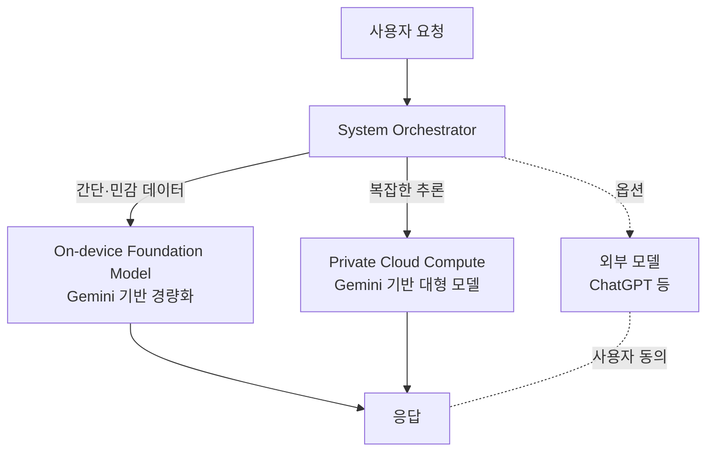

iPhone에서 사진을 정리하고, Siri에게 일정을 묻고, 이메일 요약을 받을 때 그 뒤에서 답을 만들어내는 모델이 누구의 모델인가. 어제(2026년 6월 8일)까지 애플의 공식 답은 "Apple Foundation Models — 우리 것"이었다. 오늘부터 답이 바뀐다. **그 모델은 사실상 Google Gemini를 베이스로 만든 모델이다.**

애플과 구글이 같은 날 공동 성명을 내고, Apple Intelligence(애플의 통합 AI 기능 브랜드)의 차세대 파운데이션 모델을 **Gemini(구글의 대규모 멀티모달 LLM 시리즈) 기반으로 공동 개발**한다고 발표했다. 다년간 계약이며, 애플이 직접 인용한 표현은 "Google's AI technology provides the most capable foundation for Apple Foundation Models" — 구글의 AI 기술이 가장 뛰어난 토대를 제공한다는 시인이다.

## 1년 전과 무엇이 달라졌나

작년에 애플이 OpenAI와 손잡고 ChatGPT 연동을 발표했을 때, 핵심 라인은 명확했다. **"Apple Intelligence의 본체는 우리가 만든다. ChatGPT는 정말 어려운 질문이 들어왔을 때 호출하는 외부 옵션이다."** 자체 파운데이션 모델은 자존심이자 차별점이었다.

이번 변화는 그 자존심을 내려놓은 사건이다. ChatGPT 연동은 여전히 외부 옵션 자리를 유지하지만, **그 위 단계 — Apple Intelligence의 디폴트 답변을 생성하는 기반 모델 자체가 Gemini로 바뀌었다.** 외부에 의존하는 영역이 "어쩌다 한 번 부르는 백엔드"에서 "매번 돌아가는 본체"로 올라온 셈이다.

애플은 이번 발표에서 모델 파라미터 수, 학습 데이터 크기, 정확한 변경 시점을 공개하지 않았다. 다만 다음 세 가지는 명확하다.

- **온디바이스 + Private Cloud Compute(PCC, 애플 실리콘 서버 위의 비공개 추론 인프라) 이원화 구조는 유지.** 동작 위치는 그대로다.
- **두 위치 모두에서 동작하는 모델 자체가 Gemini 기반.** 즉 아이폰 안에서 도는 작은 모델도 Gemini 계열에서 파생됐다는 뜻이다.
- **기기별로 두 등급의 모델.** 일부 기기는 음성 생성, 받아쓰기 정확도, 자연어 이해가 강화된 상위 버전을 받는다. 어떤 기기가 어떤 버전을 받는지는 공개되지 않았다.

## "시스템 오케스트레이터"라는 새 층

발표에서 한 가지 새로 등장한 개념이 있다. **시스템 오케스트레이터**(System Orchestrator) — 사용자가 지금 어떤 앱을 쓰고 있고, 어떤 작업을 하고 있는지를 보고 Apple Intelligence 기능들을 그 맥락에 맞게 조정해서 호출하는 중앙 코디네이터다.

이게 왜 새로 필요했을까. 답은 모델 분기 구조에 있다. 같은 사용자 요청도 (1) 온디바이스 모델이 처리할지, (2) PCC의 큰 모델로 올릴지, (3) ChatGPT 같은 외부 서비스로 위임할지 결정해야 한다. 모델이 단일했을 때는 분기가 단순했지만, 이제는 **베이스 모델까지 외부 의존이 들어와서 분기 정책이 더 복잡**해졌다. 오케스트레이터는 그 분기를 자동화하는 층이다.

발표 내용을 도식화하면 다음과 같다.

세 경로 모두 같은 Gemini 계보에서 파생됐다는 점이 이전 구조와의 핵심 차이다.

## 왜 자체 개발을 포기했나

애플은 "포기"라는 단어를 쓰지 않는다. 공식 프레이밍은 "공동 개발"이다. 하지만 베이스가 Gemini라는 점, 그리고 애플이 직접 "가장 뛰어난 토대"라고 표현한 점을 합치면 결론은 분명하다. **애플의 자체 파운데이션 모델이 프런티어급(주요 AI 회사들이 만드는 최상위 등급)을 따라잡지 못했다.**

지난 2년간 신호는 누적되어 있었다.

- 작년 Apple Intelligence 발표 시점에 약속했던 "더 똑똑한 Siri"는 사실상 연기됐다. 출시된 Siri는 기존 Siri와 큰 차이를 보이지 못했다.
- 애플의 자체 파운데이션 모델은 외부 벤치마크에서 GPT-4o/Claude/Gemini 대비 한 세대 뒤처진 성능으로 평가받았다.
- 회사 내부에서 AI 책임자 교체와 조직 개편이 반복됐다.

여기에 **모델 학습 비용**이 있다. 한 세대를 따라잡으려면 수십억 달러의 학습 인프라가 필요하고, 따라잡는다 해도 6개월 후엔 다시 뒤처진다. 애플은 이 레이스에 무한 자본을 투입하느니, **모델은 사오고 그 위의 OS·앱·하드웨어 통합·프라이버시 인프라에 집중**하는 쪽을 택했다고 해석된다.

이 선택을 Ben Thompson은 "Foundation vs Aggregation"의 프레임으로 정리했다 — 애플은 파운데이션(기반 모델)을 직접 만드는 길을 포기하고, 그 위에서 사용자 경험을 **집합·조립(aggregation)**하는 회사로 자리를 옮긴 것이다.

## 한국 사용자에게 의미

한국에서 iPhone을 쓰는 사용자에게 직접적인 변화는 두 갈래다.

첫째, **한국어 Siri의 응답 품질이 단기간 안에 크게 개선될 가능성**이 생겼다. Gemini는 한국어 자연어 이해와 생성에서 자체 Apple Foundation Models보다 한 단계 위로 평가받아 왔다. "더 똑똑한 Siri"가 작년의 공수표가 아니라 진짜 출시될 수 있는 근거다.

둘째, **이미지 생성·사진 편집 기능**이 새로 추가된다. 애플은 "현실적인 이미지 생성, 고급 사진 편집, 시각 질문 응답"을 차세대 능력으로 명시했다. 그동안 Apple Intelligence가 **Genmoji**(이모지 스타일 캐릭터 생성)·**Image Playground**(만화체 일러스트) 같은 의도적으로 비현실적인 스타일에 머물러 있었는데, 이 제약이 사라진다.

## 프라이버시 약속의 무게

애플은 발표에서 "사용자 데이터는 즉시 요청을 실행하는 데만 사용되며 애플이나 제3자가 접근할 수 없다"는 표현을 반복했다. PCC도 **외부 보안 전문가가 언제든 검증할 수 있다**고 명시했다.

이 약속의 핵심 쟁점은 한 가지다. **"Gemini 기반"의 모델이 PCC 안에서 돌 때, 구글이 그 모델 가중치나 추론 데이터에 접근할 수 있는가.** 발표문에는 명시되어 있지 않다. 공식 답은 "접근 불가"일 가능성이 높지만 — Gemini 가중치 라이선싱과 PCC 격리 사이의 정확한 경계는 아직 공개되지 않았다.

## 결론

이번 발표는 단순한 기능 업그레이드가 아니다. **하드웨어·OS·실리콘까지 거의 모든 스택을 자체 개발해 온 애플이, AI 파운데이션 계층만은 외부에서 빌려오기로 결정한 사건**이다. AI 시대의 수직 통합 신화가 깨지는 첫 신호일 수도 있다.

다른 한편으로 보면, 애플은 "파운데이션 모델 자체"가 차별화 포인트가 아니라고 판단한 셈이다. 모델은 누구한테서 사오든 비슷한 등급이 되고, 진짜 차이는 **그걸 어떤 OS 위에 어떻게 통합하고, 어떤 프라이버시 인프라 위에 올리느냐**라는 베팅이다. 이 판단이 맞다면 다른 디바이스 제조사들도 같은 길을 따라올 것이고, 틀렸다면 애플은 자기 정체성의 한 축을 영구히 내준 회사가 된다.

올 가을 iOS 27에서 "더 똑똑한 Siri"가 실제로 작동하는지가 첫 시험대다.

## 출처

- Macrumors, "Apple Reveals New AI Architecture Built Around Google Gemini Models" (2026-06-08): https://www.macrumors.com/2026/06/08/apple-reveals-new-ai-architecture/
- Google Blog, "Joint Statement: Apple Foundation Models will be based on Gemini": https://blog.google/company-news/inside-google/company-announcements/joint-statement-google-apple/
- Apple, "Apple Intelligence" 공식 페이지: https://www.apple.com/apple-intelligence/
- Stratechery, "Apple and Gemini, Foundation vs. Aggregation, Universal Commerce Protocol" (2026-06-08): https://stratechery.com/2026/apple-and-gemini-foundation-vs-aggregation-universal-commerce-protocol/
