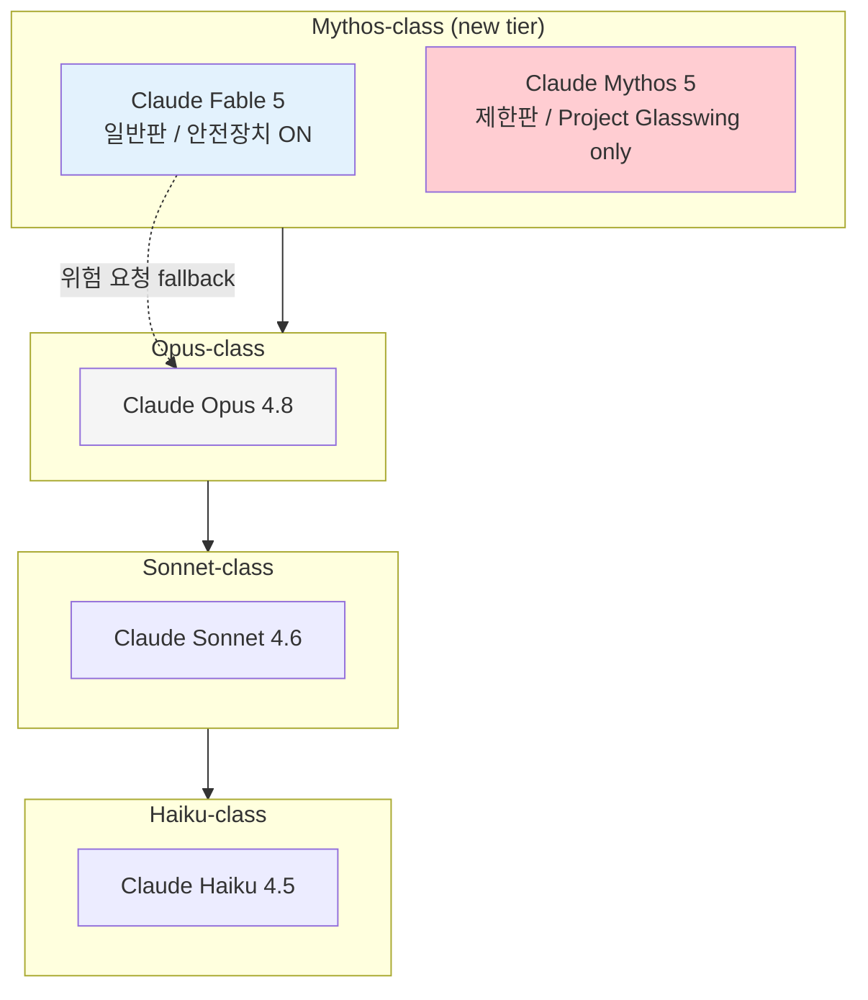

지난 1년간 AI 업계에서 "모델 등급"은 거의 같은 구조였다. OpenAI는 GPT-4와 미니, Google은 Gemini Pro와 Flash, Anthropic은 Opus·Sonnet·Haiku 세 단계. 큰 모델은 똑똑·비싸고, 작은 모델은 빠르고 싸다. 그 안에서 버전이 올라간다(4.5 → 4.6 → 4.7 → 4.8 식).

그런데 어제(2026-06-09) Anthropic이 이 그림을 한 칸 더 위로 늘렸다. **Claude Fable 5**와 **Claude Mythos 5**라는 새 모델 둘을 동시에 공개했는데, **Opus 4.8보다 한 등급 위의 Mythos-class**라는 새 티어다. 그리고 같은 베이스 모델에서 **안전장치만 다른 두 버전**으로 갈라져 있다는 점이 가장 흥미롭다.

## 같은 머리, 다른 손잡이

Fable 5와 Mythos 5는 **같은 모델**이다. 차이는 안전 분류기(safety classifier, 입력·출력에서 위험 카테고리를 판별해 차단하는 보조 모델) 설정이다.

- **Claude Fable 5**: 일반 출시판. API 식별자 `claude-fable-5`. 사이버보안·생물학·화학 관련 위험 요청은 안전장치가 작동해 거절하거나 한 단계 아래 모델(Opus 4.8)로 fallback. 가격 입력 100만 토큰당 $10, 출력 $50.
- **Claude Mythos 5**: 안전장치 일부가 풀린 제한 버전. 일반 사용자는 못 쓰고, Anthropic이 미국 정부와 함께 운영하는 **Project Glasswing**(방어형 사이버보안 공동작업, 6월 2일 약 150개 조직·15개국으로 확장 발표) 파트너와 일부 생물학 연구자만 접근. 가격 동일.

Anthropic은 "Mythos 5는 세계에서 가장 강력한 사이버보안 능력을 가진 모델"이고, "Fable 5는 그 능력이 잘못 쓰이면 심각한 피해를 낼 수 있어서" 안전장치를 얹어 일반판으로 따로 출시했다고 설명한다. 같은 모델의 안전 강도 다른 두 SKU를 **정식 제품으로 동시 출시**한 사례는 거의 처음이다.

## 측정 가능한 변화 — 가격, 자율 작업, 사용처

**가격이 절반 이하.** 직전 세대 **Claude Mythos Preview**(연구자 한정 시험판) 대비 입력·출력 토큰당 가격이 **절반 이하**라고 Anthropic이 밝혔다. 같은 회사 Opus 4.8은 입력 $15·출력 $75 — 즉 **상위 티어가 더 싸게 등장**했다. 추측이지만 추론 비용(컨텍스트 캐시·배치 처리)에서 큰 개선이 있었다고 봐야 지속가능하다.

**자율 작업 길이가 길어졌다.** Anthropic이 사례로 든 결제 인프라 회사 Stripe는 약 **5,000만 라인 규모 Ruby 코드베이스 마이그레이션을 사람 손으로 두 달 걸리던 것을 Fable 5가 하루**에 끝냈다고 한다. 한 번에 흘려보내는 작업 단위가 길어졌다는 신호 — 코딩 에이전트에 대한 사람 개입 빈도가 줄어든다는 뜻이다. 사례가 정말 두 달치였는지 검증 부담을 사후로 미룬 건 아닌지 의심은 들지만, 회사 입에서 직접 나온 자율도 demo라는 점에서 다른 모델 제공사들의 응수 압박이 커진다.

**벤치마크.** 공개된 수치는 그래프뿐이라 정확한 점수는 시스템 카드 PDF에 묶여 있지만, 발표 본문이 1위라고 명시한 항목만 추리면:

- **FrontierBench**(Cognition Labs의 코딩 평가 묶음): "frontier 모델 중 최고점, medium effort 설정에서도"
- **Hebbia Finance Benchmark**(금융 도메인 평가): "어떤 모델보다 높은 점수"
- **CursorBench**(코딩 에이전트 평가): "state-of-the-art"

특이 demo로는 **포켓몬 파이어레드를 시각 정보만으로 클리어**(persistent file-based memory를 켜고 이전 모델 대비 3배 성능), **신약 설계 약 10배 가속**, 분자생물학 가설을 전문가가 **약 80% 비율로 선호**한 사례가 본문에 있다.

**유통.** Fable 5는 어제 즉시 모든 구독 티어(Pro, Max, Team, Enterprise)와 API에 풀렸고, GitHub Copilot에도 같은 날 추가됐다. 단 구독 한도가 6월 22일까지 단계적으로 풀리고 그 후엔 추가 크레딧을 따로 사야 쓸 수 있는 구조다. 출시 30분 만에 일부 사용자의 Claude Max($200/월) 한도를 비웠다는 X 글이 HN에 올라와 있다.

## 등급이 늘면 따라오는 변화

지금까지 Claude 라인업은 Opus·Sonnet·Haiku 세 등급이었다. 위에 한 칸이 더 생긴다는 건 단순히 "더 비싼 모델 등장"이 아니다.

첫째, **가격 상한이 잠시 내려간다.** Fable 5가 Opus 4.8보다 능력이 위인데 가격은 더 싸다. 같은 가격에서 더 좋은 모델, 또는 더 비싼 모델인데 같은 가격 — 양쪽 방향 모두 다른 회사들에 응수 압박이다.

둘째, **안전장치가 모델 분기 기준이 됐다.** 지금까지 같은 모델의 안전 강도 다른 두 버전을 정식 SKU로 동시 출시한 사례는 거의 없다. 보통은 한 모델에 가드레일을 단단히 조이거나 약하게 조절하는 식이었다. Anthropic은 이번에 "위험 능력은 진짜로 위험하니 신뢰된 사용처에만 별도 SKU로 판다"는 입장을 **제품 레벨에서 명문화**했다. AI 안전 담론이 추상 정책에서 가격표·식별자로 내려온 셈이다.

## 마무리

Anthropic이 어제 한 일을 한 줄로 줄이면, **Claude 라인업 맨 위에 한 등급을 올렸고, 그 등급에서 안전장치를 다르게 단 두 SKU를 동시에 풀었다**이다. 가격은 직전 세대 절반 이하, 자율 작업 길이는 회사 사례 기준 사람 두 달치를 하루로 압축, 동시에 위험 능력 분리 출시. 모델 카탈로그 운영 방식이 또 한 번 바뀌었다고 봐도 될 변화다.

다음 주가 더 흥미로워질 가능성이 있다. OpenAI·Google이 같은 시기에 비슷한 등급의 응수를 내놓을지, 안전장치 분리 출시 같은 구조적 시도가 이번에 한정될지 — 그 부분은 추측이라 단언하지 않는다.

## 출처

- Anthropic, "Claude Fable 5 and Claude Mythos 5", 2026-06-09 — <https://www.anthropic.com/news/claude-fable-5-mythos-5>
- Anthropic, "Expanding Project Glasswing", 2026-06-02 — <https://www.anthropic.com/news/expanding-project-glasswing>
- aipricing.guru, "Claude Fable 5 and Mythos 5 pricing", 2026-06-09 — <https://aipricing.guru/news/claude-fable-5-mythos-5-pricing-june-2026/>
- GitHub Changelog, "Claude Fable 5 is generally available for GitHub Copilot", 2026-06-09 — <https://github.blog/changelog/2026-06-09-claude-fable-5-is-generally-available-for-github-copilot/>
- The Verge, "Anthropic releases Claude Fable 5", 2026-06-09 — <https://www.theverge.com/news/946725/anthropic-releases-claude-fable-5-mythos>
- Hacker News 토론: <https://news.ycombinator.com/from?site=anthropic.com>
