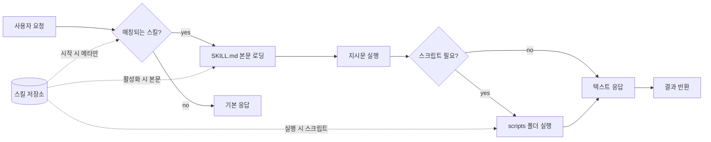

라이브러리는 개발자의 능력을 패키지로 만든다. `npm install react` 한 줄로 누군가가 만든 UI 컴포넌트를 내 프로젝트에 끌어온다. 2026년 6월 10일 GitHub 트렌딩 상위권은 비슷한 일이 AI 에이전트 쪽에서 일어나고 있다는 것을 보여줬다. 데일리 상위 6개 저장소 중 4개가 "Agent Skills"라는 같은 형식을 따른 모음집이었다. 합산 별 수만 약 31만 개. 어제 하루만 5천 개 가까이 늘었다.

이 흐름의 중심에는 Anthropic이 만든 **Agent Skills** 표준이 있다. 4월 Claude Code에 처음 등장한 이 형식은 5월에 오픈 표준으로 공개됐고, 6월 들어 개별 개발자들이 만든 스킬 패키지들이 한꺼번에 GitHub 트렌딩에 진입했다.

## 스킬이 정확히 뭔가

[agentskills.io](https://agentskills.io) 공식 정의를 그대로 옮기면 이렇다. 스킬(Skill)은 폴더 하나다. 그 안에 `SKILL.md`라는 마크다운 파일이 반드시 있고, 거기에 메타데이터(이름·설명)와 에이전트에게 줄 지시가 적혀 있다. 그 외에는 옵션이다 — 스크립트, 참고 문서, 템플릿 등.

```
my-skill/
├── SKILL.md          # 필수: 메타데이터 + 지시문
├── scripts/          # 선택: 실행 가능한 코드
├── references/       # 선택: 참고 자료
└── assets/           # 선택: 템플릿
```

핵심 메커니즘은 "점진적 노출(progressive disclosure)"이다. 컨텍스트 윈도우(context window, 모델이 한 번에 읽을 수 있는 텍스트 한도)는 비싸기 때문에 모든 스킬 본문을 시작부터 메모리에 올리지 않는다. 3단계로 나눠 로딩한다 — **발견**(시작 시 이름·설명만), **활성화**(요청 매칭되면 본문 로딩), **실행**(필요할 때만 스크립트·참고 파일 추가 로딩).

200개 스킬을 등록해도 사용 시점까지는 토큰 비용이 거의 0이다. 단순해 보이지만 라이브러리 생태계가 동작하기 위한 전제 조건이다 — 패키지를 잔뜩 깔아도 평소엔 메모리에 안 올라와야 한다.

## 왜 이 형식이 채택됐나

기존에도 비슷한 시도가 있었다. OpenAI의 GPTs, Cursor의 `.cursorrules`, 각 도구가 만든 자기 전용 플러그인 포맷. 그런데 이번 형식이 빨리 퍼진 이유는 세 가지다.

**첫째, 사양이 가볍다.** `SKILL.md`는 그냥 마크다운 파일에 frontmatter(YAML 메타데이터 헤더) 몇 줄이 붙은 것뿐이다. 개발자가 학습할 게 거의 없다. 비교 대상이었던 OpenAI의 GPT Actions는 OpenAPI 스펙 작성과 배포 인프라가 따라붙었다.

**둘째, 크로스-툴 호환을 처음부터 명시했다.** Anthropic은 표준을 [GitHub 저장소](https://github.com/agentskills/agentskills)에 공개해 다른 에이전트 제품들이 같은 형식을 읽도록 유도했다. 위에서 본 [last30days-skill](https://github.com/mvanhorn/last30days-skill) 저장소의 README는 "Claude Code, Cursor, Copilot, 그리고 50여 개 다른 에이전트 하네스에서 동일하게 동작한다"고 명시한다. 한 번 만든 스킬이 여러 도구에서 재사용되는 첫 번째 합의된 포맷에 가깝다.

**셋째, "커스텀 슬래시 명령"이 스킬에 흡수됐다.** 기존 Claude Code 사용자가 `.claude/commands/deploy.md`로 만들던 `/deploy` 명령이 이제 `.claude/skills/deploy/SKILL.md`와 똑같이 취급된다. 기존 자산이 그대로 호환되니 마이그레이션 비용이 0이다.

## GitHub에서 무슨 일이 일어났나

6월 10일 트렌딩 데일리 화면을 그대로 정리하면 이런 그림이다.

| 저장소 | 별 수(누적) | 어제 증가 | 내용 |
|---|---|---|---|
| obra/superpowers | 약 22.4만 | +1,205 | 22개 라이프사이클 스킬 + 방법론 (제시 빈센트) |
| addy/agent-skills | 약 5.15만 | +781 | 23개 엔지니어링 워크플로우 (애디 오스마니) |
| mvanhorn/last30days-skill | 약 3.9만 | +2,561 | 멀티플랫폼 리서치 스킬 (#1 트렌딩) |
| phuryn/pm-skills | 신생 | +775 | 100여 개 PM 워크플로우 스킬 |
| luongnv89/claude-howto | 신생 | +204 | 스킬 작성 가이드 + 템플릿 |

별 수 자체보다 흥미로운 건 **포맷이 같다는 점**이다. 5개 저장소 모두 `skills/<이름>/SKILL.md` 구조를 따른다. 한쪽 저장소에서 스킬 하나를 복사해 다른 저장소 형태로 그대로 옮길 수 있다. 이게 표준의 효과다 — 같은 모양의 패키지들이 여러 사람 손에서 동시에 만들어지고 호환된다.

가장 별이 많은 obra/superpowers(제시 빈센트, Prime Radiant 창업자)의 README는 이 패턴이 어디로 가는지를 잘 보여준다. 22개 스킬이 "테스트 주도 개발", "디버깅", "리뷰", "배포" 같은 소프트웨어 개발 단계별로 나뉘어 있고, 각각이 단순한 명령어가 아니라 **검증 게이트와 거부 패턴**까지 명세한다. 예를 들어 "코드 리뷰" 스킬은 에이전트가 흔히 하는 "이 정도면 됐다"라는 합리화를 미리 적어두고, 거기에 반박하는 증거 요구 항목을 둔다. 단순 매크로가 아니라 **방법론을 패키지화한 것**이다.

## 시스템 다이어그램



세 단계 모두 같은 저장소를 본다는 점이 중요하다. 같은 스킬 폴더에 대해 시점만 다르게 접근한다.

## 한계와 의문

이 흐름을 무조건 긍정만 할 이유는 없다.

**거버넌스.** 표준은 Anthropic이 만들었고 저장소도 Anthropic 직원들이 주로 관리한다. "오픈"이라 부르지만 사실상 단일 회사 주도다. OpenAI·Google이 자기 도구에 이 형식을 채택할 동기는 약하다 — 자기 마켓플레이스가 따로 있다.

**보안.** 스킬은 에이전트가 실행할 지시문이고 스크립트도 들어 있다. 별 5만 개짜리 저장소에 든 23개 스킬이 모두 검증된 것도 아니다. npm/pip 공급망 공격 패턴이 그대로 재현될 가능성이 높다.

## 의미

스킬 패턴 자체보다 중요한 건 **"에이전트 능력의 단위가 정해졌다"**는 사실이다. 지금까지 AI 에이전트에게 새 능력을 주는 방법은 도구별로 다 달랐다 — Cursor는 룰 파일, GPTs는 액션 JSON, 자체 에이전트는 각자 시스템 프롬프트. 단위가 통일되지 않으니 시장이 생기지 않았다.

`SKILL.md` 폴더라는 한 형태로 합쳐지면, 누군가가 한 번 잘 만든 스킬을 다른 사람이 그대로 가져다 쓰고 개선하고 다시 공유하는 사이클이 돈다. npm이 JavaScript 생태계에 한 일과 같은 일이 에이전트 능력에 시작되고 있는 것이다. 24시간 사이 별 5천 개가 늘어난 GitHub 트렌딩 화면은 그 사이클이 이미 돌기 시작했다는 증거다.

남은 질문은 누가 이 마켓을 통제하느냐다 — 표준 자체는 오픈이지만 검색·평가·신뢰의 인프라는 아직 분산돼 있다. 다음 6개월에 "스킬 마켓플레이스"가 어디서 자리잡는지가 다음 단계의 관전 포인트다.

## 출처

- Agent Skills 공식 정의: https://agentskills.io
- 표준 저장소: https://github.com/agentskills/agentskills
- Claude Code 스킬 문서: https://code.claude.com/docs/en/skills
- obra/superpowers: https://github.com/obra/superpowers
- addy/agent-skills: https://github.com/addyosmani/agent-skills
- mvanhorn/last30days-skill: https://github.com/mvanhorn/last30days-skill
- GitHub Trending (2026-06-10 daily): https://github.com/trending?since=daily
