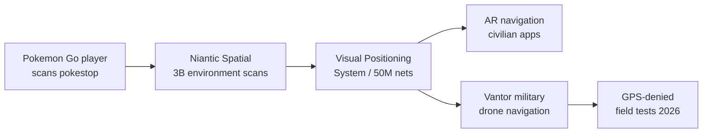

5년 전 포켓몬을 잡으러 동네를 돌아다닌 사람이라면, 게임 안에서 "이 포켓스톱 주변을 카메라로 천천히 비춰주세요"라는 요청을 한 번쯤은 봤을 것이다. 그렇게 모인 30억 장의 환경 스캔이 이제 군용 드론의 항법 시스템 학습 데이터로 흘러들어갔다.

Niantic Spatial(2025년 5월 게임 사업을 Scopely에 매각하고 남은 공간 컴퓨팅 회사)이 국방 계약사 Vantor(과거 Maxar Intelligence)와 파트너십을 맺고 자사의 시각 위치추적 시스템(Visual Positioning System, 카메라로 본 장면을 미리 만들어둔 3D 지도와 매칭해 GPS 없이도 위치를 알아내는 기술)을 GPS가 차단되거나 신뢰할 수 없는 환경의 드론에 통합한다. 핵심 학습 데이터는 포켓몬 고와 Ingress 플레이어들이 2021년부터 게임 보상을 받기 위해 휴대폰 카메라로 찍어 올린 짧은 영상 클립들이다.

## 무엇이 새로운가

Niantic이 게임 데이터로 공간 모델을 키워온 건 새 이야기가 아니다. 새로운 점은 그 모델이 **"DDIL 환경(Denied, Degraded, Intermittent, Limited, 위성 신호가 차단·열화·간헐·제한된 전장 환경)"**의 군용 드론 항법으로 이전된다는 명시적 발표다. Niantic Spatial이 공개한 ["VPS for Contested Environments"](https://nianticspatial.com/) 페이지는 회사의 모델이 "5천만 개의 신경망과 150조 개의 매개변수"로 구성된다고 밝히고, Vantor가 이를 정찰·표적 식별용 드론 소프트웨어에 통합한다고 적었다.

회사는 자사 데이터를 다음과 같이 정량화한다.

- 30억 장 이상의 실제 위치 환경 스캔
- 약 5천만 개의 위치별 신경망(location-specific neural net)
- 140건 이상의 특허 출원 또는 등록

플레이어 입장에서 이 스캔은 게임 안의 작은 보상(아이템·잡을 수 있는 포켓몬)을 받기 위한 "포켓스톱 스캔" 미니 작업이었다. 약관에는 데이터 재판매·제3자 제공 조항이 들어 있었지만, 게임 화면 어디에도 "이 영상은 향후 군용 드론 학습에 쓰일 수 있습니다" 같은 안내는 없었다.

## 30억 장이 정말 군에 쓸 만한 데이터인가

뉴스 헤드라인은 자극적이지만, 기술적 가치는 비판 지점이 많다. Hacker News 댓글에서 정리된 회의론 몇 가지는 짚어둘 만하다.

- **공간 편향**: 스캔은 사람이 들고 다닌 카메라가 닿은 포켓스톱 주변 좁은 반경에만 모인다. 도시 중심부와 관광지에 쏠려 있고, 실제 분쟁 지역과 겹치는 영역은 좁다는 지적.
- **각도·조도 문제**: 플레이어가 대충 찍은 영상은 시점·조도·가림이 일정하지 않아 학습 가능한 비율이 낮다.
- **노후화 속도**: 전쟁이 벌어진 지역의 도시 외형은 빠르게 바뀐다. 2022년 스캔된 키이우 도심이 2026년 드론에 그대로 쓸 수 있을지는 별개 문제.
- **이미 있는 대안**: Vantor의 모회사 Maxar는 세계 최고 수준의 상업 위성 영상을 보유하고 있다. 포켓몬 고 스캔이 위성 영상을 대체하기보다 보충 역할이라는 분석.

다만 **시각 위치추적은 본질적으로 위성 영상이 못 보는 곳, 즉 건물 사이 좁은 골목·실내·지하·캐노피 아래 같은 "지상 시야" 데이터가 핵심 자산**이다. 이 점에서 보행자 휴대폰이 찍은 30억 장은 위성 사진으로 못 만드는 데이터셋이고, 이중용도(군·민간 양쪽 쓰임) 자체는 학계와 산업에서 오랫동안 인지해온 문제다.

## 이중용도 데이터의 표면 위로 떠오른 순간

이 다이어그램이 보여주는 핵심은 "데이터 → 모델 → 다중 다운스트림" 구조다. 한 번 모델로 응축된 시각 정보는 민간 AR 내비게이션과 군용 드론 항법 양쪽으로 동시에 흘러나갈 수 있고, 이게 한 번 학습되면 원래의 플레이어 스캔으로 거슬러 올라가 "동의 철회"를 강제하기 어렵다. AI 시대의 데이터 거버넌스 논의가 모델 가중치 단계에서 어떻게 끊을지로 옮겨가고 있는 이유다.

## 의미

이 뉴스는 한 게임 회사가 군에 데이터를 팔았다는 단발 사건이 아니다. 다음 두 가지가 더 중요하다.

첫째, **VPS 같은 "지상 시야" 공간 AI 모델은 카메라 달린 일반인 손에서만 모일 수 있는 데이터로 학습된다.** 자율주행·로봇·AR 헤드셋 회사들이 만들어둔 비슷한 데이터셋도 같은 운명을 맞을 수 있다.

둘째, **약관에 "제3자 제공"이 쓰여 있다고 해서 사용자가 군용 드론에 동의했다고 보기는 어렵다.** 이 간극은 GDPR·국내 개인정보보호법에서 다루지 못한 회색지대이고, 앞으로 데이터 신탁(data trust)·목적 제한(purpose limitation) 같은 개념이 모델 학습 단계에서 어떻게 작동해야 할지 본격적인 정책 논의의 사례가 될 가능성이 크다.

게임을 하던 사람들이 만든 데이터가 전장으로 가는 길은 이미 열려 있다. 다음 질문은 "그 길을 어디서 끊을 것인가"다.

## 출처

- [Pokémon Go Scans Trained the Navigation Tech for Military Drones — dronexl.co](https://dronexl.co/2026/06/09/pokemon-go-scans-niantic-vantor-military-drone-navigation/)
- [Niantic Spatial 공식 페이지 — VPS 및 Vantor 파트너십](https://nianticspatial.com/)
- [Hacker News 토론 (659p)](https://news.ycombinator.com/item?id=48487029)
