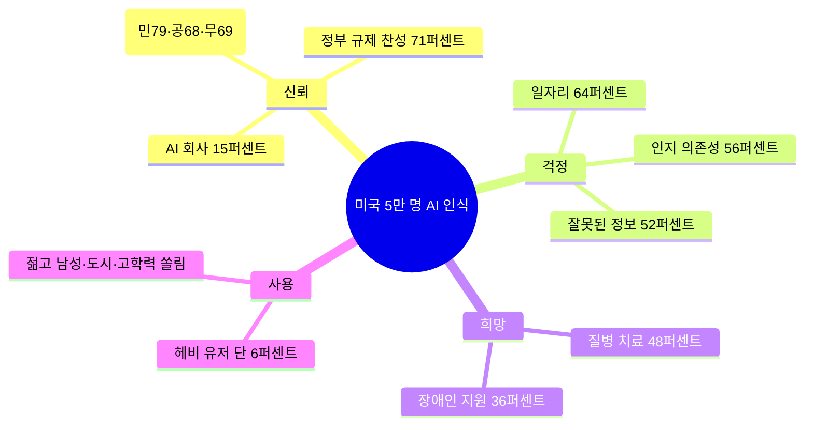

앤스로픽(Claude를 만드는 미국 AI 회사)이 6월 12일 첫 번째 Public Record를 공개했다. 이름이 다소 모호한데, 풀어 말하면 "AI에 대한 미국 대중의 생각을 정기적으로 측정해서 통째로 공개하겠다"는 약속이다. 첫 회 조사는 YouGov(여론조사 전문회사)에 의뢰해 2025년 11월 1일부터 12월 11일까지 미국 16세 이상 거주자 51,993명을 대상으로 실시됐다. 50개 주·DC·푸에르토리코의 인구 분포(주·연령·성별·교육·인종)에 맞춰 가중치 보정.

조사 자체는 익숙한 포맷인데, 누가 발표했는지가 핵심이다. **자기 사업에 가장 불리한 숫자를 자기들이 먼저 냈다.** "AI 개발 결정을 누구에게 맡기겠는가"라는 질문에서 AI 회사를 믿는다는 응답은 15퍼센트. 조사가 측정한 모든 기관 중 꼴찌다.

## 핵심 수치 한 묶음

- **AI 회사 신뢰도: 15%** — 조사 항목 중 최저
- **정부 규제 찬성: 71%** — 정파 무관 합의 (민주당 79%, 공화당 68%, 무소속 69%)
- **걱정 1위: 일자리 손실 64%** — 인구 통계 모든 집단에서 가장 흔한 두려움
- **걱정 2위: 인지 의존성 56%** (AI에 의존하느라 사람 사고 능력이 약해질 것)
- **걱정 3위: 잘못된 정보 52%**
- **희망 1위: 질병 치료 48%**
- **희망 2위: 장애인 지원 36%**
- **정부가 우선 다뤄야 할 영역: 프라이버시 56%, 어린이 안전 52%, 피해 책임 법제화 49%**

AI를 일상적으로 통합해 쓰는 "헤비 유저"는 미국인의 **6퍼센트**에 불과했고, 그마저도 "젊고 남성이고 도시 거주에 정규직이고 대졸 이상"으로 인구 분포가 좁게 쏠려 있다고 보고서는 적었다. 한국 일부 매체가 그리는 "이미 모두가 AI를 쓰고 있다"는 그림과 다른 현실.

## 왜 앤스로픽이 이걸 자기 손으로 냈나

명시된 이유는 "강력한 AI가 인류의 이익에 부합하도록 만들려면 대중 input이 필요하기 때문". 같이 진행 중인 Anthropic Interviewer(인터뷰 기반 정성 조사), Anthropic Economic Index(노동시장 영향 추적)와 같은 라인의 프로젝트로 분류된다. 회사는 Public Record를 정기적으로 반복할 것이며, 향후 미국 외 지역으로 확장하겠다고 밝혔다.

다만 보고서가 자기 검열적이지는 않다. 공개된 표 어느 곳에도 "그래도 Claude는 이렇게 잘 쓰이고 있다"는 식의 변호는 없다. 신뢰도 15%, 규제 찬성 71%를 첫 페이지 가까이 박아뒀다. 이것이 시사하는 건, 적어도 1라운드에서는 **앤스로픽 본인이 규제 입법 쪽으로 무게를 실어 정치적 포지셔닝을 잡으려 한다**는 해석이 가능하다. 신뢰도 데이터가 곧 "그러니까 규제가 필요하다"는 그들 자신의 논리로 변환되기 때문이다.

## 의미

frontier AI 회사가 자기 신뢰도 데이터를 자발적으로 측정하고 그걸 정기 발행 시리즈로 약속한 건 이번이 처음이다. OpenAI, Google DeepMind, Meta AI 누구도 비슷한 일을 한 적이 없다. 표면적으로는 투명성이지만 실질은 정책 의제 설정에 가깝다. 51,993명 표본·주 단위 마진은 미국 의회·연방기관 정책 토론에서 인용하기 쉬운 형식의 자료고, 앞으로 매 분기 같은 데이터가 갱신될 거라는 약속은 곧 "이 조사가 AI 규제 토론의 기본 reference가 되도록 만들겠다"는 의사 표시로 읽힌다.

한국 독자 입장에서는 두 가지 시사점. 첫째, 미국에서도 AI 회사 신뢰도가 15%까지 떨어진 상황에서 한국의 AI 규제 토론에 "글로벌 표준은 산업 자율"이라는 주장은 점점 설 자리가 줄어든다. 둘째, 정작 한국인 5만 명에게 같은 질문을 한 데이터는 아직 어디에도 없다.

## 출처

- Anthropic, "Results from the First Anthropic Public Record" — https://www.anthropic.com/news/anthropic-public-record
- YouGov 패널, 2025년 11월 1일 - 12월 11일 필드워크, n=51,993
