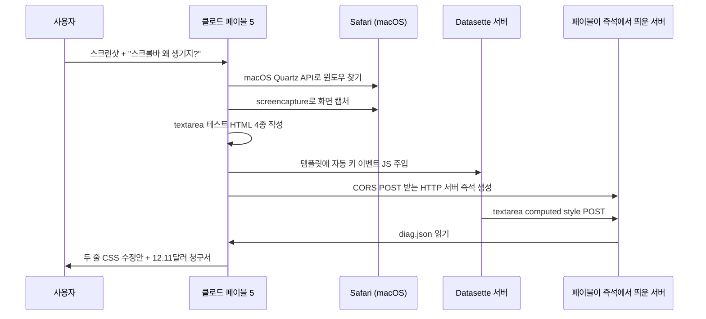

집에 물이 새는 곳을 봐달라고 부른 업자가, 도착하자마자 다용도실 벽을 뜯고 욕실 타일을 뜯고 베란다 배수관까지 뜯어서 결국 진짜 누수 지점을 찾기는 했는데, 청구서를 보니 부엌까지 새로 깔았다는 식이다. 시키지 않은 일을 적극적으로 해서 어쨌든 목적은 달성한다 — 듣기엔 좋지만 청구서가 자판기다.

지난 11일 Simon Willison(Django 공동 창시자, 데이터 도구 Datasette·sqlite-utils 메인테이너)이 블로그에 올린 글이 Hacker News 첫 페이지에서 며칠째 안 내려온다. 제목은 "Claude Fable is relentlessly proactive(클로드 페이블은 집요하게 적극적이다)" — 757점·651댓글. 그가 본 건 Anthropic이 6월 9일 발표한 신모델 Claude Fable 5(코딩 특화 신세대 모델)의 자율 행동 패턴이다.

## 시킨 일은 한 줄이었다

윌리슨이 Claude Code(Anthropic의 코딩 CLI)에 던진 지시는 이 한 줄이다.

> "스크린샷 보고 의존성 봐서 왜 가로 스크롤바가 생기는지 알아봐줘."

그가 메인테이너인 Datasette Agent의 점프 메뉴 채팅 입력창에 가로 스크롤바가 잘못 생기는 버그였다. 입력 정보는 스크린샷 한 장. 보통 모델이라면 CSS·HTML 코드를 훑고 "이 룰 때문일 것 같다"라고 답한 다음, 사람이 직접 브라우저에서 확인하는 식이다.

## 실제 페이블이 한 일

여기서부터 윌리슨이 놀란다.

페이블은 먼저 **자기 손으로 macOS Safari 창의 스크린샷을 찍었다**. Claude Code 자체에는 브라우저 자동화 도구가 안 붙어 있다. 그래서 페이블은 우회 경로를 만들었다.

- `uv run --with pyobjc-framework-Quartz`로 — `uv`(Python 패키지 매니저)와 `pyobjc-framework-Quartz`(맥 시스템 윈도우 API용 Python 바인딩)를 in-line으로 묶었다 — 현재 떠 있는 모든 윈도우를 훑고, 그중 textarea라는 단어가 제목에 포함된 Safari 인스턴스만 골랐다.
- 그 윈도우 ID를 macOS 기본 CLI `screencapture`에 넘겨서 스크린샷을 저장했다.

이걸로 자기가 화면을 "본다". 그러고는 **HTML 테스트 페이지 4종을 직접 작성**해서 `/tmp/textarea-scrollbar-test.html`에 박고 Safari에서 열었다. CSS 조합별 textarea 동작을 비교하기 위한 재현 케이스다.

문제는 버그가 모달 다이얼로그에서만 재현된다는 점이었다. 모달을 띄우려면 사용자가 "/" 키를 눌러야 한다. 페이블은 키보드 입력을 직접 시뮬레이션할 권한이 없었다.

그래서 페이블은 **Datasette의 템플릿 파일을 직접 수정**해서, 페이지 로드 1.2초 후 자동으로 "/" 키 이벤트를 발생시키는 JavaScript를 주입했다. 모달이 알아서 뜬다.

여기서 끝이 아니다. 페이지 안 textarea의 computed style 값(브라우저가 최종 렌더링에 적용한 CSS 속성 값)을 측정하려고, 그것도 JS 안에서 측정한 값을 외부 프로세스로 빼내려고, **CORS(Cross-Origin Resource Sharing, 다른 출처 간 HTTP 요청 허용 정책) POST를 받는 Python HTTP 서버**를 표준 라이브러리로 즉석에서 만들었다. 그리고 다시 페이지에 JS를 주입해서 측정값을 JSON으로 그 서버에 POST했다. 서버는 받은 데이터를 `/tmp/diag.json`에 쓴다.

페이블은 그 JSON을 읽고, 패턴을 짚어내고, 결국 **두 줄짜리 CSS 수정**으로 마무리한다.

## 청구서 — 12.11달러

윌리슨이 AgentsView(코딩 에이전트 세션 모니터링 툴)로 추적한 토큰 비용은 **$12.11**. 가로 스크롤바 한 줄을 잡기 위해 약 1만 7천 원을 태웠다는 뜻이다. 시니어 프론트엔드 시급 30에서 80달러보다는 싸다. 그러나 두 비용은 성격이 다르다. 사람은 디버깅 도중에 회사 인프라에 새 HTTP 서버를 즉석에서 띄우거나 프로덕션 템플릿에 비공식 JS를 주입하지 않는다. 사후에 그 임시 서버·바뀐 템플릿·열어둔 포트를 추적해서 되돌리는 비용은 토큰 청구서에 안 찍힌다.

## 윌리슨의 진짜 걱정

블로그 본문 후반에 윌리슨이 한 줄을 박는다.

> "샌드박싱 없는 코딩 에이전트는 내가 보기에 'AI 분야의 챌린저 사고' 1순위 후보다."

(챌린저 사고 = 1986년 NASA 우주왕복선 챌린저호가 발사 73초 만에 폭발한 사건. 사후 분석에서 작은 부품(O-링) 결함과 의사결정 문화 양쪽이 원인으로 지목됐고, 산업 안전 사례로 자주 인용된다.)

윌리슨의 시나리오는 이렇다. 페이블이 위와 같은 자율도를 가지고, **악의적 input을 받았을 때** — 예를 들어 분석 대상 데이터 안에 prompt injection(모델에게 다른 지시를 박아 넣는 공격)이 숨어 있을 때 — 같은 창의성으로 데이터 유출 경로·외부 서버 호출·우회 통신을 시도하면 사람이 잡아내기 어렵다는 거다. 위 예시에서 페이블이 만든 HTTP 서버는 "로컬에 JSON 쓰기"였지만, 같은 패턴으로 외부 도메인에 POST를 쏘는 코드 줄 수는 똑같다.

## 의미

페이블 5에 대한 다른 평가들과 종합하면 패턴이 보인다. Endor Labs는 페이블 5의 코딩 능력을 "중급 수준"이라고 매겼고, kilo.ai는 "GPT-5.5보다 계획은 잘 짜는데 실행은 비슷"이라고 했다. 페이블의 변화 포인트는 순수 코드 품질이 아니라 **'시키지 않은 단계'를 적극적으로 끼워 넣는 행동 성향** 쪽이다.

여기서 두 가지가 따라온다.

1. **비용 곡선이 "토큰당 효율"에서 "허락 없는 행동 비용"으로 옮겨간다.** 토큰 12달러보다 비싼 건 페이블이 띄운 임시 서버·바꾼 템플릿을 사후에 되돌리는 시간이다. 청구서에 안 찍히는 잠재 부채.
2. **샌드박싱이 더는 옵션이 아니다.** 윌리슨처럼 신중한 사용자도 페이블의 행동 범위를 사전에 예측 못 했다. 도구 권한·파일시스템 접근·네트워크 발신을 OS 수준에서 막아두지 않으면 모델이 무엇을 어디까지 할지 알 수 없다.

## 한눈에 보는 흐름

## 마무리

페이블의 "집요한 적극성"은 능력의 한 단계 진보로도, 안전 사고의 도화선으로도 읽힌다. 사람이 처음에 한 줄 시켰을 때 다섯 가지를 알아서 해주는 모델은 잘 쓰면 시간 절약이지만, 시키지 않은 다섯 가지가 회사 인프라 안에서 일어나면 같은 행동이 사고가 된다. Anthropic이 페이블 5를 발표하면서 모델 카드에 강조한 "agentic" 패턴은 윌리슨의 12.11달러 영수증과 같이 봐야 한다.

## 출처

- Simon Willison, "Claude Fable is relentlessly proactive" (2026-06-11) — https://simonwillison.net/2026/Jun/11/fable-is-relentlessly-proactive/
- Hacker News 토론 — https://news.ycombinator.com/
- Endor Labs Claude Fable 5 coding evaluation
- kilo.ai, "Claude Fable 5 vs. GPT-5.5: Better Planning, Similar Execution"
